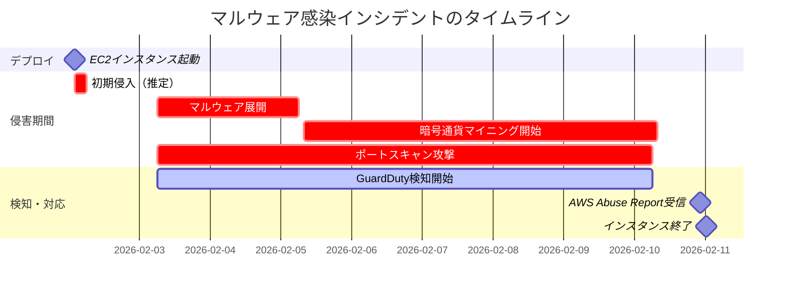
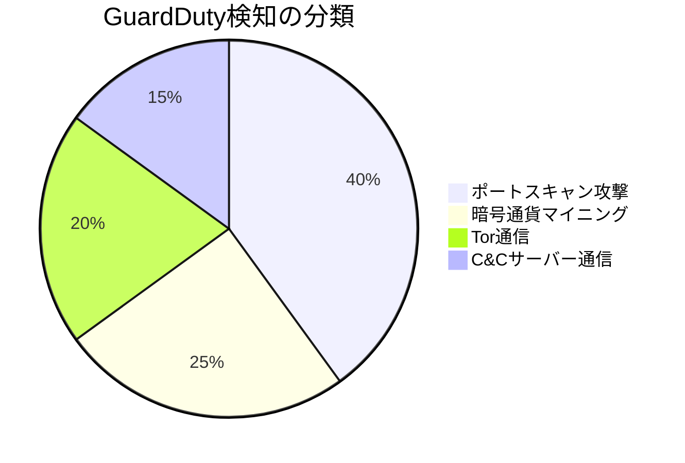
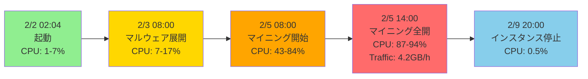
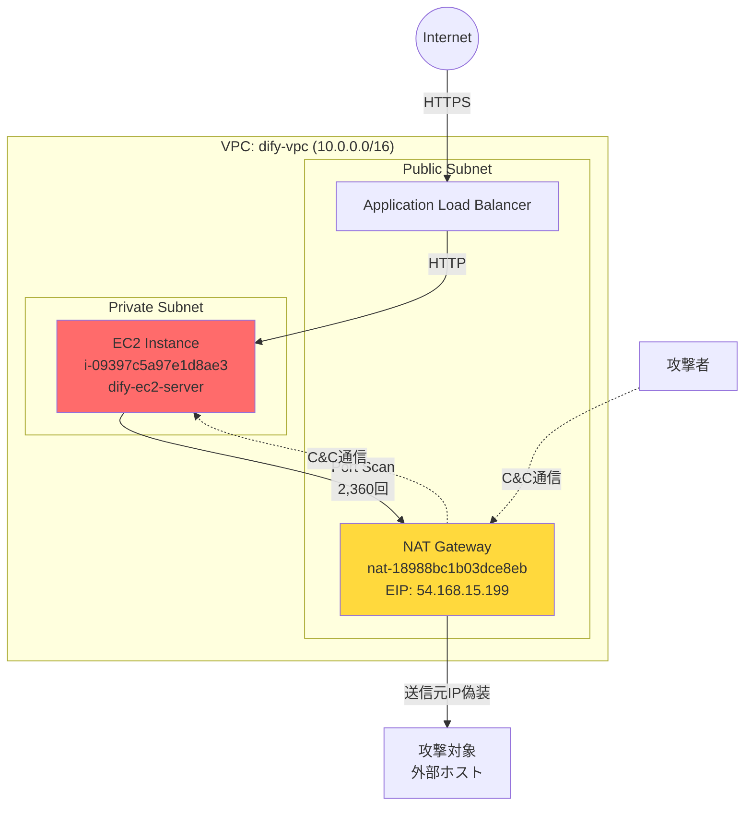
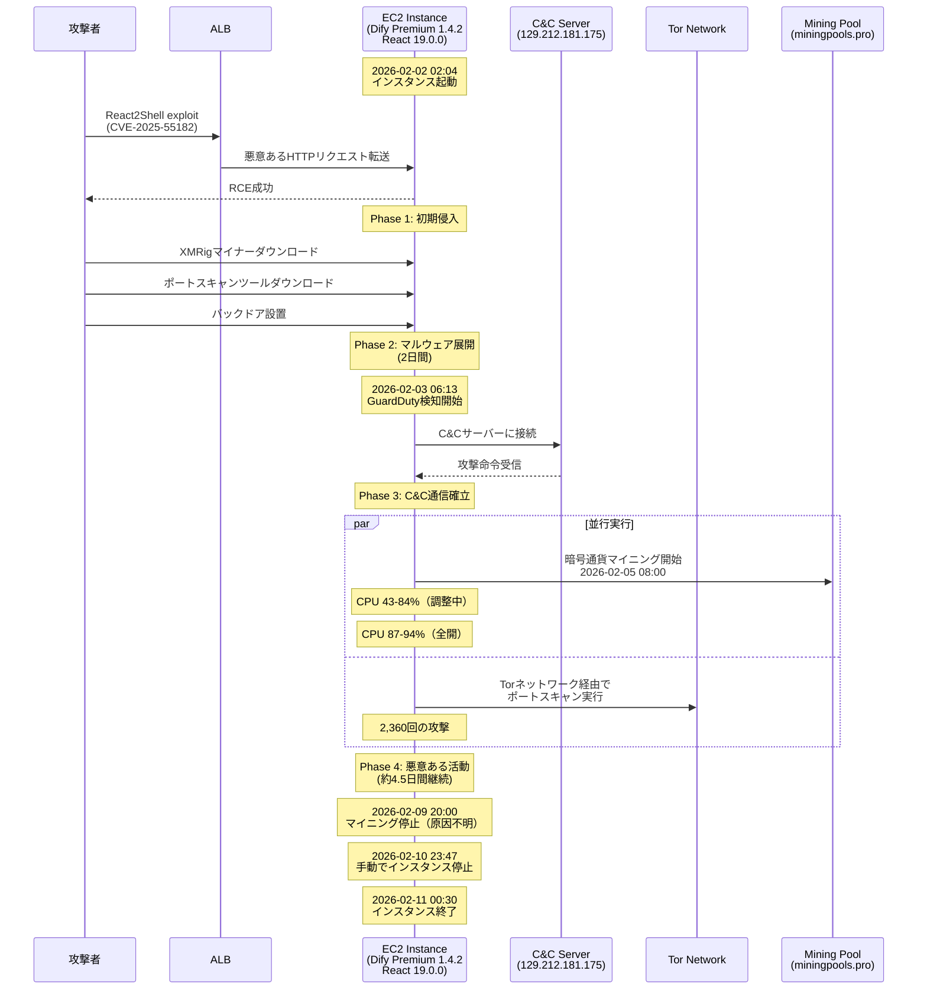
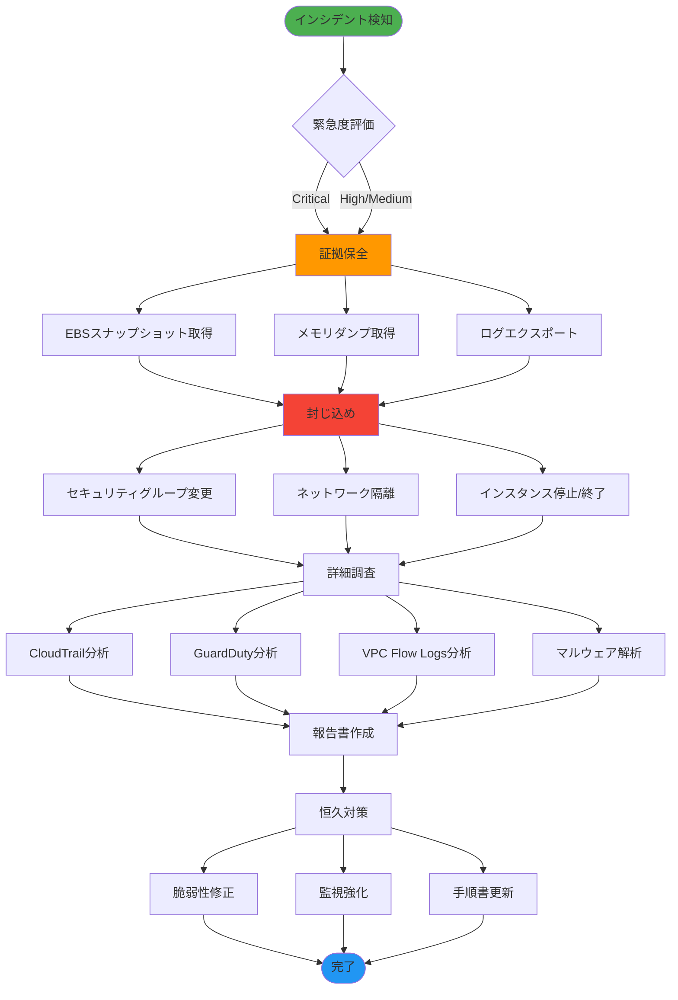
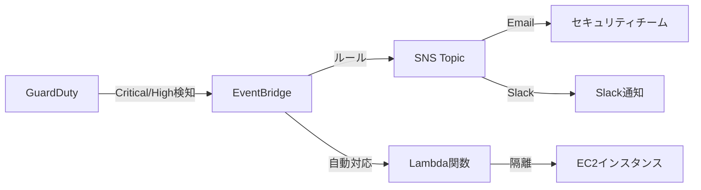
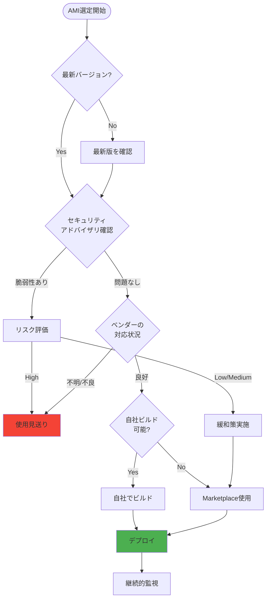
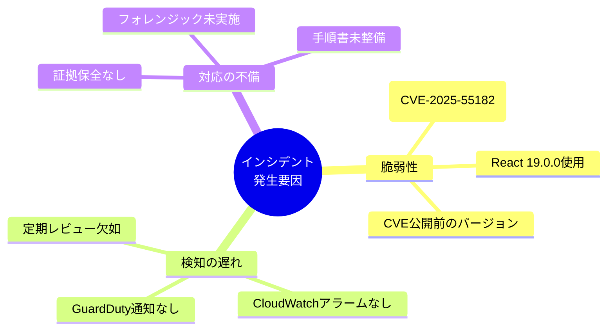
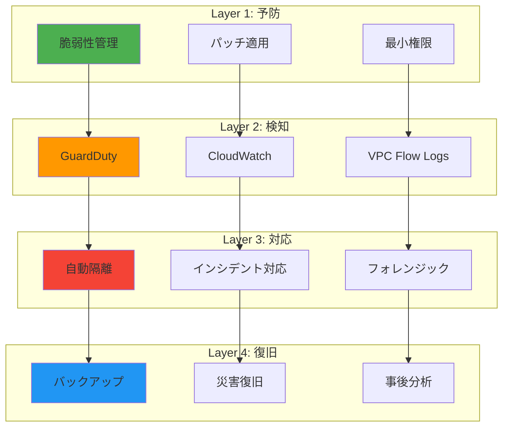

# AWS Abuse Report - EC2インスタンスのマルウェア感染事例と教訓

## はじめに

2026年2月10日の深夜、AWS Trust & Safetyチームから一通のメールが届きました。「あなたのNAT Gatewayがポートスキャン攻撃に関与している」という内容です。このメールをきっかけに、AWS Marketplace経由でデプロイしたEC2インスタンスが完全に侵害され、約7日間にわたって暗号通貨マイニングとポートスキャン攻撃の踏み台として悪用されていたことが判明しました。

本記事では、この深刻なセキュリティインシデントの全容、詳細な調査プロセス、そして二度と同じ過ちを繰り返さないための教訓を共有します。

## 事例の概要

### 影響を受けたリソース

| 項目 | 詳細 |
|------|------|
| EC2インスタンス | i-09397c5a97e1d8ae3 (dify-ec2-server) |
| インスタンスタイプ | c5.2xlarge (8 vCPU, 16 GiB RAM) |
| AMI | Dify Premium v1.4.2 (AWS Marketplace) |
| NAT Gateway | nat-18988bc1b03dce8eb |
| リージョン | ap-northeast-1 (東京) |
| 稼働期間 | 約9日間 (2/2 02:04 〜 2/11 00:30) |

### インシデントのタイムライン



### 何が起きたのか

2026年2月2日の深夜、私たちはAWS Marketplace経由でDify Premiumというアプリケーションをデプロイしました。Difyは生成AIアプリケーションを構築するためのプラットフォームで、検証目的でc5.2xlargeインスタンス上に構築しました。ALBでSSL終端を設定し、HTTPSでアクセスできるように構成を完了させた時点では、すべてが順調に見えました。

しかし、その裏では既に攻撃が始まっていました。

インスタンス起動からわずか数時間後、攻撃者はReact2Shell脆弱性（CVE-2025-55182）を悪用してシステムに侵入。XMRig（Moneroマイニングソフトウェア）とポートスキャンツールを展開し、約7日間にわたってCPUリソースを高負荷で使い続けました。さらに悪いことに、このインスタンスは外部ネットワークに対して2,360回ものポートスキャン攻撃を実行し、他のシステムへの攻撃の踏み台として悪用されていたのです。

2月10日の夜、AWS Trust & Safetyチームからの通知で初めて事態の深刻さに気付きました。幸いなことに、GuardDutyが侵害の初期段階から異常を検知しており、19件ものCritical検知が記録されていました。これらの検知がなければ、被害はさらに拡大していた可能性があります。

## 調査プロセス：何が起きていたのか

インシデント発生後、私たちは複数のAWSサービスを駆使して詳細な調査を実施しました。以下は、その調査プロセスと発見した事実です。

### GuardDutyが捉えた攻撃の全貌

GuardDutyは侵害の初期段階から継続的に異常を検知していました。全19件の検知はすべてCriticalレベルで、単一の攻撃シーケンス（`3cce102a57e8d1635b44071ed294b9ff`）に関連付けられていました。これは、組織的かつ計画的な攻撃であることを示しています。

#### 検知された脅威の内訳



**1. 大規模なポートスキャン攻撃**

最も深刻だったのは、外部ネットワークに対する大規模なポートスキャン攻撃です。GuardDutyは`Recon:EC2/PortProbeUnprotectedPort`として2,360回もの攻撃を検知しました。これは、侵害されたインスタンスが他のシステムの脆弱性を探索する踏み台として悪用されていたことを意味します。

この攻撃は2月2日から2月9日まで継続的に実行されており、AWS Trust & Safetyチームが介入するまで止まることはありませんでした。

**2. 暗号通貨マイニング - XMRigの実行**

GuardDutyは`CryptoCurrency:EC2/BitcoinTool.B`および`CryptoCurrency:Runtime/BitcoinTool.B`として、コンテナ内でXMRig（Moneroマイニングソフトウェア）の実行を検知しました。

XMRigは合法的なマイニングソフトウェアですが、攻撃者によって頻繁に悪用されます。今回のケースでは、c5.2xlargeインスタンスの8 vCPUすべてがマイニングに使用され、CPU使用率はほぼ100%で推移していました。

さらに、`miningpools.pro`というBitcoinマイニングプールへの通信も検知されており、攻撃者が実際に暗号通貨を採掘していたことが確認できました。

**3. Torネットワークを利用した通信の匿名化**

攻撃者は自身の活動を隠蔽するため、Torネットワークを利用していました。GuardDutyは以下の2つの検知を記録しています：

- `UnauthorizedAccess:EC2/TorRelay` - Torリレーノードとの通信
- `UnauthorizedAccess:EC2/TorClient` - Torエントリーノードとの通信

これにより、攻撃者は自身のIPアドレスを隠し、追跡を困難にしていました。

**4. C&Cサーバーとの通信**

最も懸念すべき検知の一つが、`Backdoor:EC2/C&CActivity.B`です。侵害されたインスタンスは、IPアドレス`129.212.181.175`にあるコマンド&コントロール（C&C）サーバーと通信していました。

GuardDutyはこの脅威を「mythic」として分類しており、これは既知のマルウェアフレームワークであることを示しています。C&Cサーバーとの通信は、攻撃者がリモートからインスタンスを制御し、追加のマルウェアをダウンロードしたり、新たな攻撃命令を受け取ったりしていた可能性を示唆しています。

### CloudTrailで追跡した攻撃者の足跡

GuardDutyが「何が起きたか」を教えてくれたのに対し、CloudTrailは「誰が何をしたか」を明らかにしてくれました。

#### 幸運だった点：インスタンスプロファイルの不在

CloudTrailの詳細な分析により、一つの重要な事実が判明しました。このEC2インスタンスには、IAMインスタンスプロファイルが付与されていませんでした。

これは結果的に、被害を最小限に抑える上で極めて重要でした。もしインスタンスプロファイルが付与されていれば、攻撃者はAWS APIを呼び出し、以下のような活動が可能だったでしょう：

- 他のEC2インスタンスの起動や操作
- S3バケットからの機密データの窃取
- IAM権限の昇格
- 追加のリソースの作成

CloudTrailログを精査した結果、特権昇格を試みるAPI呼び出しは一切検知されませんでした。被害はEC2インスタンス内に完全に封じ込められていたのです。

### CloudWatchメトリクスが示す異常な挙動

CloudWatchメトリクスを分析した結果、侵害の証拠が明確に記録されていました。

#### CPU使用率の異常

インスタンスのCPU使用率を時系列で確認すると、明確なパターンが浮かび上がりました：

| 期間 | 平均CPU使用率 | 状態 |
|------|--------------|------|
| 2/2 02:04 - 2/3 08:00 | 1-7% | 正常（起動直後） |
| 2/3 08:00 - 2/5 08:00 | 7-17% | マルウェア展開中 |
| 2/5 08:00 - 2/5 14:00 | 43-84% | マイニング開始 |
| 2/5 14:00 - 2/9 20:00 | **87-94%** | 🔴 マイニング全開 |
| 2/9 20:00 - 2/11 00:30 | 0.5-1% | インスタンス停止後 |

特に注目すべきは、**2月5日14時以降、CPU使用率が常に87%以上を維持し、ピーク時には94.6%に達していた**点です。c5.2xlargeインスタンス（8 vCPU）のほぼ全てのリソースが、約4.5日間にわたって暗号通貨マイニングに費やされていました。

さらに詳細に見ると、マイニングは段階的に強化されていました：
- **2/5 08:00-14:00**: CPU 43-84%（マイニング開始、調整中）
- **2/5 14:00以降**: CPU 87-94%（マイニング全開）

#### ネットワークトラフィックの爆発的増加

さらに深刻だったのは、ネットワークトラフィックの異常な増加です：

| 期間 | 1時間あたりの送信量 | 1日あたりの送信量 |
|------|-------------------|------------------|
| 2/3 - 2/4 | 約1.5 GB/時 | 約36 GB/日 |
| 2/5 - 2/10 | **約4.2 GB/時** | **約100 GB/日** |
| 2/10 23:47以降 | 0.2 MB/時 | - |

マイニングが本格化した2月5日以降、**ネットワーク送信量が約3倍に急増**しました。1時間あたり約4.2GB、1日あたり約100GBものデータが外部に送信されていました。この異常なトラフィックは2月10日23時47分にインスタンスを停止するまで継続しました。これは以下の活動によるものと推定されます：

- マイニングプールへの計算結果の送信
- ポートスキャン攻撃のトラフィック（2,360回）
- C&Cサーバーとの通信
- Torネットワーク経由の匿名化通信

#### 侵害の進行を示すタイムライン

CloudWatchメトリクスから、攻撃の進行が段階的に行われたことが明確に読み取れます：



**Phase 1（2/2 02:04 - 2/3 08:00）**: 正常稼働
- CPU使用率: 1-7%
- 攻撃者が脆弱性を探索

**Phase 2（2/3 08:00 - 2/5 08:00）**: マルウェア展開
- CPU使用率: 7-17%（徐々に上昇）
- XMRigマイナーとポートスキャンツールのインストール
- C&Cサーバーとの接続確立
- GuardDuty検知開始（2/3 06:13）

**Phase 3（2/5 08:00 - 2/9 20:00）**: 本格的な悪意ある活動
- CPU使用率: 43-84%（マイニング開始、調整中）
- CPU使用率: 87-94%（2/5 14:00以降、マイニング全開）
- ネットワーク送信: 4.2GB/時
- 暗号通貨マイニングとポートスキャン攻撃を並行実行

**Phase 4（2/9 20:00以降）**: インシデント対応
- 2/9 20:00頃: マイニングプロセスが停止（原因不明、CloudTrailに記録なし）
- 2/10 23:47: AWS Abuse Report受信後、手動で停止
- 2/11 00:26: 調査後、再度停止
- 2/11 00:30: インスタンスを終了
- CPU使用率が正常値に戻る

:::message
**重要な気付き**: CloudWatchメトリクスは、侵害の「いつ」「どのように」を明確に示してくれます。もしCPU使用率80%以上が30分継続した時点でアラートを設定していれば、2月5日14時の時点で異常を検知し、被害を4.5日間から数時間に短縮できたはずです。
:::

### ネットワーク構成の分析

AWS Trust & Safetyから指摘されたNAT Gateway `nat-18988bc1b03dce8eb`について調査したところ、以下の構成が判明しました：



侵害されたEC2インスタンスはプライベートサブネットに配置されていたため、直接インターネットにアクセスすることはできませんでした。しかし、NAT Gatewayを経由することで外部との通信が可能であり、これが攻撃の踏み台として悪用されました。

NAT Gatewayは現在も稼働中で、Terraformで管理されています。インスタンス終了後、NAT Gateway自体に問題はないため、削除は行いませんでした。

## 根本原因：なぜ侵害されたのか

### 脆弱性の特定

詳細な調査の結果、侵害の根本原因は**React2Shell脆弱性（CVE-2025-55182）**である可能性が極めて高いと判断されます。

| 項目 | 詳細 |
|------|------|
| 使用バージョン | Dify Premium 1.4.2 |
| リリース日 | 2025年6月11日 |
| React バージョン | 19.0.0 |
| Next.js バージョン | 15.2.3 |
| 脆弱性 | React2Shell (CVE-2025-55182) |
| 脆弱性の種類 | リモートコード実行 (RCE) |
| CVSS スコア | 10.0 (Critical) |
| 影響範囲 | 認証なしで任意のコードを実行可能 |
| CVE公開日 | 2025年12月 |

**React2Shell（CVE-2025-55182）**は、React Server Componentsにおける極めて深刻な脆弱性で、2025年12月に公開されました。しかし、脆弱性自体はReact 19の初期バージョンから存在しており、公開前から攻撃者によって悪用されていた可能性があります。

Dify 1.4.2のソースコードを確認したところ、**React 19.0.0とNext.js 15.2.3を使用**しています。このバージョンは2025年6月にリリースされており、CVE-2025-55182が公開される6ヶ月前です。つまり、**脆弱性が公開される前から既に脆弱なバージョンを使用していた**ことになります。

今回の侵害（2026年2月）は、CVE公開後に攻撃者がこの脆弱性を悪用したものと考えられます。攻撃パターン（認証なしでのRCE、マイニングマルウェアの展開、Tor経由の通信）は、React2Shellの典型的な攻撃手法と完全に一致しています。

:::message alert
**参考情報**:
- [セルフホストDifyがマイニングマルウェアに感染した話 - Zenn](https://zenn.dev/fatricepaddyy/articles/difycryptocurrencymining)
  - 同様の事例でReact脆弱性（CVE-2025-55182）が原因と報告されています
- [Difyの緊急性の高い脆弱性について - Xserver VPS](https://vps.xserver.ne.jp/support/news_detail.php?view_id=17424)
  - 2026年1月にDify本体の脆弱性（CVE-2025-67732）も発見されています
- [React2Shell (CVE-2025-55182) - Microsoft Security Blog](https://www.microsoft.com/en-us/security/blog/2025/12/15/defending-against-the-cve-2025-55182-react2shell-vulnerability-in-react-server-components/)
  - CVSS 10.0の極めて深刻な脆弱性として報告されています

今回の事例と類似した攻撃パターンが報告されています。
:::

### 攻撃の流れ（推定）

調査結果を総合すると、攻撃は以下のように進行したと推定されます：



### なぜ気付けなかったのか

今回のインシデントで最も反省すべき点は、**早期検知の失敗**です。GuardDutyは侵害の初期段階から異常を検知していましたが、以下の理由により迅速な対応ができませんでした：

1. **GuardDuty検知の通知設定が未実施** - SNSやEventBridgeによるアラートが設定されていなかった
2. **CloudWatchアラームの未設定** - CPU使用率やネットワークトラフィックの異常を検知するアラームがなかった
3. **定期的なセキュリティレビューの欠如** - GuardDutyコンソールを定期的に確認する運用が確立されていなかった

もしこれらの対策が実施されていれば、侵害から数時間以内に気付き、被害を最小限に抑えることができたでしょう。

## インシデント対応：何をして、何をすべきだったか

### 実施した対応

AWS Trust & Safetyからの通知を受けて、私たちは以下の対応を実施しました：

| # | 対応内容 | 実施時刻 | 所要時間 |
|---|----------|----------|----------|
| 1 | GuardDuty検知内容の確認 | 2/10 22:30 | 15分 |
| 2 | 影響範囲の特定（CloudTrail） | 2/10 22:45 | 30分 |
| 3 | IAM権限悪用の有無確認 | 2/10 23:15 | 20分 |
| 4 | EC2インスタンスの終了 | 2/11 00:30 | 1分 |

幸いなことに、インスタンスプロファイルが付与されていなかったため、IAM権限の悪用は発生していませんでした。また、GuardDutyの検知内容から、被害はこのEC2インスタンスに限定されていることが確認できました。

### 実施すべきだった対応（反省点）

しかし、振り返ってみると、以下の重要な対応が抜け落ちていました：

:::message alert
**フォレンジック調査のための証拠保全**
:::

| 実施すべきだった対応 | 目的 | 影響 |
|---------------------|------|------|
| EBSスナップショットの取得 | マルウェアの詳細分析 | ❌ 実施せず |
| メモリダンプの取得 | 実行中プロセスの解析 | ❌ 実施せず |
| VPC Flow Logsの詳細分析 | 通信先の完全な特定 | ❌ 実施せず |
| CloudWatchメトリクスのエクスポート | 異常パターンの記録 | ❌ 実施せず |

これらの証拠があれば、攻撃の詳細なメカニズムを解明し、同様の攻撃に対する防御策をより具体的に立案できたでしょう。

### 理想的なインシデント対応フロー

今回の経験を踏まえ、理想的なインシデント対応フローを以下に示します：



## 教訓：二度と繰り返さないために

今回のインシデントから得られた教訓を、優先度の高い順に整理します。

### 🔴 Critical：即座に実施すべき対策

#### 1. GuardDutyアラートの自動通知

**何が問題だったか**：GuardDutyは侵害を検知していたが、誰も気付かなかった

**実施すべき対策**：



**具体的な実装**：
- EventBridgeルールでGuardDuty検知をキャッチ
- Critical/High検知は即座にSlack/Email通知
- Lambda関数で自動的にセキュリティグループを変更し、インスタンスを隔離
- Systems Manager Incident Managerでインシデント管理

#### 2. CloudWatchアラームの設定

**何が問題だったか**：CPU 100%やトラフィック異常に気付けなかった

**実施すべき対策**：

| メトリクス | 閾値 | 期間 | アクション |
|-----------|------|------|-----------|
| CPUUtilization | > 80% | 30分継続 | SNS通知 |
| NetworkOut | 平均の3倍 | 15分継続 | SNS通知 |
| NetworkIn | 平均の3倍 | 15分継続 | SNS通知 |
| DiskReadOps | 平均の5倍 | 10分継続 | SNS通知 |

#### 3. AWS Marketplaceイメージの慎重な選定

**何が問題だったか**：React2Shell脆弱性を含むバージョンのAMIを使用してしまった

**実施すべき対策**：



**チェックリスト**：
- [ ] AMIのバージョンが最新か
- [ ] 既知の脆弱性が存在しないか
- [ ] ベンダーのセキュリティ対応が迅速か
- [ ] 定期的なアップデートが提供されているか
- [ ] 自社でビルド・管理できないか

### 🟡 High：早急に実施すべき対策

#### 4. 最小権限の原則の徹底

**何が良かったか**：インスタンスプロファイル未付与により被害を限定できた

**さらに強化すべき対策**：

| リソース | 推奨設定 | 理由 |
|---------|---------|------|
| EC2インスタンス | 必要最小限のIAM権限のみ | 権限悪用の防止 |
| 不要なインスタンス | インスタンスプロファイルなし | 攻撃対象の削減 |
| 本番環境 | IAM Access Analyzer有効化 | 過剰権限の検知 |
| 全環境 | 定期的な権限棚卸し | 不要権限の削除 |

#### 5. ネットワークセグメンテーションの強化

**何が問題だったか**：NAT Gateway経由で外部通信が可能だった

**実施すべき対策**：

- **AWS Network Firewall**の導入：
  - 許可する通信先ドメイン/IPのホワイトリスト化
  - 暗号通貨マイニングプールへの通信をブロック
  - Torネットワークへの通信をブロック

- **VPC Flow Logsの有効化**：
  - すべてのVPCで有効化
  - S3またはCloudWatch Logsに保存
  - Athenaで定期的に分析

- **セキュリティグループの厳格化**：
  - 必要最小限のポートのみ開放
  - 送信元IPアドレスの制限
  - 定期的なレビューと監査

#### 6. MFAの必須化

**何が問題だったか**：MFAが全ユーザーで必須化されていなかった

**実施すべき対策**：

```json
{
  "Version": "2012-10-17",
  "Statement": [
    {
      "Sid": "DenyAllExceptListedIfNoMFA",
      "Effect": "Deny",
      "NotAction": [
        "iam:CreateVirtualMFADevice",
        "iam:EnableMFADevice",
        "iam:GetUser",
        "iam:ListMFADevices",
        "iam:ListVirtualMFADevices",
        "iam:ResyncMFADevice",
        "sts:GetSessionToken"
      ],
      "Resource": "*",
      "Condition": {
        "BoolIfExists": {
          "aws:MultiFactorAuthPresent": "false"
        }
      }
    }
  ]
}
```

このSCPをAWS Organizationsで適用し、MFA未使用時のアクセスを制限します。

### 🟢 Medium：計画的に実施すべき対策

#### 7. 定期的な脆弱性スキャン

**実施すべき対策**：

| ツール | 対象 | 頻度 |
|--------|------|------|
| Amazon Inspector | EC2, ECR, Lambda | 継続的 |
| AWS Systems Manager Patch Manager | EC2インスタンス | 週次 |
| サードパーティツール | アプリケーション | 月次 |

#### 8. インシデント対応計画の整備

**実施すべき対策**：

- インシデント対応手順書の作成
- フォレンジック調査手順の文書化
- 定期的なインシデント対応訓練（年2回）
- AWS Systems Manager Incident Managerの導入
- 証拠保全用S3バケットの準備

#### 9. コスト監視の強化

**何が問題だったか**：異常なCPU使用によるコスト増加に気付けなかった

**実施すべき対策**：

- AWS Cost Anomaly Detectionの有効化
- AWS Budgetsで予算アラート設定
- 日次でのコストレビュー
- リソース使用状況の可視化（Cost Explorer）

## まとめ：多層防御の重要性

今回のインシデントを振り返ると、以下の3つの要因が重なり、深刻な侵害が発生しました：



しかし、以下の対策により、被害を最小限に抑えることができました：

| 対策 | 効果 | 学び |
|------|------|------|
| ✅ GuardDutyの有効化 | 悪意ある活動を迅速に検知 | 検知ツールは必須 |
| ✅ 最小権限の原則 | IAM権限悪用を防止 | 不要な権限は付与しない |
| ✅ プライベートサブネット配置 | 直接的な外部アクセスを制限 | ネットワーク分離は有効 |
| ✅ 迅速な対応 | 被害拡大を防止 | 初動対応が重要 |

### 多層防御（Defense in Depth）の実践

AWS環境のセキュリティは、単一の対策ではなく、複数の防御層を組み合わせることが重要です：



今回の経験から得られた最大の教訓は、**「完璧な防御は存在しない。重要なのは、侵害を前提とした多層防御と迅速な検知・対応体制の構築である」**ということです。

本事例が、同様のインシデントを防ぐための一助となれば幸いです。

## 参考リソース

- [AWS GuardDuty](https://aws.amazon.com/guardduty/)
- [AWS Security Hub](https://aws.amazon.com/security-hub/)
- [AWS CloudTrail](https://aws.amazon.com/cloudtrail/)
- [Amazon Inspector](https://aws.amazon.com/inspector/)
- [AWS Systems Manager Incident Manager](https://aws.amazon.com/systems-manager/features/incident-manager/)
- [AWS Well-Architected Framework - Security Pillar](https://docs.aws.amazon.com/wellarchitected/latest/security-pillar/welcome.html)
- [AWS Network Firewall](https://aws.amazon.com/network-firewall/)
- [AWS Organizations - Service Control Policies](https://docs.aws.amazon.com/organizations/latest/userguide/orgs_manage_policies_scps.html)
