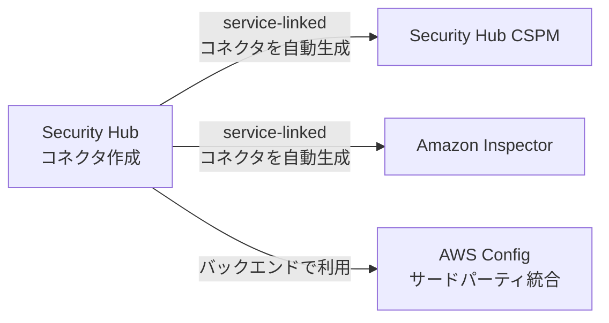
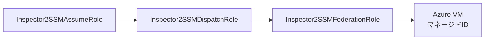

こんにちは、CSC の [CloudFastener](https://cloud-fastener.com/) というプロダクトで TAM のポジションで働いている平木です！

皆さんはマルチクラウドで運用していますか？

昨日、「AWS Security Hub は、統合セキュリティ管理を Microsoft Azure に拡張します。」というアップデートが発表されました。

https://aws.amazon.com/jp/about-aws/whats-new/2026/06/aws-security-hub-supports-monitoring-microsoft-azure/

マルチクラウド環境のセキュリティ統制に長年課題を感じてきた方であれば、このニュースにピンと来たのではないでしょうか？

この記事では、機能の技術的な仕組みや前提条件・運用上のポイントを整理します。
「この機能でどんな組織課題が解決できるのか」という活用イメージも併せてお伝えできればと思います。

なお、Azure側スクリプトの実行からAWS側のコネクタ作成までの実際の構築手順は、別のScrapにハンズオン記録としてまとめていますのでご興味ありましたら見てみてください。

https://zenn.dev/khirasan/scraps/524c021ad08f44

:::message
**この記事の6行まとめ**
- Security Hub（新コンソール）がAzure VM、ACR、Function Apps、Azure認証情報の監視に対応した
- リソース構成評価は内部的にSecurity Hub CSPMが担っており、AWS側の知識・ワークフローだけでAzureのセキュリティ状態を一元的に把握できるようになる
- 裏側ではOIDCフェデレーション認証とAWS Configのサードパーティ統合機能が使われている
- Azure側でアプリ登録・Event Hub構築、AWS側でコネクタ作成という手順で連携する
- 初回30日間は無料でトライアルでき、料金体系はAWSリソースと同じユニット課金・スキャン単価がそのままAzureにも適用される
- AWS Config・SSMのAPI仕様は公式ドキュメントとAWS公式のAPIリファレンスに基づき確定情報として記載している
:::

## 何ができるようになったか

まず、今回のアップデートで技術的に何が可能になったのかを端的に整理します。  
活用イメージの前提として押さえておくと、以降の内容が理解しやすくなります。

- 対応リソース: Azure VM／ACR／Function Apps／Azure認証情報（詳細は後述）
- 関与するAWSサービス
  - Security Hub: コネクタ作成・相関分析
  - Security Hub CSPM: 構成評価の実体
  - Amazon Inspector: 脆弱性スキャン
  - AWS Config: サードパーティ統合によるAzure構成情報の収集
  - SSM: Azure VMスキャン時のマネージドID連携

データの流れをおおまかに図示すると、以下のようになります。

流れを整理すると、以下のようになります。

1. Azure環境の情報がEvent Hub経由でAWS Configに取り込まれる
2. Security Hub CSPMとAmazon Inspectorがそれぞれ構成評価・脆弱性スキャンを行う
3. 資産インベントリ用のレコーダー（Security Hub Assets）が、構成評価とは別に広範なAzureリソースを棚卸しし、資産可視化やエクスポージャー相関分析の基盤データとして使われる
4. 最終的にAWSリソースと同じOCSF形式の検出結果としてSecurity Hub上に集約される

図の詳細は後述の「アーキテクチャ」で解説します。  
対応リソースや検出内容の詳細な対応状況は後述の「対応リソースと機能の全体像」でまとめています。

:::message
**Security Hub経由 と CSPM直接作成、2つの入り口があります**
今回のAzure統合は、Security Hub側でコネクタを作成する形が基本です。この場合、Security Hub CSPMとAmazon Inspectorに対してservice-linkedなコネクタが自動的に作成されます。

一方で、**Security Hub CSPM側から独立してAzure統合を直接作成することも可能**です。この場合はSecurity Hub本体を経由しないため、Amazon Inspectorとの連携やSecurity Hub側のFindings一覧への集約は行われません。CSPM単体でのAzure構成評価だけを使いたい場合の選択肢として覚えておいてください。
:::

## この機能で何が変わるのか

この機能がもたらす変化を、運用の観点で見ていきます。

### マルチクラウド運用における「見えない資産」の問題

複数クラウドを利用している組織でよくあるのが、「AWSのセキュリティ体制は整っているが、Azure側は別チームが個別に管理していて全体像が見えない」という状態です。

特に、買収・合併や事業部ごとの独自導入によって結果的にAzureリソースが混在しているケースでよく見られます。セキュリティ部門がAzureの構成ミスやインターネット公開状況をリアルタイムに把握できていないことが少なくありません。

Security Hubの新コンソールがAzureを直接監視できるようになったことで、AWSのSecurity Hubコンソール1つでAWS・Azure両方の検出結果を横断的に確認できるようになります。

単に画面が1つにまとまるだけでなく、すでに運用している以下のような仕組みを、そのままAzureに対しても使い回せるようになる点が大きいです。

- Security Hubのアラート対応フロー
- Findingsの重要度判定基準
- SOAR連携

### Azureの専門知識がなくてもAzureのリスクに気づける

もう一つ大きいのが、「Azureに詳しい人材がいなくても、AWS側の知識だけでAzureのセキュリティ状態を把握できる」という点です。

CIS Azure Foundations Benchmark v4.0.0のようなAzure固有の基準に基づく評価結果が、使い慣れたFindings形式（OCSF）で表示されます。そのため、Azure Portalの操作に不慣れなセキュリティ担当者でも、AWSと同じ感覚でトリアージ作業を進められます。

セキュリティ基準にはCIS Azure Foundations Benchmark v4.0.0に加えて、AWS独自の基準であるAzure Foundational Security Best Practices v1.0.0も用意されています。

これは特に、AWSを主軸としながら一部のワークロードだけAzureで動かしている組織にとって、大きな運用負荷削減につながるはずです。M&Aによって急にAzure環境の面倒を見ることになったセキュリティチームにとっても同様です。

### CSPMダッシュボード統合による運用負荷軽減

従来、AWSとAzure両方のセキュリティ体制を統制しようとすると、Microsoft Defender for CloudとSecurity Hubの両方を個別に運用する必要がありました。担当者が2つの画面を行き来しながら状況を突き合わせるか、サードパーティの製品を使うしかない状態でした。

今回のアップデートでは、Microsoft Defender for CloudのアラートをEvent Hub経由でSecurity Hubに取り込む連携も用意されています。Defenderで検出したアラートも含めてSecurity Hub側に一本化できます。

さらに、エクスポージャー相関分析機能を使えば、AWSとAzureにまたがるリスクの関連性を分析できます。例えば「AWS側で外部公開されているAPIがAzure上の脆弱なVMと連携している」といった、単一クラウドの視点では気づきにくいリスクを可視化できるようになります。

この相関分析やAWS・Azure横断の資産可視化を支えているのが、後述する「Security Hub Assets」用のConfigレコーダーが収集する資産インベントリデータです。構成評価（CSPM）よりも遥かに広いリソースタイプを棚卸ししており、相関分析の材料として使われていると考えられます。

### Network Scanningによる「実際に到達可能か」の検証

Azureコネクタの作成画面には `Network scanning` という設定項目があります。

これはSecurity Hubが提供する「ネットワークスキャン」機能です。セキュリティグループやNACLの設定を静的に評価する従来の「コントロールプレーン分析」とは異なる仕組みです。AWS所有のインフラから対象リソースに向けて実際にTCP接続を試行し、以下を能動的に検証します。

- 本当にインターネットから到達可能か
- 到達可能な場合は何のサービスが動いているか

対象はEC2・EIP・各種ロードバランサーといったAWSリソースに加えて、Azure側はパブリックIPアドレスが対象になります。  

Azure VM自体を直接スキャンするのではなく、そのVMなどに紐づくパブリックIPが対象という位置づけです。  
スキャン結果はAWSリソースの場合と全く同じ形式（OCSF）の検出結果として、クラウドプロバイダーの区別なく同じ画面に表示されます。

このNetwork Scanningが実測する「到達可能性」のデータは、先述のエクスポージャー相関分析の入力の一つになっています。  
つまり「実際に外部から到達できる」という実測結果と、「設定ミスがある」という静的な評価を掛け合わせることで、優先度の高い露出リスクを絞り込める設計になっていると考えられます。

https://docs.aws.amazon.com/securityhub/latest/userguide/securityhub-v2-network-scanning.html

:::message alert
Network Scanningは実際にネットワーク越しにプローブを送信する能動的なスキャンです。  
有効化するリソースやスキャン対象外にしたいリソース（`SecurityHubNetworkScanExclusion` タグで除外可能）は事前に整理しておくことをおすすめします。
:::

## 対応リソースと機能の全体像

現時点で対応しているリソースと検出内容は以下のとおりです。

| 項目 | 内容 |
|---|---|
| 対応リソース | Azure Virtual Machines、Azure Container Registry (ACR)、Azure Function Apps、Azure認証情報（Entra ID関連） |
| 検出内容 | 設定ミス、インターネット公開状況、ソフトウェア脆弱性 |
| 準拠標準 | CIS Azure Foundations Benchmark v4.0.0、Azure Foundational Security Best Practices v1.0.0 |
| 脆弱性スキャン | Amazon Inspectorと連携し、Azure VM／Function Apps／ACRの脆弱性スキャンが可能（VMスキャンには同一リージョンでのSSM設定が必要） |
| Network Scanning | AzureのパブリックIPアドレスに対して能動的な到達可能性検証を実施（コネクタ作成時デフォルト有効、除外はタグで指定可能） |
| Defender連携 | Microsoft Defender for CloudのアラートをEvent Hub経由でOCSF形式に変換し取り込み可能 |
| 料金 | Azure統合作成後30日間は無料トライアル。トライアル終了後はAWSリソースと同等の料金体系（詳細は後述の「料金について」を参照） |
| 非対応リージョン | 中東(UAE)、中東(バーレーン)、アジア太平洋(台北)、アジア太平洋(ニュージーランド) |
| 対応Azure環境 | Azure商用クラウドのみ（Azure Government、Azure Chinaは非対応） |

「設定ミス」「インターネット公開状況」「ソフトウェア脆弱性」という3つの検出軸は、AWSリソースに対してSecurity Hub CSPMがすでに提供しているものと同じ考え方です。  
つまり、Azureに対しても同じ物差しでリスクを評価できるようになったということになります。

## 料金について

Azure統合を検討する上で気になるのが料金です。  
公式の料金ページ（[Security Hub Pricing](https://aws.amazon.com/security-hub/pricing/)、[Amazon Inspector Pricing](https://aws.amazon.com/inspector/pricing/)）の内容をもとに整理します。

### Security Hub（Essentialsプラン）: リソースユニット課金

Security HubのEssentialsプランは、AWSリソースとAzureリソースを区別しない統合されたリソースユニット課金です。  
1ユニットあたり月額 **$3.75** で、リソースの種類ごとに以下の換算率でユニット数が計算されます。

| リソース種別 | ユニットへの換算率 |
|---|---|
| EC2インスタンス または Azure VM | 1リソース = 1ユニット |
| ECRイメージ または Azureコンテナイメージ | 18リソース = 1ユニット |
| Lambda関数 または Azure Function Apps | 12リソース = 1ユニット |
| IAMユーザー/ロール または Azure ID（Entra ID） | 125リソース = 1ユニット |

公式ドキュメントでも「1 EC2 or Azure VM = 1 unit」のように明記されており、AWSリソースとAzureリソースが完全に同じ単価・同じ換算率で扱われることが分かります。  
Azureだからといって割高になる、あるいは別建ての料金体系になる、ということはありません。

なお、Azure統合を作成すると、Azureリソースの監視には独立した30日間の無料トライアルが適用されます。  
すでにAWSリソースでSecurity Hubを使い込んでいて無料トライアル期間が終わっている場合でも、Azure統合分については改めて30日間無料でリソース数や課金イメージを確認できます。

### Amazon Inspector: スキャン対象ごとの従量課金

Azure VM・ACR・Function Appsの脆弱性スキャンはAmazon Inspectorの課金対象です。  
スキャン種別ごとの月額単価は以下の通りです（AWSリソースに対するEC2・ECR・Lambdaのスキャン料金と同一の単価が適用されます）。

| Azureリソース | 課金内容 | 単価 |
|---|---|---|
| Azure VM | エージェントベーススキャン（VM Scanner agent） | 月額 $1.258/VM |
| Azure Container Registry (ACR) | 初回スキャン | $0.09/イメージ |
| Azure Container Registry (ACR) | 再スキャン | $0.01/イメージ |
| Azure Function Apps | コード依存関係の脆弱性スキャン | 月額 $0.30/アプリ |

Inspectorには最低利用料金や前払いのコミットメントはなく、スキャンした分だけ課金される仕組みです。  
新規アカウントであれば15日間の無料トライアルも利用できます。

### AWS Configのサードパーティ統合は追加課金なし

前述の通り、Azure統合のバックエンドではAWS Configのサードパーティリソースタイプ統合が使われていますが、これは独立した課金対象ではありません。  

Security Hubの料金ページにもAWS Config単体の料金は登場せず、AWS Config側の構成情報収集はSecurity Hubの料金体系に含まれる形になっています。  

レコーダー設定や記録件数を気にして個別にコストを計算する必要はありません。  
後述の「アーキテクチャ」で触れる通り、実際にバックエンドで動いている6つのAzure専用Configレコーダーは `recordingScope: INTERNAL` として作成されています。

:::message
料金は変更される可能性があるため、実際の見積もりの際は必ず最新の公式ページ（[Security Hub Pricing](https://aws.amazon.com/security-hub/pricing/)、[Amazon Inspector Pricing](https://aws.amazon.com/inspector/pricing/)）を確認してください。
:::

## アーキテクチャ: どうやってAzureの情報を取り込んでいるのか

技術的な裏側の仕組みを理解しておくと、トラブルシューティングや運用設計がしやすくなります。全体のデータフローは大きく以下のステップに分かれます。

### Security Hubコネクタという接続の仕組み

今回のAzure対応の中心にあるのは、Security Hubに新設された「コネクタ」という概念です。

コネクタは、AWS外部のクラウド・SaaSといった環境をSecurity Hubに接続するための共通の窓口で、今回はその第一弾としてAzureがサポートされた、という位置づけになります。

https://docs.aws.amazon.com/securityhub/latest/userguide/securityhub-v2-azure.html

利用者から見ると、コネクタを1つ作成するだけで、対象環境（今回であればAzureテナント）の構成情報・アクティビティログ・脆弱性スキャン結果がSecurity Hub側に継続的に取り込まれます。AWSリソースの検出結果と同じ画面・同じOCSF形式で扱えるようになる点がポイントです。

個別のサービス（Security Hub CSPM、Inspector、Config）をそれぞれ外部クラウド向けに設定する必要はありません。コネクタを作成した瞬間にバックエンドでこれらのサービス間の連携が自動的にセットアップされる点が特徴です。

スコープ（対象Subscription・Region）はSecurity Hub側の設定に一致し、変更もSecurity Hub側でのみ可能です。  
CSPM・Inspector側のservice-linked統合を直接変更することはできません。冒頭で触れた通り、Security Hub CSPM側に独立したAzure統合を直接作成する場合はこの限りではありません。

このため、Azure向けの手順として紹介している内容の多くは、実際には次の2つの組み合わせだと捉えると理解しやすくなります。

- Security Hubコネクタを作成・運用するための一般的な作業
- Azure固有の準備作業（アプリ登録やEvent Hub構築など）

今後、他の外部クラウドやSaaSがSecurity Hubの監視対象として追加される場合も、この「コネクタ」という枠組みが再利用される可能性が高いと考えられます。

### 1. Azure側の準備

https://docs.aws.amazon.com/securityhub/latest/userguide/securityhub-v2-azure-setup-azure.html

Azure Entra IDにアプリを登録し、OIDCフェデレーテッドID資格情報を設定します。  
ここでのポイントは、クライアントシークレットを発行・管理する必要がないことです。

AWS側が発行するToken Issuer URLをissuerとし、AWS ConfigのサードパーティフェデレーションロールのARNをsubjectとした資格情報をAzure側に登録します。これにより、AWSがAzure ADトークンを取得できるようになります。  
長期的なシークレットローテーションの運用負荷がない点は、セキュリティ運用上のメリットとして評価できます。

あわせて以下の設定も行います。

- RBACのReaderロールをテナントルート管理グループスコープで付与
- Graph API権限（`Directory.Read.All`、`AuditLog.Read.All`、`Policy.Read.All`）
  - Azure Global Administratorによるadmin consentが必要

さらに、Activity LogやAudit Logをリアルタイムに取り込むためのAzure Event Hubを構築します。

### 2. AWS側でのコネクタ作成

https://docs.aws.amazon.com/securityhub/latest/userguide/securityhub-v2-azure-setup-securityhub-v2.html

AWS側ではまずIAM Outbound Identity Federationを有効化し、Token Issuer URL（`https://{uuid}.tokens.sts.global.api.aws` の形式）を取得します。  
このURLをAzure側のフェデレーテッドID資格情報の設定に使います。

準備が整ったら、Security HubのコンソールでAzureコネクタを作成します。

### 3. バックエンドの動作: AWS Configのサードパーティ統合

コネクタを作成すると、バックグラウンドでAWS Configのサービスリンクロール `AWSServiceRoleForConfigThirdParty` が自動的に作成されます。信頼するプリンシパルは `thirdparty.config.amazonaws.com` です。

https://docs.aws.amazon.com/config/latest/developerguide/using-service-linked-roles-config-third-party.html

このロールにアタッチされる `AWSConfigThirdPartyServiceRolePolicy` には、以下の権限が含まれます。このロールを通じてAWS ConfigがAzureリソースの構成情報を継続的に収集します。

- `sts:GetWebIdentityToken`（audienceを `api://AzureADTokenExchange` に限定）
- `config:PutEvaluations`
- `config:GetComplianceDetailsByConfigRule`
- `cloudwatch:PutMetricData`（namespaceを `AWS/Config` に限定）

実際に構築済みの環境で `list-configuration-recorders` を実行して確認したところ、単一のレコーダーではありませんでした。用途別に**6つのAzure専用サービスリンク型Configレコーダー**が自動生成されていました。

いずれもroleARNは共通で `AWSServiceRoleForConfigThirdParty` です。レコーダー名のサフィックスにはAzureテナントID（`{tenant-id}`）が使われています。

| レコーダー名（サフィックスは`{tenant-id}`） | プリンシパル | 用途 | 記録対象の目安 |
|---|---|---|---|
| `AzureConfigurationRecorderForSecurityHubCSPM_{tenant-id}` | `azure.cspm.securityhub.amazonaws.com` | 構成評価 | 約50種（VM、Graph関連、Security関連、Storage関連など） |
| `AzureConfigurationRecorderForSecurityHubAssets_{tenant-id}` | `azure.assets.securityhub.amazonaws.com` | 資産インベントリ | 140種以上（API Management、機械学習、Synapse、Cognitive Servicesなども含む広範なリソース） |
| `AzureConfigurationRecorderForInspector2VM_{tenant-id}` | `vm.azure.inspector2.amazonaws.com` | VM脆弱性スキャン | VM、スケールセット、ネットワークインターフェース、パブリックIP |
| `AzureConfigurationRecorderForInspector2ContainerImage_{tenant-id}` | `container-image.azure.inspector2.amazonaws.com` | ACRイメージスキャン | Container Registry関連 |
| `AzureConfigurationRecorderForInspector2Serverless_{tenant-id}` | `serverless.azure.inspector2.amazonaws.com` | Function Appsスキャン | Web Apps／Functions関連 |
| `AzureConfigurationRecorderForSSM_{tenant-id}` | `azure.ssm.amazonaws.com` | SSM連携 | VM／スケールセットとその拡張機能 |

:::details 各レコーダーが記録するAzureリソースタイプの例
- CSPM用
  - `microsoft.compute/virtualmachines`
  - `microsoft.graph/user`
  - `microsoft.graph/policies/conditionalaccesspolicy`
  - `microsoft.security/pricings`
  - `microsoft.storage/storageaccounts` など約50種
- Assets用
  - `microsoft.apimanagement/service`
  - `microsoft.machinelearningservices/workspaces`
  - `microsoft.synapse/workspaces`
  - `microsoft.cognitiveservices/accounts`
  - `microsoft.network/applicationgateways` など140種以上
  - CSPMが評価する構成項目よりも、資産の棚卸し対象として遥かに広いリソースタイプをカバーしています
:::

このうち、**すべてのAzure専用レコーダーは `recordingScope` が `INTERNAL`** になっている点が重要です。  

通常、AWS Control Towerなどで作成される標準的なレコーダー（`recordingScope: PAID`）とは異なります。  
`INTERNAL` スコープのレコーダーはユーザーのAWS Config利用料としてカウントされません。  

なお、AWS側のリソースについても同様の仕組みが使われています。`AWSConfigurationRecorderForSecurityHubCSPM` と `AWSConfigurationRecorderForSecurityHubAssets` という2種類のINTERNALレコーダーが内部的に動いています。Security Hubは構成評価用と資産インベントリ用のレコーダーを2系統持つ設計のようです。

:::message
レコーダー名・関連ロール名のサフィックスにはAzureテナントIDが使われています。複数のAzureテナントと連携する場合、このサフィックスを見ればどのテナント向けのレコーダー・ロールかを判別できます。
:::

同時に、Security Hub CSPMとAmazon Inspectorへのサービスリンク統合も自動的に生成されます。これにより、収集された構成情報がSecurity HubのFindingsとして評価されるだけでなく、Inspectorによる脆弱性スキャンの対象にもなります。公式ドキュメントでは、今回のAzure統合における実際のリソース構成評価はSecurity Hub CSPMが担う、と明記されています。

### 4. Amazon InspectorによるVMスキャンの仕組み

Azure VM上での脆弱性スキャンについては、少し複雑な認証の流れになります。  

IAM OIDC IDプロバイダ（issuer: `https://sts.windows.net/{tenant-id}/`）を作成し、AWS SSM側のロールを経由して、Azure VM上のシステム割り当てマネージドID経由でアクセスする構成です。VM側にAWSのエージェントを個別にインストールするのではなく、マネージドIDを軸にした認証フェデレーションでスキャンを実現しています。

実際の環境で `list-roles` を確認したところ、SSM側には `Inspector2SSMFederationRole` 単体ではありませんでした。**3つのロールがチェーン状に連携する構成**になっていました（いずれもサフィックスはAzureテナントID）。

- `Inspector2SSMAssumeRole_{tenant-id}`: 信頼するプリンシパルは `ssm.amazonaws.com`（`aws:SourceAccount` 条件付き）
- `Inspector2SSMDispatchRole_{tenant-id}`: スキャンジョブの振り分けを担う中間ロール
- `Inspector2SSMFederationRole_{tenant-id}`: 信頼するプリンシパルはアカウントrootと `ssm.amazonaws.com`
  - ただしrootからのAssumeRoleは `aws:PrincipalTag/caller=SSM` かつ、呼び出し元ARNが上記の `Inspector2SSMAssumeRole` / `Inspector2SSMDispatchRole` に限定される条件付き

つまり `AssumeRole → DispatchRole → FederationRole` という多段のロールチェーンを経て、最終的にAzure VM上のマネージドIDにフェデレーションする構成です。  
単一のロールがマネージドIDに直接アクセスするわけではなく、各ロールの責務を分離した設計になっています。

### 5. 検出結果の集約

収集されたすべての情報は、AWSリソースの検出結果と同様にOCSF（Open Cybersecurity Schema Framework）形式に統一されます。  
Security Hubコンソール上で一元的に表示され、初期の検出結果は15〜30分程度で確認できます。全リソースの完全な評価には最大24時間かかるとされています。

## 構築時の前提条件とポイント

Azure側スクリプトの実行やAWS側でのコネクタ作成といった具体的な手順は、実際に構築した際の記録として下記のScrapにまとめています。

ここでは、事前に押さえておくべき前提条件と、構築後の確認・運用のポイントを整理します。

https://zenn.dev/khirasan/scraps/524c021ad08f44

### 前提条件

https://docs.aws.amazon.com/securityhub/latest/userguide/securityhub-v2-azure-prereqs.html

**AWS側**

- コネクタ作成対象のアカウント・リージョンで Security Hub と Security Hub CSPM の両方が有効化されていること
- コネクタ作成を行うIAMプリンシパルに `config:GetConnector` / `config:ListConnectors` / `config:PutConnector` の権限があること
- IAM Outbound Identity Federationが有効化され、Token Issuer URL（`https://{uuid}.tokens.sts.global.api.aws` 形式）を取得済みであること

**Azure側**

- 対象がAzure商用クラウドであること（Azure Government、Azure Chinaは非対応）
- 構成作業を行うアカウントにMicrosoft Entra IDの Global Administrator ロールがあること
- Graph API権限3つ（`Directory.Read.All` / `AuditLog.Read.All` / `Policy.Read.All`）についてadmin consentを行えること
- テナントルート管理グループスコープでReaderロールを付与できること

Azure側ではアプリ登録・RBAC設定・Event Hub構築が必要です。AWS側ではIAM Outbound Identity Federationの有効化とコネクタ作成が必要になります。  
具体的なコマンドや画面操作は前述のScrapを参照してください。  

ここでは構築時に押さえておきたいポイントのみ触れます。

- Azure側のフェデレーテッドID資格情報は、AWSが発行するToken Issuer URLをissuerに設定します
  - subjectにはAWS ConfigのサードパーティフェデレーションロールのARNを設定します
  - クライアントシークレットの発行・ローテーションが不要な点はセキュリティ運用上のメリットです
- Event Hub名前空間に付与するタグ（`AWSConfig-{account-id}-{region}=activitylog` の形式）は、AWS Config側がどのEvent Hubを参照すればよいかをタグベースで自動発見するための仕組みです
  - 命名規則やタグを間違えると、Event Hub自体は正しく構築できていてもAWS Config側から見つけてもらえません
- コネクタ名は作成後に変更できないため、命名規則をあらかじめ決めておくことを推奨します
- 監視対象のRegionsは、Entra ID／Graph評価に関わるコントロールを機能させるためグローバルリージョンスコープを含める必要があります

### ヘルスチェックの観点

構築が完了したら、以下の観点で状態を確認します。

- `Integrations` 画面でコネクタのステータスを確認する
- FindingsをResourceCloudProviders = Azureでフィルタし、Azureリソースに対する検出結果が表示されているか確認する
- CIS Azure Foundations Benchmark v4.0.0の標準ページで、各コントロールのPASSED/FAILEDステータスを確認する

前述の通り、初期の検出結果が出るまでには時間がかかります。すぐにFindingsが出ないからといって焦る必要はありません。

## Amazon Inspectorと連携したAzure VM脆弱性スキャンについて（オプション）

Azure VMの脆弱性スキャンまで行いたい場合は、追加でInspector向けの設定が必要です。  
認証方式は前述の「4. Amazon InspectorによるVMスキャンの仕組み」の通りです。具体的な手順（IAM OIDC IDプロバイダの作成、Inspector・SSM向けフェデレーションロールの作成、対象VMへのマネージドID付与など）は前述のScrapにまとめています。ここでは運用上のポイントのみ触れます。

- スキャン対象のVMが多い場合、マネージドIDの付与漏れを防ぐためAzure PolicyのDeployIfNotExistsポリシーで自動付与する運用が現実的です

## 制限事項

運用設計の前に把握しておきたい制限事項をまとめます。

- Entra ID／Graphを評価対象とするコントロールは、グローバルリージョンスコープでの監視設定が必須です。特定リージョンのみをスコープに指定していると、これらのコントロールのFindingsが生成されません
- ヘルスステータスは結果整合性で更新されるため、原因を修正してから実際に `Healthy`（Connected）に戻るまで最大24時間かかることがあります。修正直後に `Degraded` 等の表示が残っていても、必ずしも問題が継続しているとは限りません
- コネクタのスコープに新しいリージョンを追加する場合は、そのリージョン用のEvent Hubを新たに構築する必要があるため、Azure側のセットアップスクリプトを再実行する必要があります
- コネクタ名およびConfig側のコネクタ自体は作成後の変更ができません。変更したい場合は削除して作り直す必要があります
- Azure Government、Azure Chinaは非対応です
- 現時点における非対応リージョンが4つあります（中東・UAE、中東・バーレーン、アジア太平洋・台北、アジア太平洋・ニュージーランド）

## トラブルシューティング

設定時によく遭遇しそうな症状と、考えられる原因をまとめておきます。

| 症状 | 考えられる原因 |
|---|---|
| コネクタが `Unhealthy` と表示される | フェデレーテッドID資格情報のissuer／subjectの値の誤り、RBAC Readerロールが正しいスコープ（テナントルート管理グループ）に付与されていないこと。Token Issuer URLの記述ミスはよくある原因です |
| 30分経過してもFindingsが表示されない | Graph API権限のadmin consentが正しく完了していない、監視対象のSubscription・Regionの選択が意図通りでない（初期評価には15〜30分程度かかるのが通常です） |
| 特定のコントロールがNO_DATAになる | Entra ID／Graph評価に関わるコントロールに必要なグローバルリージョンスコープでの監視設定が漏れている |
| 一部のサブスクリプションのみFindingsがある | 診断設定によるActivity Log／Audit LogのEvent Hubへのエクスポートは、サブスクリプションごとの設定であることを見落としている（すべての監視対象サブスクリプションで個別に確認が必要） |

## 連携を解除する場合

コネクタが不要になった場合は、`Integrations` 画面からコネクタを選択し `Delete` を実行します。これによりCSPM・Inspector側のサービスリンク統合も自動的に削除されます。

https://docs.aws.amazon.com/securityhub/latest/userguide/securityhub-v2-azure-delete.html

いくつか運用上の注意点があります。

- 削除しても、既存のFindingsは90日間保持されます
- Azure側で作成したアプリ登録・Event Hubは自動削除されないため、不要であれば手動で削除する必要があります
- 削除から6時間以内に再作成すると、検出結果が反映されるまで最大6時間かかる場合があります

## まとめ

今回は、AWS Security HubがAzureの監視にも対応した件について紹介しました。

AWS Security HubのAzure監視対応は、単なる「対応リソースの追加」ではなく、マルチクラウド環境のセキュリティ統制を一元化するための重要な一歩だと感じています。  
特に、AWS側の運用知識やワークフローをそのままAzureにも適用できる点は、Azureの専任担当者を置きにくい組織にとって大きな価値があります。  
一方で、Azure側のアプリ登録やEvent Hub構築など、事前準備には一定の作業が必要です。まずは無料トライアル期間を使って、自組織のAzure環境でどの程度のFindingsが検出されるかを確認してみることをおすすめします。

また、今回新規で追加されたAPIの構造を見るとどうやらAzureだけを視野に入れた構造ではないことが見えてきたりもしているので、今後の更なるアップデートにも期待が高まってきます。

この記事がどなたかの役に立つと嬉しいです。
