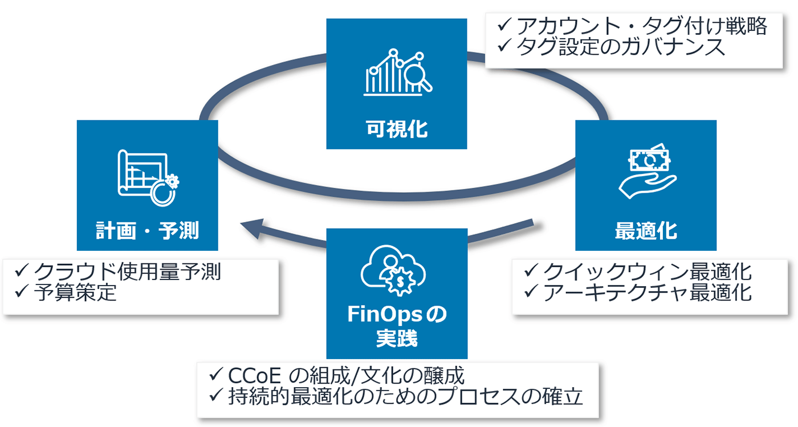
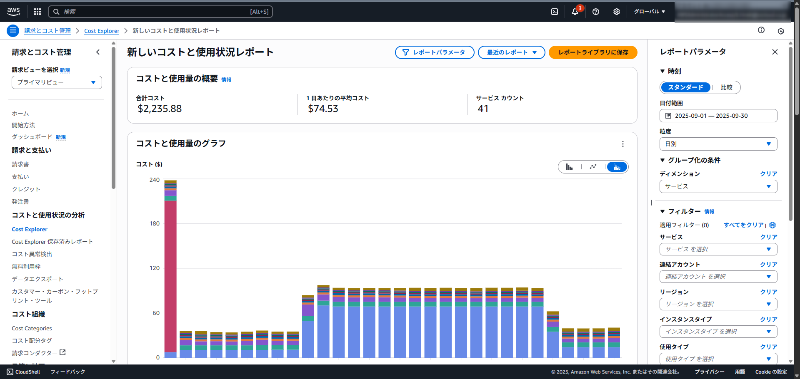
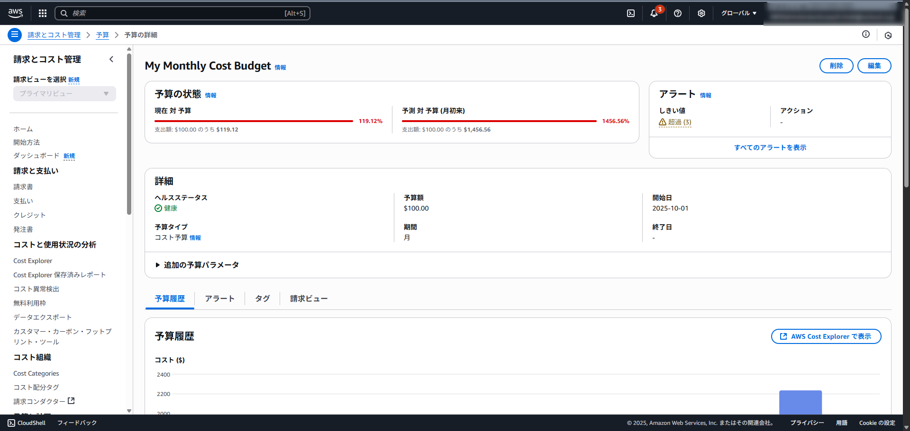
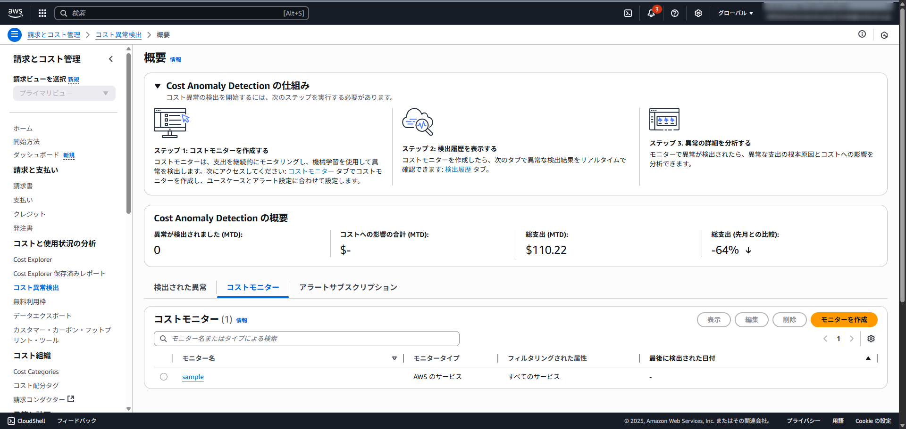

こんにちは、CSC の平木です！

皆さんは AWS の利用料金、しっかり管理できていますか？
「気づいたら想定より高額になっていた…」なんて経験、あるのではないでしょうか。

先日、社内で「第 1 回 AWS コスト最適化勉強会」開催したため、その内容をブログ記事として再構成し、公開したいと思います。

## コスト最適化 ≠ コスト削減

「コスト最適化」と聞くと、多くの人が「コスト削減」を思い浮かべるかもしれません。
しかし、この 2 つは似て非なるものです。  

コスト最適化の本質は、単に費用を削ることではなく、サービスに求められるパフォーマンスや信頼性を維持しつつ、無駄な出費をなくすことにあります。

- 行き過ぎたコスト削減の罠:
    - **機会損失**
      - コストを切り詰めすぎた結果、サーバーがリクエストを捌ききれず、ビジネスチャンスを逃してしまう。
    - **復旧の遅れ**
      - 必要なセキュリティ対策やバックアップの費用まで削減してしまい、障害発生時に迅速な復旧ができず、結果的に大きなビジネス損失に繋がる。

「安かろう悪かろう」では意味がなく、ビジネスの成長を止めない、賢いコスト管理こそが「コスト最適化」です。

## なぜコスト最適化をするのか

ビジネスの基本はシンプルで、「利益 = 売上 - 経費」です。利益を最大化するには、売上を伸ばすか、経費を減らすかの 2 択です。

多くの現場では売上を伸ばすことに目が行きがちですが、経費の削減も同じくらい重要です。  
100 万円の売上を新たに作るのと、100 万円の無駄な経費を削減するのでは、どちらが早く達成できるでしょうか？

サービスの利益を本気で考えるなら、コスト最適化は後回しにせず、日々の業務の中で取り組むべき重要なテーマなのです。

:::message
今回は AWS 内でのコスト最適化に焦点を当てますが、もちろん、サービス内容によっては他社クラウドへの移行が最適な選択となる場合もあります。
:::

## AWS におけるコストの種類

AWS はこれまでに 100 回以上の値下げを実施してきましたが、その恩恵を最大限に受けるには、私たちがコスト構造を正しく理解する必要があります。AWS のコストは、主に以下の 7 種類に分類されます。

| 種類 | 概要 | 代表的な削減例 |
| :--- | :--- | :--- |
| **コンピューティング使用料** | EC2, Fargate, Lambda など、計算処理を行うリソースの利用時間や回数に応じた料金。 | ・未使用リソースの停止 ・ Savings Plans (SP) やリザーブドインスタンス (RI) の活用 ・スポットインスタンスの利用 |
| **ストレージ料金** | S3, EFS, CloudWatch Logs など、データを保管する容量や期間に応じた料金。 | ・ストレージクラスの変更（アクセス頻度に応じた使い分け） ・ライフサイクルルールの設定 ・不要なデータの削除 |
| **データ転送費** | AWS からインターネットへ、またはリージョン間でデータを転送する際のデータ量に応じた料金。 | ・ VPC エンドポイントを活用し、AWS 内部の通信に切り替える ・ CloudFront などの CDN を利用する |
| **リクエスト課金** | S3, API Gateway, Lambda など、サービスへのリクエスト回数に応じた料金。 | ・ API キャッシュや CloudFront キャッシュを導入し、オリジンへのリクエストを減らす |
| **データ処理料金** | NAT Gateway や ELB など、特定のサービスがデータを処理した量に応じた料金。 | ・ VPC エンドポイントを活用して、NAT Gateway を通過するトラフィックを削減する |
| **ライセンス費用** | OS や特定のソフトウェアを利用するためのライセンス料金。 | ・ライセンス体系を見直す ・ Bring Your Own License (BYOL) を検討する |
| **リージョン毎の価格差** | 同じサービスでも、利用するリージョンによって価格が異なる。 | ・要件を満たせるなら、東京リージョンより安価なリージョン（バージニア北部など）を検討する |

## まず、何から始めればいいの？

コスト最適化の全体像を掴むために、AWS は**Cloud Financial Management (CFM)** というフレームワークを提唱しています。  
これは、コストの「可視化」「最適化」「計画」「FinOps の実践」という 4 つのサイクルを回すことで、組織的にコスト管理を改善していく考え方です。

*(出典: AWS Well-Architected Framework)*

とはいえ、いきなり全部をやるのは大変です。
そこで、最初のステップとして **「最低限の可視化」** と **「クイックウィン最適化」** から始めることを強くお勧めします。

### Step 1: まずは現状把握をする AWS の「可視化」ツール

最初の段階では、凝ったダッシュボードは不要です。  
まずは AWS に標準で備わっている無料のツールを使って、自分たちのコストがどうなっているのかを把握しましょう。

#### ① AWS Cost Explorer
AWS の利用コストと使用状況をグラフで分かりやすく表示してくれるツールです。サービス別、タグ別などで費用をドリルダウンできるため、「何に」「どれくらい」使っているのかを一目で把握できます。将来のコスト予測機能も便利です。

#### ② AWS Budgets
設定した予算（コスト、使用量など）を超えそうになると、アラートで通知してくれるサービスです。「今月は〇〇ドルまで」といった予算を設定しておけば、使いすぎを未然に防ぐことができます。

#### ③ AWS Cost Anomaly Detection
機械学習を用いて、普段の利用パターンから逸脱した「異常なコスト増」を自動で検出してくれる機能です。予期せぬ設定ミスや不正利用による高額請求を早期に発見するのに役立ちます。

### Step 2: すぐに効果が出るクイックウィン最適化

現状を把握できたら、次はいよいよ最適化の実践です。  
まずは簡単かつ効果の大きい、以下の 4 つに取り組んでみると良いです。

#### ① インスタンスの再選定 (Right-Sizing)

- **インスタンスタイプを見直し**
  - CPU やメモリの使用率をチェックし、過剰なスペックのインスタンスはより小さなサイズに変更（スケールダウン）します
  - AWS Compute Optimizer を使えば、推奨のインスタンスタイプを提示してくれます。
- **コミットメント契約の適用**
  - 24 時間 365 日稼働する本番環境の EC2 や RDS などには、**Savings Plans (SP)** や**リザーブドインスタンス (RI)** の適用が効果的です
  - 1 年または 3 年の利用を約束することで、オンデマンド料金から**最大 70%以上**もの割引を受けられます。
  - 特にこだわりがなければ、EC2 以外（Fargate や Lambda）にも適用できる**Compute Savings Plans**から検討するのがお勧めです

#### ② 未使用リソースの停止・削除

- **使っていないリソースは迷わず削除:**
  - 検証用に作ったまま放置されているサーバー、古くなった EBS スナップショットなどはありませんか？
  - 「塵も積もれば山となる」です。不要なリソースは定期的に棚卸しして削除しましょう。
- **Trusted Advisor を活用する:**
  - ビジネスサポート以上であれば、Trusted Advisor が長期間利用されていないリソースを自動でリストアップしてくれます。

#### ③ スケジューリング

- **開発・ステージング環境は夜間や休日に停止**
  - 決まった時間しか使わないサーバーは、使わない時間帯は停止しておくことで、コンピューティング費用を大幅に節約できます。Amazon EventBridge Scheduler やサードパーティのツールで簡単に自動化が可能です。
- **Auto Scaling の活用**
  - アクセスの増減に合わせてサーバー台数を自動で調整する Auto Scaling を設定すれば、常に最適なリソース量でサービスを運用できます。

#### ④ ストレージの再選定

- **アクセス頻度に応じたストレージクラスの最適化**
  - S3 を例に挙げると、複数のストレージクラスが用意されています
  - 頻繁にアクセスしないデータは、より安価なストレージクラス（例: S3 Standard-IA）に移動させるだけで、ストレージコストを削減できます
  - ライフサイクルポリシーを設定すれば、この移動を自動化することも可能です

## ただし、焦りは禁物

意気込んで最適化に取り組んでも、必ずしも計画通りに進むとは限りません。

- ビジネスが急成長している最中は、コストの増減要因を特定するのが難しいかもしれません。
- ストレージクラスを変更したら、アクセスパターンによっては逆にコストが増えてしまうケースもあります。
- 他部署が管理するリソースの要否を確認しようとすると、調整に時間がかかり、計画が遅々として進まないこともあります。

大切なのは、一度で完璧を目指すのではなく、計測と改善のサイクルを根気強く回していくことです。

## まとめ

今回は、AWS コスト最適化の第一歩として、基本的な考え方とすぐに実践できるアクションをご紹介しました。

- コスト最適化は、単なるコスト削減ではなく、ビジネスの価値を最大化するための重要な活動です。
- まずは「最低限の可視化」と「クイックウィン最適化」から始め、小さな成功体験を積むことが、継続の秘訣です。
- コスト最適化は一度やれば終わりではありません。定期的に見直し、改善を続ける文化を組織に根付かせることが理想です。

この記事が、どなたかの役に立つと嬉しいです。

## 関連リンク

- [AWS のコスト最適化/ 削減方法 15 選のご紹介](https://aws.amazon.com/jp/builders-flash/202404/aws-cost-optimizaton/)
- [AWS コスト最適化/削減方法 15 選 (Part2) のご紹介](https://aws.amazon.com/jp/builders-flash/202406/aws-cost-optimizaton-03/)
- [AWS コスト最適化/削減方法 10 選のご紹介](https://aws.amazon.com/jp/builders-flash/202305/aws-cost-optimization-2/)
- [AWS のコストを正しく把握するためには ~AWS のコストの種類についてまとめてみた~](https://speakerdeck.com/hotakanoda/awsnokosutowozheng-sikuba-wo-surutameniha-awsnokosutonozhong-lei-nituitematometemita)
- [AWS Well-Architected - コスト最適化の柱](https://docs.aws.amazon.com/ja_jp/wellarchitected/latest/cost-optimization-pillar/practice-cloud-financial-management.html)
- [【初心者向け】AWS のコスト最適化、何から始める？最初の一歩を徹底解説](https.dev.classmethod.jp/articles/aws-cost-optimization-first-step/)
