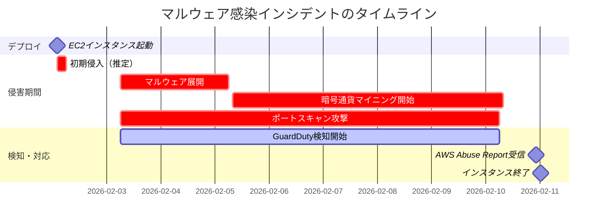
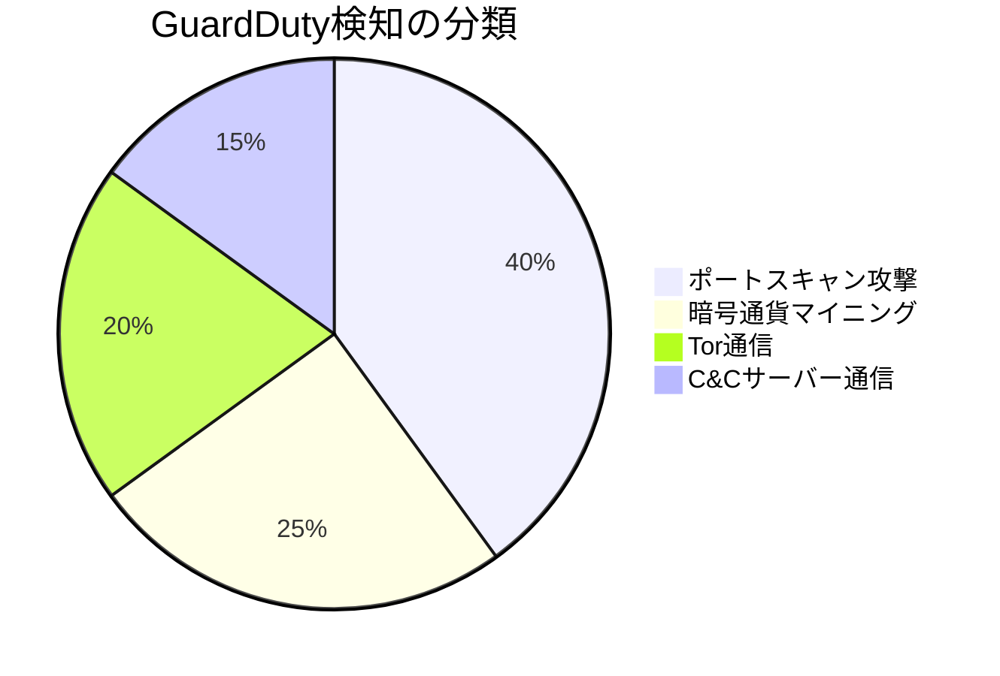
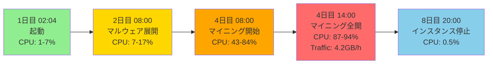
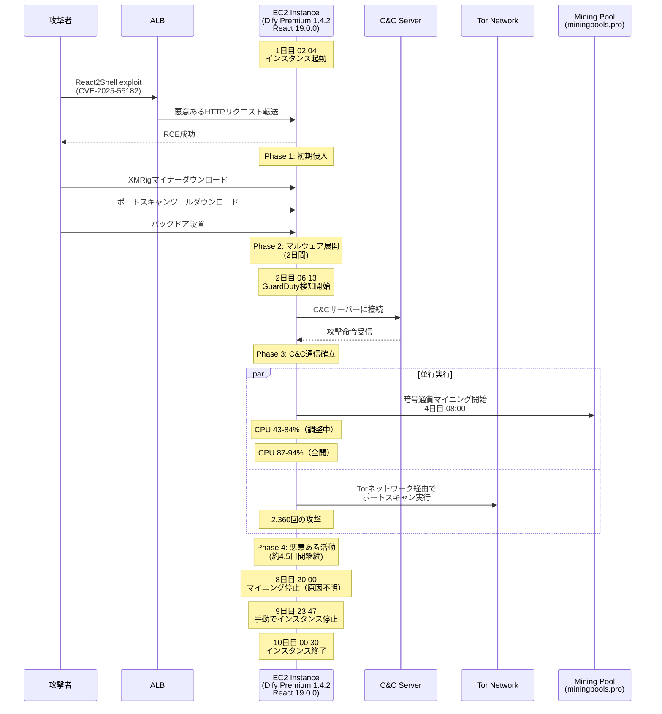

こんにちは、CSC の [CloudFastener](https://cloud-fastener.com/) というプロダクトで TAM のポジションで働いている平木です！

クラウドベンダーの Marketplace 製品を使う際、「公認の製品だから安全」と過信してはいないでしょうか。  
本記事では、AWS Marketplace 経由でデプロイした EC2 インスタンスがマルウェアに感染した実際のインシデントをもとに、**過信がもたらすリスク**と、**検証に入る前に整えておくべきセキュリティ体制の考え方**を整理します。

## 結論（TL;DR）

- AWS Marketplace 製品でも**既知の重大脆弱性（CVSS 10.0）を含むバージョン**が提供され続けることがある
- 検証環境でも GuardDutyの通知を最初から設定しないと、侵害に**すぐに気づけない**
- IAM インスタンスプロファイルをつけなかったことが、被害を EC2 内に封じ込めた唯一の功績
- 「検証だから」と油断せず、**最低限のセキュリティ基盤**を先に整えてからデプロイする
- 侵害された EC2 は7日間で2,360回のポートスキャン攻撃を**他の組織に向けて実行**していた——被害者は同時に、知らぬ間に攻撃の加担者になりうる

## インシデントの概要

### 何が起きたのか

ある日の深夜、AWS Trust & Safety チームから一通のメールが届きました。  
「あなたの NAT Gateway がポートスキャン攻撃に関与している」という内容です。  
このメールをきっかけに、AWS Marketplace 経由でデプロイした EC2 インスタンスが完全に侵害され、**約7日間にわたって暗号通貨マイニングとポートスキャン攻撃の踏み台として悪用されていた**ことが判明しました。  
7日間気づけなかったその間、私たちのインスタンスは2,360回もの攻撃を他の組織に向けて行い続けていました。

### 影響を受けたリソース

| 項目 | 詳細 |
|------|------|
| 影響を受けたリソース | EC2インスタンス |
| AMI | Dify Premium v1.4.2 (AWS Marketplace) |
| NAT Gateway | ap-northeast-1 リージョン内に配置 |
| リージョン | ap-northeast-1 (東京) |
| 稼働期間 | 約9日間 (1日目 02:04 〜 10日目 00:30) |

### インシデントのタイムライン

## 「Marketplace 製品なら安全」という思い込み

### 今回の構成と背景

ある日の夜、私たちは生成 AI アプリケーション構築プラットフォーム **Dify** を、AWS Marketplace から **Dify Premium v1.4.2** として EC2 インスタンスへデプロイしました。  
目的はあくまで**検証**です。ALB で SSL 終端を設定し、HTTPS でアクセスできるよう構成を完了させた時点では、すべてが順調に見えました。

### 使用バージョンに含まれていた重大脆弱性

詳細な調査の結果、侵害の根本原因は **React2Shell 脆弱性（CVE-2025-55182）** である可能性が極めて高いと判断されます。

| 項目 | 詳細 |
|------|------|
| 使用バージョン | Dify Premium 1.4.2 |
| リリース日 | 2025年6月11日 |
| React バージョン | 19.0.0 |
| Next.js バージョン | 15.2.3 |
| 脆弱性 | React2Shell (CVE-2025-55182) |
| 脆弱性の種類 | リモートコード実行 (RCE) |
| CVSS スコア | **10.0 (Critical)** |
| 影響範囲 | 認証なしで任意のコードを実行可能 |
| CVE 公開日 | 2025年12月 |

**React2Shell（CVE-2025-55182）** は、React Server Components における極めて深刻な脆弱性で、2025年12月に公開されました。  
Dify 1.4.2 は2025年6月にリリースされており、**脆弱なコンポーネントを含むバージョンを使用していた**ことになります。
インシデントが発生した時点では、CVE 公開済みにもかかわらず脆弱なバージョンのままだったのです。

:::message alert
**以下のような情報も後に見つかりました**:
- [セルフホストDifyがマイニングマルウェアに感染した話 - Zenn](https://zenn.dev/fatricepaddyy/articles/difycryptocurrencymining)
  同様の事例で React 脆弱性（CVE-2025-55182）が原因と報告されています
- [Difyの緊急性の高い脆弱性について - Xserver VPS](https://vps.xserver.ne.jp/support/news_detail.php?view_id=17424)
  2026年1月に Dify 本体の脆弱性（CVE-2025-67732）も発見されています
  CVSS 10.0 の極めて深刻な脆弱性として報告されています
:::

## 調査で判明した侵害の実態

インシデント発生後、GuardDuty・CloudTrail・CloudWatch を駆使して詳細な調査を実施しました。

### GuardDuty が捉えた攻撃の全貌

GuardDuty は侵害の初期段階（2日目 06:13）から継続的に異常を検知していました。全 **19件の検知はすべて Critical レベル**で、単一の攻撃シーケンスに関連付けられた、組織的かつ計画的な攻撃でした。

**1. 大規模なポートスキャン攻撃**

最も深刻だったのは、外部ネットワークに対する大規模なポートスキャン攻撃です。`Recon:EC2/PortProbeUnprotectedPort` として **2,360回**もの攻撃を検知しました。これが AWS Trust & Safety チームから連絡が来た直接の原因であり、侵害されたインスタンスが他のシステムへの攻撃の踏み台になっていたことを意味します。

**2. 暗号通貨マイニング（XMRig）**

`CryptoCurrency:EC2/BitcoinTool.B` および `CryptoCurrency:Runtime/BitcoinTool.B` として、コンテナ内での XMRig（Monero マイニングソフトウェア）実行を検知。`miningpools.pro` という Bitcoin マイニングプールへの通信も確認されており、攻撃者が実際に採掘していたことが判明しました。

**3. Tor ネットワークを利用した通信の匿名化**

- `UnauthorizedAccess:EC2/TorRelay` — Tor リレーノードとの通信
- `UnauthorizedAccess:EC2/TorClient` — Tor エントリーノードとの通信

攻撃者は Tor を使って自身の IP アドレスを隠し、追跡を困難にしていました。

**4. C&C サーバーとの通信**

`Backdoor:EC2/C&CActivity.B` として、特定の IP アドレスにある C&C サーバーとの通信を検知。GuardDuty はこの脅威を「mythic」（既知のマルウェアフレームワーク）として分類しており、攻撃者がリモートからインスタンスを制御し、追加の攻撃命令を受け取っていた可能性を示しています。

### CloudWatch メトリクスが示す異常な挙動

#### CPU 使用率の推移

| 期間 | 平均CPU使用率 | 状態 |
|------|--------------|------|
| 1日目 02:04 - 2日目 08:00 | 1-7% | 正常（起動直後） |
| 2日目 08:00 - 4日目 08:00 | 7-17% | マルウェア展開中 |
| 4日目 08:00 - 4日目 14:00 | 43-84% | マイニング開始 |
| 4日目 14:00 - 8日目 20:00 | **87-94%** | 🔴 マイニング全開 |
| 8日目 20:00 - 10日目 00:30 | 0.5-1% | インスタンス停止後 |

**4日目14時以降、CPU 使用率が常に 87% 以上を維持し、ピーク時には 94.6% に達**していました。c5.2xlarge（8 vCPU）のほぼ全リソースが、約4.5日間にわたって暗号通貨マイニングに費やされていたことになります。

#### ネットワークトラフィックの爆発的増加

| 期間 | 1時間あたりの送信量 | 1日あたりの送信量 |
|------|-------------------|------------------|
| 2日目 - 3日目 | 約1.5 GB/時 | 約36 GB/日 |
| 4日目 - 9日目 | **約4.2 GB/時** | **約100 GB/日** |
| 9日目 23:47以降 | 0.2 MB/時 | — |

マイニングが本格化した4日目以降、**ネットワーク送信量が約3倍に急増**。1時間あたり約4.2GB、1日あたり約100GBものデータが外部に送信されていました。マイニングプールへの計算結果の送信・ポートスキャン攻撃・C&C通信・Tor 経由の匿名化通信が複合した結果です。

#### 侵害の進行フロー

:::message
**重要な気付き**: CPU 使用率 80% 以上が30分継続した時点でアラートを設定していれば、4日目14時の段階で異常を検知でき、被害期間を4.5日間から数時間に短縮できたはずです。
:::

### ネットワーク構成の分析

AWS Trust & Safety から指摘された NAT Gateway について調査したところ、以下の構成が判明しました。

侵害された EC2 インスタンスはプライベートサブネットに配置されていたため直接インターネットへアクセスできませんでしたが、**NAT Gateway を経由することで外部との通信が可能**であり、これが攻撃の踏み台として悪用されました。

### CloudTrail で追跡した幸運な事実

CloudTrail の分析により、一つの重要な事実が判明しました。**このEC2インスタンスには、IAM インスタンスプロファイルが付与されていませんでした。**

CloudTrail ログを精査した結果、**特権昇格を試みる API 呼び出しは一切検知されませんでした**。被害は EC2 インスタンス内に完全に封じ込められていたのです。

### 推定される攻撃の流れ

:::message
**現状の補足**: 2026年4月時点で、AWS Marketplace の Dify Premium は **v1.13.2** にアップデートされています。本インシデントで問題となった CVE-2025-55182 は修正済みのバージョンが提供されています。ただし、**Marketplace 製品のバージョン管理・脆弱性確認は利用者自身の責任**であることに変わりはありません。
:::

## 実際のインシデント対応と反省

### 実施した対応

| # | 対応内容 | 実施時刻 |
|---|----------|----------|
| 1 | GuardDuty検知内容の確認 | 9日目 22:30 |
| 2 | 影響範囲の特定（CloudTrail） | 9日目 22:45 |
| 3 | IAM権限悪用の有無確認 | 9日目 23:15 |
| 4 | EC2インスタンスの終了 | 10日目 00:30 |

幸いなことに、インスタンスプロファイルが付与されていなかったため、IAM 権限の悪用は発生していませんでした。GuardDuty の検知内容から、被害はこの EC2 インスタンスに限定されていることも確認できました。

### 実施すべきだった対応（反省点）

:::message alert
**フォレンジック調査のための証拠保全が抜け落ちていました。インスタンスを停止/終了する前に必ず実施すべきです。**
:::

| 実施すべきだった対応 | 目的 |
|---------------------|------|
| 封じ込め | 安全にインターネットから侵害されたサーバを切り離すため |
| EBSスナップショットの取得 | マルウェアの詳細分析 |
| メモリダンプの取得 | 実行中プロセスの解析 |
| VPC Flow Logsの詳細分析 | 通信先の完全な特定 |
| CloudWatchメトリクスのエクスポート | 異常パターンの記録 |

これらの証拠があれば、攻撃の詳細なメカニズムを解明し、同様の攻撃に対する防御策をより具体的に立案できたでしょう。

## 検証に入る前に整えておくべきセキュリティ体制

今回の教訓を踏まえ、Marketplace 製品だけでなくOSSを含むサードパーティ製品をデプロイする前に最低限整えておくべきことを整理します。  
「本番環境だけの話」ではなく、開発・検証環境であっても、インターネットに接続したインスタンスは侵害されれば攻撃の踏み台になるため環境に関わらず最低限のセキュリティ体制は整えましょう。

### 利用する製品のバージョン・脆弱性確認

脆弱なバージョンをデプロイしなければ、侵害の起点を根本からなくせます。今回のインシデントは、CVE-2025-55182 が公開されてから約2ヶ月後に発生しました。その間、Marketplace には脆弱なバージョンが掲載され続けていました

Marketplace の製品ページには AMI のバージョン履歴が掲載されています。デプロイ前に最新バージョンかどうかを確認し、含まれるソフトウェアの CVE をベンダーの GitHub やセキュリティアドバイザリで調べる習慣をつけてください。

今回の Dify 1.4.2 は CVE-2025-55182 が公開された後も Marketplace に残り続けていました。「掲載されているから安全」ではなく、**バージョンの鮮度とベンダーのセキュリティ対応の速さを自分で確認する**ことが不可欠です。

### GuardDuty の通知設定

GuardDuty を有効化しているだけでは不十分です。**検知を即座に通知する設定がなければ、有効化していないのと同じ**です。

EventBridge で `aws.guardduty` ソースのイベントをキャッチし、SNS 経由で Email や Slack に通知するだけです。

### コンピューティングサービスに付与するプロファイルを最小権限にする

今回はたまたま EC2 にインスタンスプロファイルを付与していなかったため被害が EC2 内のみに留まっていましたが、
もし `AdministratorAccess` が付与されていた場合、以下のような事象が発生していたかもしれません。

- 高額なEC2インスタンスの起動や操作
- S3バケットからの機密データの窃取
- 追加のリソースの作成
- Bedrock経由でのLLMの不正呼び出し

特に人が使用しない Non-Human Identity (NHI) の権限については十分気を付けましょう。

## まとめ

**被害者でありながら加害者になるという現実**

今回のインシデントで最も反省すべき点は、**早期検知の失敗**です。GuardDuty は侵害の初期段階から異常を検知していましたが、**「検証環境だから、細かい監視設定は後でいい」** という判断が、侵害発生から通知まで7日間もかかった直接の原因です。

今回のインシデントで最も重く受け止めるべき事実は、**被害者でありながら、7日間にわたって他の組織への攻撃に加担した加害者でもあった**という点です。

GuardDuty が検知した `Recon:EC2/PortProbeUnprotectedPort`（2,360件）はすべて、侵害された私たちの EC2 から**第三者の組織に向けて実行された攻撃**です。攻撃を受けた組織からすると、攻撃元は今回侵害された AWS アカウントです。

自分のリソースが侵害されても、検証環境だし自分が損するだけではなく、侵害されたインスタンスは攻撃者の武器になり、その矛先は何の関係もない第三者に向かいます。
セキュリティ対策は、自分を守るためだけでなく、**他者への攻撃の加担を防ぐための責任**でもあります。

Marketplace 製品であっても、検証環境であっても、セキュリティの基盤は最初から整える。そしてセキュリティ対策は「自分を守る」だけが目的ではありません。  
**自分のリソースを守ることは、他者への攻撃の加担を防ぐことでもある**——この視点を持って、本事例が同様のインシデントを防ぐための一助となれば幸いです。
