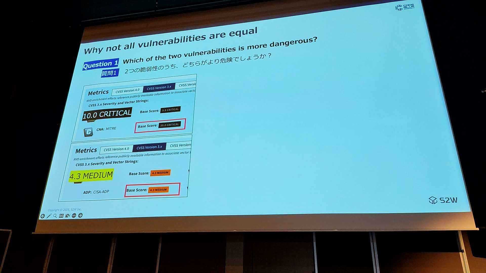
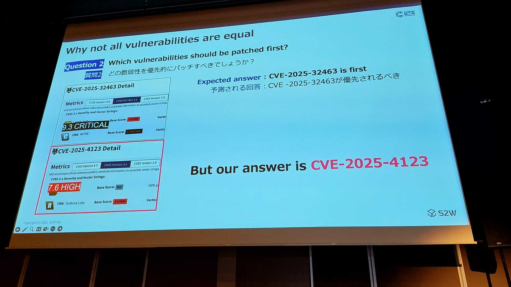
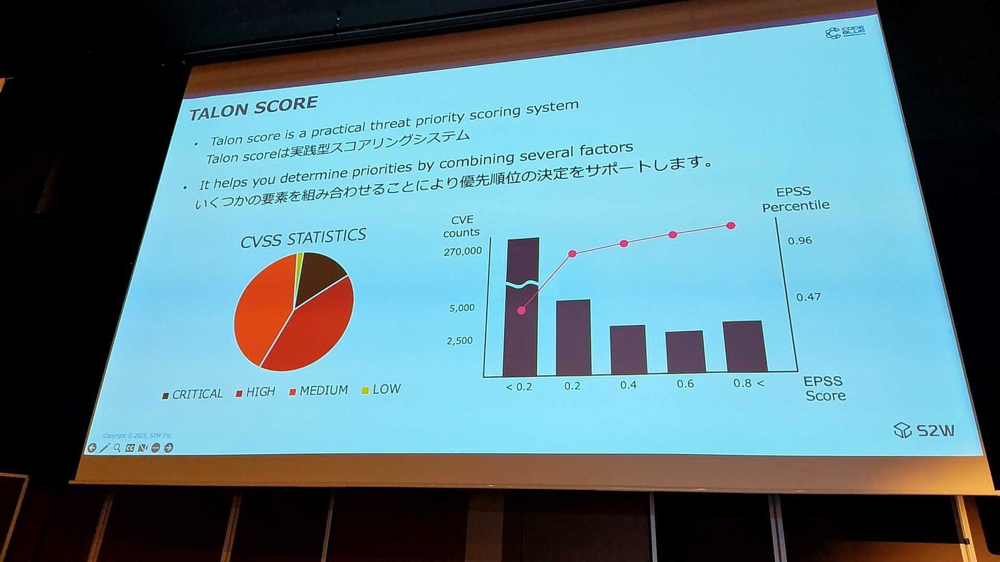
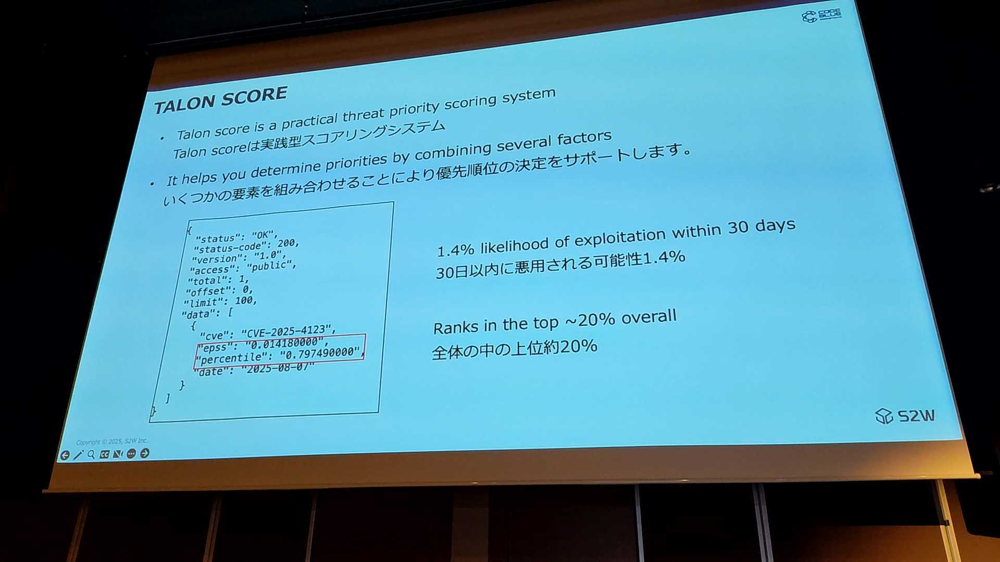
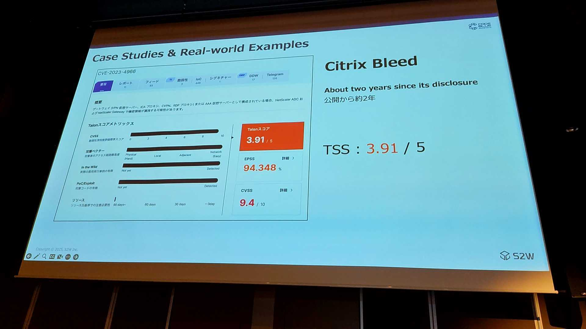
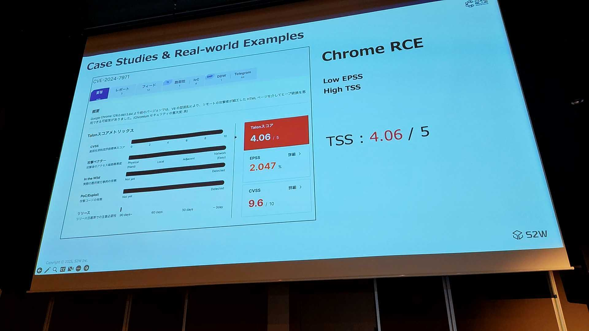
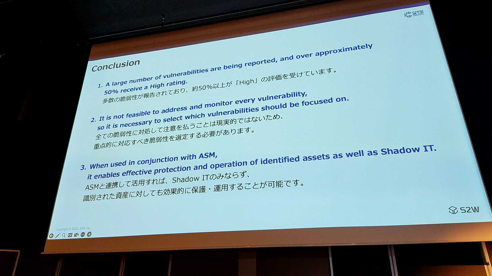

こんにちは、CSC の [CloudFastener](https://cloud-fastener.com/) というプロダクトで TAM のポジションで働いている平木です！

今回は、日本発の世界トップクラスの専門家による最先端の技術研究が発表される国際的なサイバーセキュリティカンファレンス、CODE BLUEに参加してきたため参加レポートを執筆します。

https://codeblue.jp/

## 「“本当の”脆弱性に注目せよ ― セキュリティで本当に重要なものを優先する 」の概要

- Speakers: S2W INC. ヤン・ジョンヒョン氏
- Category: OpenTalks
- Location: Track 2(HALL A)

膨大な脆弱性の中から、実際にシステムや企業に影響を与える「本当の脆弱性」を見極めるための、S2W Threat Research & Intelligence Center（Talon）が開発した体系的な評価フレームワークを紹介します。
本講演では、社内プロジェクト「Vulnerability Structuring（脆弱性の構造化）」の開発プロセスと成果、およびこのフレームワークが実際のサービスに適用された事例を解説します。

https://codeblue.jp/program/time-table/day1-t2-opentalks-07/

## セッションレポート

アジェンダの紹介が始まり、本セッションでは適切な脆弱性の対応優先度の決定方法についてTALON SCOREのフレームワークと紐づけて解説されたセッションです。

*ヤン・ジョンヒョン氏の講演スライドより*

すべての脆弱性が同等ではない理由はどういったことなのかを2つの例題から考えてみます。

まず1つ目の質問では、2つの脆弱性のうちどちらが危険かについてです。

言わずもがな、上の脆弱性のほうがCVSSベーススコアが下側よりも高いので上のほうが危険と分かります。

*ヤン・ジョンヒョン氏の講演スライドより*

続いて2つ目の質問では、どっちを優先的にパッチ適用すべきかという問いです。

大方予想される答えとしてはCVSSスコアの高い上が優先されるべきと考えてしまいがちです。
しかしSpeakerの答えは下のCVE-2025-4123が優先されるべきと回答しています。

なぜCVSSスコアが低い下の脆弱性が優先度が高いと考えられるかを紐解いていきます。

*ヤン・ジョンヒョン氏の講演スライドより*

評価を行う中で、TALONスコアと呼ばれる実践型スコアリングシステムを活用して優先順位を決定していると言います。

TALONスコアでは、CVSSやEPSSなどいくつかの要素の組み合わせにより優先順位の決定する

*ヤン・ジョンヒョン氏の講演スライドより*

先ほどのCVEを見てみるとEPSSが高いことから

*ヤン・ジョンヒョン氏の講演スライドより*

TALONでは5つの要素を優先順位を決定するためのフレームワークとして採用しています。

- CVSS/Attack Vector
  - CVSSが高いほど危険性が増し、攻撃が容易となる
- 公開日
  - 古い脆弱性はパッチが公開されている可能性が高い
- PoC/Exploit
  - 脆弱性がどの程度研究されているかも重要な指標となる
- ITW
  - 実際の環境で悪用されているかどうか
- トレンド
  - どれだけ流行している脆弱性かどうか

スコアリングの方法としては以下の考え方になります。

- CVSS: スコアが高いほど、TALONスコアも高く加算
- Attack Vector: より沿革であるほど、TALONスコアも高く加算
- PoC,Exploitファイル: 公開状況に応じてTALONスコアを付与
- 情報源の信頼性: 信用のある機関や団体が公開しているものかどうかでTALONスコアを差別的に付与
- ITW: 実際の環境で悪用された場合は、TALONスコアも高く加算

SNSや報道、ディープダークウェブで多く言及されるほど高くなるなど、総合的な観点から単なる情報の羅列のみによって算定しないことが重要だと言います。

ここからはケーススタディとして実例を紹介されました。

まずは`Log4Shell`の例ですが、現在は公開から4年経っていることから、TSS（TALONスコア）は`3.48`と算出されたようです。

*ヤン・ジョンヒョン氏の講演スライドより*

続いては`Citrix Bleeds`の例です。こちらは公開から約2年と直近のものであるためTSSも高く`3.91`と算出されています。

*ヤン・ジョンヒョン氏の講演スライドより*

続いて`Chrome RCE`の例では、EPSSは低いがTSSは高く算出されていますが、EPSSが低くても重大な脆弱性で早急に対応すべきという考えからTSSが高くなったと言います。

*ヤン・ジョンヒョン氏の講演スライドより*

最後にまとめとして、
全ての脆弱性に対応することは現実的ではないため重点的に実施するために脆弱性を選定する必要があるといったこと話されていました。

*ヤン・ジョンヒョン氏の講演スライドより*

## まとめ

こちらのセッションでは、
脆弱性を適切にトリアージしていくことの重要さ
について詳しく知ることができました。

この記事がどなたかの役に立つと嬉しいです。