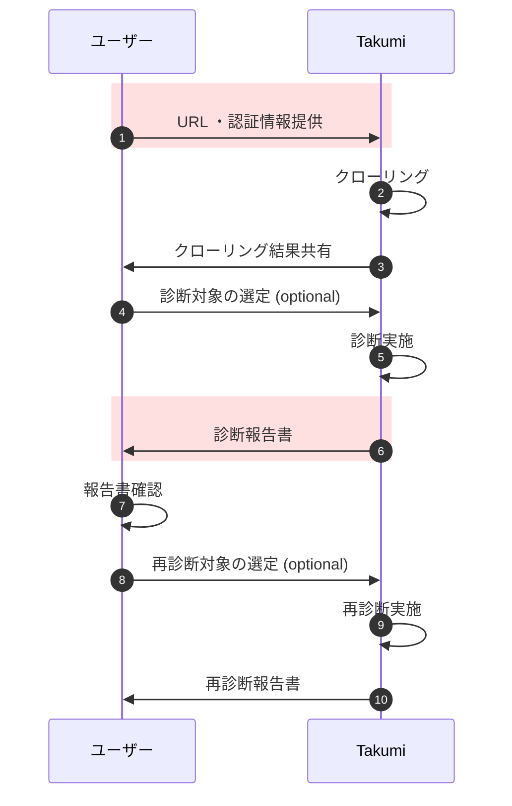

こんにちは、CSC の [CloudFastener](https://cloud-fastener.com/) というプロダクトで TAM のポジションで働いている平木です！

今回は、日本発の世界トップクラスの専門家による最先端の技術研究が発表される国際的なサイバーセキュリティカンファレンス、CODE BLUE に参加してきたため参加レポートを執筆します。

https://codeblue.jp/

## 「AI × セキュリティ診断最前線 『Takumi byGMO』体験会」の概要

> GMO Flatt Security が開発・提供する日本初・セキュリティ診断 AI エージェント「Takumi byGMO」との対話を通じて、AI により大きく変わりつつあるソフトウェアのセキュリティ診断の世界を体験いただきます。  
> （引用）https://codeblue.jp/program/contests-workshops/ai-securityshindan/

## 体験レポート

こちらの体験レポートは、GMO Flatt Security さんが開発・提供するセキュリティ診断 AI エージェント「Takumi byGMO」のコンソールを実際に体験した内容を記載いたします。

まず前提の知識として、Takumi では 2 種類のアプローチで診断できます。

- ホワイトボックス診断
  - アプリケーションのソースコードを GitHub のリポジトリなどからクローンし静的に解析する
- ブラックボックス診断
  - 動作中のアプリケーションに対して疑似的に攻撃を実施することで脆弱性を解析する

今回の体験は、後者のブラックボックス診断を想定したものでした。

診断の流れは以下の通りです。  
ただし時間とワークショップという制約上、今回体験できた部分は、赤枠で囲われた、

- アプリケーションの URL や診断対象に関する情報を提供する直前までの部分
- 既存の診断報告書を出力する部分

を体験させていただきました。



診断対象としてワークショップ用に作成された簡単なメモアプリを診断するという流れで、そのメモアプリには XSS(クロスサイトスクリプティング) の脆弱性のあるアプリでそれを検知させるという流れです。

まずは診断を始めるために、診断名を任意のものを入力し、診断タイプとしてどこを診断対象とするかを指定します。


続いて対象のアプリケーションの URL と認証情報を入力します。

診断観点をカスタマイズでは、自然言語を用いて診断の仕方をカスタマイズできるようです。
ところどころ自然言語で指示できるのは柔軟性高くて良いなと感じました。


実際の診断の場合は、ここで診断を開始しますが今回はこちらはスキップしました。

続いては診断報告書についてです。


構成としては以下のようになっていました。

```
アプリケーション診断報告書
├── 1. 診断概要
│   ├── 1.1. 本報告書について
│   └── 1.2. 診断について
├── 2. 検査項目
├── 3. 診断対象
├── 4. 診断結果概観
│   └── 4.1. 全体に対する評価
├── 5. 指摘事項一覧
└── 6. 試行結果一覧
    ├── 6.1. 試行レベルについて
    └── 6.2. 試行結果一覧
```

どの脆弱性にどのようなリスクがあるか、再現方法から対策までが詳細に記載されており、運用担当者の目線に立ったレポートだと感じました。

## まとめ

こちらのワークショップでは、
Takumi の実際運用をするとなったときの利用感や実際のレポートの記載粒度とクオリティ
について詳しく知ることができました。

この記事がどなたかの役に立つと嬉しいです。