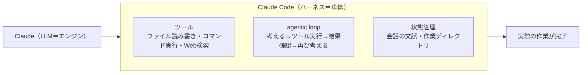
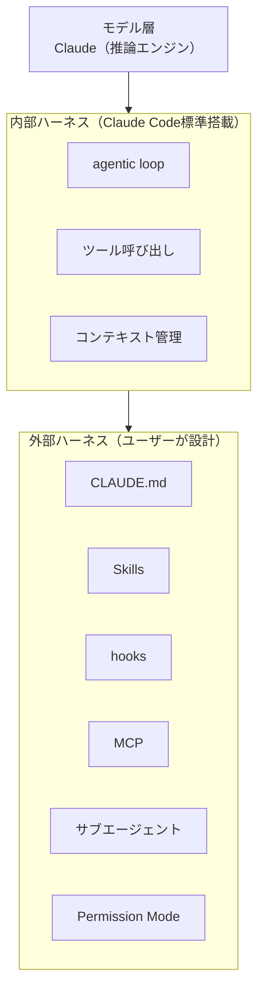

こんにちは、CSC の [CloudFastener](https://cloud-fastener.com/) というプロダクトで TAM のポジションで働いている平木です！

CSC社内で「CloudFastener の TAM(テクニカルアカウントマネージャー)向けに、Claude Codeを初歩から実践まで学ぶ勉強会」を始めることになり、その資料を社外にも公開します。

セキュリティコンサルティングの現場でもAIエージェントの活用が広がりつつある一方、「触ったことはあるけれど、仕組みまでは理解していない」という方も多いのではないでしょうか。  
この勉強会では、そうした方を対象に、Claude Codeを題材にしてAIエージェントの基礎から実践までを毎回テーマを決めて学んでいきます。

第1回は「Claude Codeとは何か」の理解と、実際にインストール・ログインして最初の一往復のやり取りを体験するところまでがゴールです。

:::message
**この記事の3行まとめ**

- Claude Code は Claude(LLM) そのものではなく、Claude に「ツール」「agentic loop」「状態管理」を与えて実作業をこなせるようにする「ハーネス」である
- インストール・ログインの手順はシンプルだが、WSL・社内プロキシ・認証画面が開かない環境などでつまずきやすいポイントがある
- 最初の題材はコードでなくてよく、メモの要約のような非エンジニア業務からagentic loopの最小単位を体験するのが近道
:::

## 今日のゴール

Claude Codeとは何かを理解し、自分のPCにインストールしてログインを済ませ、最初の一往復(1回お願いして、1回答えが返ってくるやり取り)を体験する。

## 座学

### なぜセキュリティコンサルタントがAIエージェントを学ぶのか

2025年6月、AIによる自動ペネトレーションテストツール「XBOW」がバグバウンティプラットフォームHackerOneのランキングで人間のリサーチャーを抑えて1位を獲得しました。  
これは、AIエージェントが「壁打ち相手」から「自律的に手を動かして脆弱性を発見する存在」へと進化しつつあることを示す出来事でした。

https://gigazine.net/news/20250625-hackerone-xbow/

セキュリティコンサルティングの現場でも、調査・診断・報告書作成といった業務の多くはAIエージェントによる支援と相性が良い領域です。  
まずは、この分野で最も広く使われているツールの一つであるClaude Codeから触れてみましょう。

### Claude Codeは「ハーネス」である

LLMとは、大規模言語モデルでありChatGPTやClaudeのような対話AIの本体を指す言葉です。  
Claude CodeはLLMであるClaudeそのものではなく、LLMを実際の作業に使えるようにする「ハーネス(harness)」です。  
ハーネスとは、LLMに次の3つを与える仕組みのことを指します。

1. **ツール**: ファイルの読み書き、コマンドの実行、Web検索など、LLM単体ではできない操作を行う手段
2. **ループ(agentic loop)**: 「考える→ツールを使う→結果を見る→また考える」を、タスクが終わるまで自律的に繰り返す仕組み
3. **状態管理**: 会話の文脈(コンテキスト)や作業ディレクトリの状態を保持する仕組み

つまり、Claude Codeは「Claudeというエンジンを積んだ車体」に相当します。  
同じClaudeというモデルでも、Web版のClaude.aiとClaude Codeとでは、できることが大きく異なるのはこのためです。

図にすると、次のような関係になります。



*Claudeというエンジンだけでは動けず、ハーネス(Claude Code)に載って初めて実際の作業ができるようになります。*

さらに、ハーネスは「内部ハーネス」と「外部ハーネス」の2層に分けられます。



- **内部ハーネス**: agentic loop・ツール呼び出し・コンテキスト管理など、Claude Codeが最初から備える「モデルをエージェントに変える層」
- **外部ハーネス**: CLAUDE.md・Skills・hooks・MCP・サブエージェント・Permission Modeなど、ユーザーやチームが業務に合わせて組み立てる層(通称「ハーネスエンジニアリング」)


万能なハーネスはなく、まずは内部ハーネスとモデルの素の実力を使い倒し、足りない部分だけ外部ハーネスで補うのが定石です。

この記事では1つ目のハーネス(agentic loop・ツール・状態管理)を扱いましたが、今後の回ではCLAUDE.md・Skills・MCP・サブエージェントといった2つ目のハーネスの具体的な作り方を扱っていきます。

### 対応プラットフォームとインストール方法

Claude Codeの対応プラットフォームやインストール方法は、公式の[Quickstartガイド](https://code.claude.com/docs/en/quickstart.md)にまとまっています。以下の環境で利用できます。

- ターミナル(CLI): macOS、Linux、Windows(WSLなど)
- デスクトップアプリ: macOS、Windows
- IDE拡張機能: VS Code、JetBrains系IDE
- Web版: Claude Code on the web

インストール方法として、まずはネイティブインストーラ(自動更新に対応)を推奨します。

:::message
以降のコマンドは「ターミナル」というアプリの中で実行します。ターミナルは、マウス操作の代わりに文字でコマンドを入力してPCを操作するツールです。macOSでは「ターミナル.app」(Launchpadや `Cmd + Space` の検索から「ターミナル」と入力すると見つかります)、Windowsではスタートメニューで「PowerShell」と検索して開く「PowerShell」を使います。
:::

**macOS / Linux / WSL(ターミナル)**
```bash
curl -fsSL https://claude.ai/install.sh | bash
```

**Windows(PowerShell)**
```powershell
irm https://claude.ai/install.ps1 | iex
```

macOSでHomebrewを利用している場合は `brew install --cask claude-code` でも導入できますが、この場合は自動更新が別途必要になる点に注意してください。

Windowsユーザーは以下を確認し、WSLの導入またはPowerShellでのネイティブインストールを実施してください。

https://dev.classmethod.jp/articles/windows-wsl-claude-code/

https://qiita.com/kai_kou/items/2e33c169a9e297fe71c1

### ログインと認証

インストール後、ターミナルで `claude` と入力するとブラウザが自動的に開き、認証画面が表示されます。

以下のいずれかの方法でログインできます。

- Claude Pro / Max / Team / Enterprise アカウント(推奨。追加課金なしでプランの範囲内で利用可能)
- Claude Console(API利用、従量課金)
- Amazon Bedrock / Google Vertex AI 経由(社内で既にクラウド契約がある場合)

一度ログインすれば認証情報は保存され、次回以降は再ログインの必要はありません。

### つまずきやすいポイント

初回セットアップでは、次のような点で詰まる方が多く見られます。あらかじめ知っておくと、初回のハードルがぐっと下がります。

- **WSL環境**: WindowsのPowerShell側ではなく、WSLのターミナル(Ubuntuなど)の中でmacOS/Linux向けのインストールコマンドを実行してください。Windows側とWSL側は別環境として扱われるため、片方にインストールしても、もう片方では使えません。
- **社内プロキシ**: 会社の環境でインターネットアクセスにプロキシを経由する場合、`curl` によるインストールやログイン時の通信がブロックされることがあります。`HTTPS_PROXY` / `HTTP_PROXY` 環境変数の設定が必要かどうか、社内の情報システム部門に確認してください。
- **認証画面が開かない・ループする**: リモートサーバーやコンテナ環境など、ブラウザを自動で開けない環境では、ターミナルに表示される認証用URLを手動でコピーしてブラウザに貼り付けることでログインできます。何度も認証画面がループする場合は、ブラウザのCookieやキャッシュをクリアしてから再試行してみてください。

## ミニハンズオン

### 手順1: 作業用フォルダを作る

Claude Codeは起動したディレクトリ以下のファイルを読み書きの対象にします。最初は影響範囲を限定するため、専用の作業フォルダを用意しましょう。

**macOS / Linux / WSL(ターミナル)**
```bash
mkdir ~/claude-work
cd ~/claude-work
claude
```

**Windows(PowerShell)**
```powershell
mkdir ~\claude-work
cd ~\claude-work
claude
```

### 手順2: コードではない題材で最初の対話をしてみる

Claude Codeという名前から「プログラミング専用ツール」という印象を持ちがちですが、最初の一歩はコードでなくて構いません。例えば、適当なテキストファイル(会議メモや調査したい製品の情報など)を作業フォルダに置き、次のように依頼してみます。

手元に適当なファイルがない場合は、まずClaude Code自身に「適当なメモを1つ作って」のように頼み、サンプルファイルを作ってもらうところから始めても構いません。

```
このフォルダにあるメモを読んで、3行で要約してください。
```

Claude Codeがファイルを探し出し、内容を読み込み、要約を返す一連の流れを体験できます。  
この「読む→考える→答える」という一往復こそが、先ほど説明した「agentic loop」の最小単位です。

### 手順3: 少しだけ手を加えてもらう

```
その要約を summary.md というファイルに保存してください。
```

ファイルの新規作成を依頼すると、実行前に確認を求められることがあります(これは「Permission Mode」という仕組みによるもので、次回詳しく扱います)。許可すると、実際に `summary.md` が作成されます。

## まとめ+チーム資産化アクション(5分)

- Claude Codeは「Claudeを動かすハーネス」であり、ツール・ループ・状態管理の3要素で成り立つ
- 作業は専用フォルダから始めることで、影響範囲を安全にコントロールできる
- 最初の題材はコードでなくてよい。要約・整理といった非エンジニア業務から慣れていくのが近道

**チームへの持ち帰りアクション**: 今日作った `~/claude-work` フォルダを、今後の勉強会や日常業務の実験場として使い続けてください。第3回では、このフォルダの中に、Claude Codeの挙動をチームで再現可能にする「CLAUDE.md」を置いていきます。

## ベストプラクティスのひとこと

Anthropic公式のベストプラクティスでは、「曖昧な指示より具体的な指示の方が良い結果を生む」ことが繰り返し強調されています。

https://code.claude.com/docs/en/best-practices.md 

| 悪い例 | 良い例 |
|---|---|
| "メモを整理して" | "このフォルダのメモを読んで、日付順に並べ替えたうえで3行で要約してください" |

今日のハンズオンで依頼した「3行で要約してください」も、この原則に沿った指示になっています。次回以降も、指示はできるだけ具体的にする習慣を意識していきましょう。

## 参考リンク

- [oikon48「Claude Codeとハーネスについて考えてみる」(Speaker Deck)](https://speakerdeck.com/oikon48/claude-codetohanesunituitekao-etemiru)
- [Anthropic「Steering Claude Code: when to use CLAUDE.md, skills, hooks, and subagents」(公式ブログ)](https://claude.com/blog/steering-claude-code-skills-hooks-rules-subagents-and-more)
- [Claude Code Quickstart(公式)](https://code.claude.com/docs/en/quickstart.md)
- [Claude Code 概要(公式)](https://code.claude.com/docs/en/overview.md)
- [Claude Code ベストプラクティス(公式)](https://code.claude.com/docs/en/best-practices.md)
- [Gigazine「AIを活用した完全自律型の侵入テストツール「XBOW」がHackerOneのランキングでついに人間を抜いて1位に」](https://gigazine.net/news/20250625-hackerone-xbow/)
- [カンリー「ゼロから始めるClaude Code入門・ハンズオン」(Zenn)](https://zenn.dev/canly/articles/2e0d115e360144)
- [クラスメソッド DevelopersIO「非エンジニア向けClaude/Claude Codeシリーズ」](https://dev.classmethod.jp/articles/claude-business-use1/)

## おわりに

社内勉強会第2回以降もこの形式で資料を公開していきます。

次回はPermission Modeや基本的な操作コマンドなど、実務で使う上での「一歩進んだ」内容を予定しています。TAMのようなエンジニア以外のポジションの方にも、AIエージェントを日常業務に取り入れるきっかけになれば幸いです。

この記事がどなたかの役に立つと嬉しいです。
