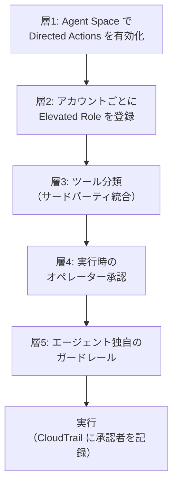

こんにちは、CSC の [CloudFastener](https://cloud-fastener.com/) というプロダクトで TAM のポジションで働いている平木です！

以前、AWS DevOps Agent と GuardDuty を連携させてセキュリティインシデントの調査をやらせてみる、という記事を書きました。

https://zenn.dev/cscloud_blog/articles/devops-agent-guardduty-integration

このとき DevOps Agent は VPC フローログの分析から攻撃キルチェーンの推定まで自律的にやってくれた一方で、**「調査と提案」までしかできず、セキュリティグループの変更やインスタンスの隔離といった実行は人間が手を動かす必要がありました**。記事の最後も「修復アクションの自動実行は行わない」で締めています。

そこに **Directed Actions（コンソール上の表記は「エージェントアクション」）** が登場しました。DevOps Agent が実際にリソースを変更できるようになる機能です。

つまり、**インシデントレスポンスの「封じ込め（Containment）」まで AI に任せられるのか？** という話です。今回はそこを検証しました。

なお、Directed Actions 自体の基本的な挙動については、クラスメソッドさんの記事が非常に分かりやすいので先に読んでおくとスムーズです。

https://dev.classmethod.jp/articles/devops-agent-directed-actions/

## この記事の 5 行まとめ

:::message

- Directed Actions を有効化すると、DevOps Agent が**セキュリティグループの書き換え・スナップショット作成といった封じ込めアクションを実際に実行できる**ようになる
- ただし最大の制約として、**承認リクエストはチャットにしか出ない**。自律調査の途中でエージェントが変更操作を呼ぶと、承認を求めるのではなく**そのまま失敗する**。「深夜 2 時に AI が勝手に隔離してくれる」は原理的に成立しない
- エージェント側に**独自のガードレール**があり、IAM ロールで許可しても・人間が承認しても、**リソース削除・permissions boundary の変更・`iam:PassRole` を伴う操作は実行されない**
- 管理ポリシー `AIDevOpsAgentActionsPolicy` は `iam:*` / `sts:*` / `organizations:*` などを除外しているため、**アクセスキーの無効化のような「IAM 系の封じ込め」は標準構成では一切できない**
- 実行された操作は CloudTrail に**承認した人間の Source Identity 付き**で記録されるため、「AI がやった」ではなく「誰が承認して AI が代行した」を監査で追跡できる

:::

## 前回記事からの変化

まず、前回の読み取り専用時代と今回で何が変わったのかを整理します。

| 観点 | 前回（読み取り専用のみ） | 今回（Directed Actions 有効化後） |
| --- | --- | --- |
| GuardDuty Finding の受信・トリアージ | 自動 | 自動（変化なし） |
| VPC フローログ分析・攻撃シナリオ推定 | 自動 | 自動（変化なし） |
| 推奨アクションの提示 | 提示のみ | 提示 ＋ **調査画面にインラインで緩和策の提案が出る** |
| セキュリティグループの書き換え | 不可（人間が手動） | **チャットで指示 ＋ 承認すればエージェントが実行** |
| 証拠保全（スナップショット作成） | 不可 | **同上** |
| インスタンスの終了・リソース削除 | 不可 | **不可（エージェントが拒否）** |
| IAM アクセスキーの無効化 | 不可 | **標準構成では不可（管理ポリシーが `iam:*` を除外）** |
| 自律調査中の自動封じ込め | 不可 | **不可（チャット外の変更操作は失敗する）** |
| 実行者の監査 | — | **CloudTrail に承認者の Source Identity が記録される** |

「読み取り専用 → 全自動」ではなく、「読み取り専用 → **人間の承認を挟んだ代行実行**」という一段だけの前進、というのが正確な理解だと思います。この一段が運用的にどれくらい効くのかが、この記事の本題です。

## Directed Actions とは

Directed Actions は、DevOps Agent がリソースを作成・変更できるようにする機能です。エージェントの操作は 2 種類に分類されます。

| 種類 | 内容 | デフォルト |
| --- | --- | --- |
| **Read-only actions** | 接続先の情報を読むだけの操作 | 利用可能 |
| **Directed actions** | リソースを作成・変更・その他ミューテートする操作 | **無効**（段階的なオプトインが必須） |

https://docs.aws.amazon.com/devopsagent/latest/userguide/working-with-devops-agent-working-with-directed-actions.html

安全性の設計思想は多層防御（defense in depth）で、以下の独立した層をすべて通過しないと実行されません。



重要なのは**層 5** です。ここは顧客側の IAM 権限とは独立してエージェント側が拒否する層で、人間が承認しても覆せません。セキュリティ運用の観点だと、ここが何を拒否するのかを把握しておくのが実務上いちばん大事だと思います。

### セットアップの 3 ステップ

前回構築した Agent Space に対して、以下を追加していきます。

<!-- TODO(検証): 各ステップのコンソールスクリーンショットを撮る。Agent Space 設定タブのトグル画面、Elevated Role 登録画面、View Supported Actions のリスト画面 -->

#### ステップ 1: Agent Space で Directed Actions を有効化する

Agent Space の設定からエージェントアクションのトグルを ON にします。ここが最上位のスイッチで、**無効のままだと Elevated Role の登録もツールのオプトインも一切効きません**（登録自体が `ValidationException` で弾かれることもあります）。

CLI からも設定できます。

```bash
aws devops-agent update-agent-space \
  --agent-space-id <your-agent-space-id> \
  --preferences elevatedActionsEnabled=true
```

:::message alert
`preferences` は `UpdateAgentSpace` でセット全体が置き換わります。指定しなかったキーはデフォルト値に戻るので、他の preference を設定している場合は一緒に渡す必要があります。
:::

#### ステップ 2: Elevated Role を作成して登録する

エージェントが AssumeRole する専用の IAM ロールを、**AWS アカウントごとに**作成します。前回のクロスアカウント構成のように複数アカウントを紐付けている場合、モニターアカウント（プライマリ）とソースアカウント（セカンダリ）それぞれで登録が必要です。

登録していないアカウントは読み取り専用のままになるので、「調査は全アカウント横断、封じ込めは特定アカウントのみ許可」といった段階的な導入もできます。これはセキュリティ運用としてはかなりありがたい設計です。

信頼ポリシーはこちらです。STS のアクションが **3 つ必要**なところが最大の落とし穴です。

```json
{
  "Version": "2012-10-17",
  "Statement": [
    {
      "Effect": "Allow",
      "Principal": {
        "Service": "aidevops.amazonaws.com"
      },
      "Action": [
        "sts:AssumeRole",
        "sts:SetSourceIdentity",
        "sts:TagSession"
      ],
      "Condition": {
        "StringEquals": {
          "aws:SourceAccount": "111122223333"
        },
        "ArnLike": {
          "aws:SourceArn": "arn:aws:aidevops:ap-northeast-1:111122223333:agentspace/*"
        }
      }
    }
  ]
}
```

:::message alert
`sts:SetSourceIdentity` と `sts:TagSession` を落とすと、**検証ステータスが `valid` になっているのに実行時のクレデンシャル取得で失敗します**。`sts:AssumeRole` だけ書いて満足しないよう注意です。

また `aws:SourceArn` のリージョンは Agent Space のリージョンと一致させる必要があります。複数リージョンで運用する場合はワイルドカード（`arn:aws:aidevops:*:111122223333:agentspace/*`）にします。
:::

`aws:SourceAccount` と `aws:SourceArn` は confused deputy 対策で、自分の Agent Space のためにしかこのロールを引き受けられないようにするためのものです。

ロール名は `DevOpsAgent-ElevatedAction-*` のような識別しやすい命名規則が推奨されています（サービス側の必須要件ではありません）。監査時に「エージェントが使う特権ロール」を一覧しやすくなるので、素直に従っておくのが良さそうです。

#### ステップ 3: 権限ポリシーを決める

Elevated Role の権限ポリシーが、**エージェントが実行しうる操作の天井**を決めます。ただしエージェントはこの天井では動きません。承認された操作ごとにセッションポリシーで対象オペレーションとリソースまで絞り込まれたクレデンシャルが発行されます。

選択肢は 2 つです。

**オプション 1: 管理ポリシー `AIDevOpsAgentActionsPolicy` をアタッチする**

`arn:aws:iam::aws:policy/AIDevOpsAgentActionsPolicy` です。特性は以下の通りです。

- 全アクション・全リソースを許可する**かなり広いポリシー**
- ただし ID・認証・組織管理系のサービスを除外している。除外対象は `account:*` / `cognito-identity:*` / `iam:*` / `identitystore:*` / `organizations:*` / `ram:*` / `rolesanywhere:*` / `sso:*` / `sts:*`
- そこから読み取り系のごく一部だけを許可し直している（`iam:ListRoles`、`organizations:DescribeOrganization`、`sts:DecodeAuthorizationMessage` など）
- **削除系のアクションは天井には含まれている**。ただしエージェント側が拒否するため実行されない

**オプション 2: カスタマー管理ポリシーを書く**

天井をもっと狭くしたい場合は自分で書きます。本番のセキュリティ運用でやるなら、こちらが現実的だと思います。この記事の後半では、封じ込めに必要なアクションだけに絞ったカスタムポリシーも試しています。

:::message
エージェントがセッションポリシーを組み立てる際に使えるアクションは、**AWS DevOps Agent がメンテナンスしているサポート対象アクションの一覧に限られます**。この一覧に無いアクションはセッションポリシーに載らないため、ロール側で許可していても実行できません。

一覧はコンソールの `Configuration` ページ → `Agent Actions` セクション → `View Supported Actions` から確認できます。「このアクションは通るのか？」を事前に確かめられるので、封じ込めの設計をする前に一度眺めておくのがおすすめです。
:::

<!-- TODO(検証): View Supported Actions の一覧に、封じ込め系アクションが載っているかを確認してスクショ。特に ec2:ModifyInstanceAttribute / ec2:RevokeSecurityGroupIngress / ec2:CreateSnapshot / ec2:StopInstances / ec2:CreateNetworkAclEntry / iam:UpdateAccessKey の有無 -->

### エージェントが絶対にやらない操作

ここが層 5 のガードレールです。**IAM で許可していても、オペレーターが承認しても実行されません。**

| 拒否される操作 | 具体例 | 拒否する理由 |
| --- | --- | --- |
| **リソースの削除** | インスタンス・バケット・テーブル・関数・スタックの削除 | 不可逆な操作は人間が自分のクレデンシャルで実施する |
| **permissions boundary の変更** | `iam:PutRolePermissionsBoundary`、`iam:DeleteRolePermissionsBoundary`、`iam:PutUserPermissionsBoundary`、`iam:DeleteUserPermissionsBoundary` | boundary は組織がエージェントを制約するための仕組みなので、エージェント自身に変更させない |
| **`iam:PassRole` を伴う操作** | インスタンスプロファイル付きの EC2 起動、実行ロール付きの Lambda 作成、タスクロール付きのタスク起動 | ロールの受け渡しはサービス経由で権限を間接的に拡張しうる |

これらを指示された場合、エージェントは理由を説明して断り、可能な場合は手動手順を提示します。

セキュリティインシデント対応の文脈でこれが何を意味するかというと、こうなります。

- **侵害インスタンスの終了**は不可（削除系）→ 停止までは可能なはず
- **クリーンな AMI からの再構築**は不可（インスタンスプロファイル付き起動 = `iam:PassRole`）
- **エージェント自身の権限拡張**は不可

つまり Directed Actions は「封じ込めまでは踏み込めるが、根絶（Eradication）と復旧（Recovery）には踏み込めない」設計になっています。インシデントレスポンスの教科書的なフェーズ分けとかなりきれいに一致していて、個人的にはよく考えられた線引きだと感じました。

## 【最重要】自律調査の途中では封じ込めできない

ここが今回の検証でいちばん重要な発見です。ドキュメントにこう書かれています。

> AWS DevOps Agent surfaces operator approval requests only in chat. If the agent invokes a mutating tool outside chat, for example during an autonomous investigation, the call fails instead of presenting an approval request. AWS DevOps Agent never executes a mutating tool without approval.

**承認リクエストはチャットにしか出ません。** 自律調査の最中にエージェントが変更操作を呼び出すと、承認を求めるのではなく**その呼び出しが失敗します**。

前回記事の冒頭で「深夜 2 時に GuardDuty のアラートが飛んできたとき、誰が調査しますか？」という問いを立てました。Directed Actions が来た今、この問いはこう更新されます。

- **調査**は深夜 2 時でも AI が勝手にやってくれる（前回検証済み）
- **封じ込め**は、深夜 2 時に起きた人間がチャットで指示して承認するまで動かない

「AI が自律的に検知から封じ込めまで完了させる」という運用は、現時点の DevOps Agent では**設計上できません**。これは制約ではなく意図的な安全設計だと思いますが、期待値としては正しく持っておく必要があります。

:::message
一方で、調査画面には **Inline mitigation proposals**（インラインの緩和策提案）という機能があり、根本原因分析の完了後に緩和策の提案が調査ビューに直接表示され、パラメータを調整して適用を選べる、と説明されています。

「調査画面から適用できる」と「承認はチャットにしか出ない」の関係が公式ドキュメントだけでは読み切れないため、**実際に調査画面から適用を試して、チャットに降りるのか・その場で承認できるのか**を検証しました。
:::

<!-- TODO(検証): 調査画面の Inline mitigation proposal から適用しようとしたとき、(a) その場で承認パネルが出る (b) チャットに遷移する (c) 失敗する のどれになるか確認。スクショ必須。ここが記事の目玉になる -->
<!-- TODO(検証): あわせて、自律調査中にエージェントが自発的に変更操作を試みたログ（失敗している痕跡）がタイムラインに残るかも確認 -->

## 検証環境

<!-- TODO(検証): 環境が確定したらここを埋める。前回環境を再利用するなら「前回記事の構成に Elevated Role を足しただけ」と書いて差分だけ説明する。作り直すなら構成図を再掲する -->

前回の記事で構築した環境をベースにしています。

```
VPC
├── Public Subnet
│   ├── Internet Gateway
│   └── NAT Gateway
├── Private Subnet
│   ├── EC2 ← テスト対象
│   └── VPC Endpoints (SSM, SSM Messages)
└── VPC Flow Logs → CloudWatch Logs

GuardDuty Finding → EventBridge → Lambda → DevOps Agent Webhook
```

ここに今回追加したものは以下です。

| 追加したもの | 内容 |
| --- | --- |
| Agent Space の設定 | `elevatedActionsEnabled` を有効化 |
| Elevated Role | <!-- TODO(検証): ロール名を記載 --> |
| 権限ポリシー | <!-- TODO(検証): 管理ポリシーかカスタムポリシーかを記載 --> |
| 隔離用セキュリティグループ | <!-- TODO(検証): 事前に用意した隔離用 SG の ID / ルール内容を記載 --> |

:::message
封じ込め先の**隔離用セキュリティグループは事前に作っておく**のがおすすめです。インシデント発生後に「隔離用 SG を作って、それを当てて」と 2 段階でエージェントに依頼すると、承認が 2 回に増えて MTTR が伸びます。深夜 2 時に承認ボタンを押す回数は 1 回でも減らしたいところです。
:::

## シナリオ 1: 検知から封じ込めまで通してやってみる

前回と同じくコインマイニングドメインへの DNS ルックアップで GuardDuty Finding を発生させ、そこから封じ込めまで一気通貫で流してみます。

### ステップ 1: Finding を発生させて自律調査を待つ

Session Manager 経由で EC2 に接続し、前回同様のテストを実施します。

```bash
nslookup pool.supportxmr.com
dig GuardDutyC2ActivityB.com
```

<!-- TODO(検証): Finding 生成のスクショ。前回と同じく検知タイプと Severity を表にする -->

| テスト | コマンド | 期待される Finding | 結果 |
| --- | --- | --- | --- |
| コインマイニング DNS | `nslookup pool.supportxmr.com` | `CryptoCurrency:EC2/BitcoinTool.B!DNS` | <!-- TODO(検証) --> |
| C&C ドメイン | `dig GuardDutyC2ActivityB.com` | `Backdoor:EC2/C&CActivity.B!DNS` | <!-- TODO(検証) --> |

<!-- TODO(検証): Triage Agent の LINKED 判定、調査開始までの時間を計測してタイムライン表を作る -->

| 経過時間 | イベント | 担当 |
| --- | --- | --- |
| T+0 分 | GuardDuty Finding が生成される | AWS GuardDuty |
| T+? 分 | EventBridge → Lambda → Webhook で通知 | Lambda（自動） |
| T+? 分 | DevOps Agent が調査を自動開始 | DevOps Agent |
| T+? 分 | 根本原因分析完了、緩和策の提案が提示される | DevOps Agent |
| T+? 分 | 人間がチャットで封じ込めを指示 | オペレーター |
| T+? 分 | 承認 → 封じ込め実行完了 | オペレーター ＋ DevOps Agent |

### ステップ 2: 緩和策の提案を確認する

<!-- TODO(検証): 調査画面に出た Inline mitigation proposal のスクショ。提案内容・期待される結果・前提条件がどう書かれているかを引用する -->

### ステップ 3: チャットで封じ込めを指示する

調査結果を確認したうえで、チャットからエージェントに封じ込めを指示します。

<!-- TODO(検証): 実際に投げたプロンプトをそのまま載せる。案:
「調査で特定された EC2 インスタンス <instance-id> を隔離してください。インバウンド・アウトバウンドをすべて遮断した隔離用セキュリティグループ <sg-id> に差し替えてください。フォレンジック用に EBS ボリュームのスナップショットも作成してください。」
-->

### ステップ 4: 承認パネルの中身を読む

承認リクエストには以下が提示されます。ここは Directed Actions のいちばん良くできている部分だと思います。

| 表示項目 | 内容 |
| --- | --- |
| ツールとオペレーション | 実際に呼ばれる API（サービス名・オペレーション名） |
| パラメータ | API に渡される引数の完全な内容 |
| 対象リソース | どのリソースに対する操作か |
| リージョン・アカウント | どこに対して実行されるか |
| リスク評価 | 操作の影響度と可逆性 |
| ブラストラディウス | 対象リソースと下流への波及の有無 |
| ロールバック手順 | 元に戻す方法 |
| 使用される IAM ロール | どの Elevated Role で実行されるか |

さらに、**オペレーターはパラメータを絞り込んで承認できます**。公式の例では `10.0.0.0/8` を `10.1.0.0/16` に narrow して承認する、というケースが挙げられています。範囲を広げることはできず、狭めることだけができる仕様です。AI の提案を鵜呑みにせず、人間が最後にスコープを詰められるのは実務的にかなり重要なポイントです。

<!-- TODO(検証): 承認パネルのスクショ。リスク評価とブラストラディウスの記述内容をそのまま引用する。パラメータを narrow して承認する操作も試す -->

承認のスコープは以下のルールで管理されます。

- 1 つの承認は、**要求された特定のツール・オペレーション・リソースにのみ**有効
- **別の操作やリソースには再利用できない**
- 有効期限があり、**単回利用（single-use）**か、**最大 4 時間の再利用ウィンドウ**を選べる
- ライフサイクルは `PENDING` → `APPROVED` / `REJECTED`、`APPROVED` は消費されると `REDEEMED`、使用前なら `REVOKED` にできる

:::message
封じ込めのように「同じ種類の操作を複数リソースに対して連続で実行する」ケースでは、再利用ウィンドウの設計が効いてきます。ただし承認は**リソース単位**で有効なので、「SG 差し替えを 10 インスタンスに一括適用」を 1 回の承認で済ませることはできません。ここは大規模インシデント時の現実的な制約になりそうです。
:::

### ステップ 5: 実行結果を確認する

<!-- TODO(検証): 実行後のスクショ。EC2 コンソールで SG が差し替わっていること、スナップショットが作られていることを確認 -->
<!-- TODO(検証): 実行にかかった時間、レスポンスの内容（Lambda タグ付けの例では空レスポンス {} が正常応答だった） -->

### ステップ 6: CloudTrail で「誰が承認したか」を追う

Directed Actions で実行された操作は CloudTrail に記録され、AssumeRole セッションに **Source Identity** が付与されて**承認したオペレーターに帰属**します。

```bash
aws cloudtrail lookup-events \
  --lookup-attributes AttributeKey=EventName,AttributeValue=ModifyInstanceAttribute \
  --start-time <開始時刻> \
  --query 'Events[].CloudTrailEvent' \
  --output text | jq '.userIdentity'
```

<!-- TODO(検証): 実際の CloudTrail イベントの userIdentity / sourceIdentity 部分を（アカウント ID をマスクして）貼る。承認者が誰として記録されるかを確認 -->

セキュリティ運用の監査観点では、ここが担保されているかどうかが導入判断の分かれ目になります。「AI が勝手にやりました」ではなく「誰が承認して AI が代行しました」を証跡として残せるので、変更管理プロセスに組み込む筋道は立ちます。

## シナリオ 2: 封じ込めアクションを総当たりで試す

「結局どこまでやってくれるのか」を把握するため、インシデントレスポンスで定番の封じ込めアクションを 1 つずつ依頼して、通るものと断られるものを検証しました。

<!-- TODO(検証): この表の「結果」列を実測で埋める。断られた場合はエージェントの返答文をそのまま引用する（拒否理由の説明の質が読みどころになる） -->

| # | 封じ込めアクション | 想定 API | 事前予想 | 結果 |
| --- | --- | --- | :---: | --- |
| 1 | 隔離用 SG への差し替え | `ec2:ModifyInstanceAttribute` | 通る | <!-- TODO --> |
| 2 | SG のインバウンドルール削除 | `ec2:RevokeSecurityGroupIngress` | 通る（公式が代表例として掲載） | <!-- TODO --> |
| 3 | 隔離用 SG の新規作成 | `ec2:CreateSecurityGroup` | 通る | <!-- TODO --> |
| 4 | NACL に Deny エントリ追加 | `ec2:CreateNetworkAclEntry` | 通る | <!-- TODO --> |
| 5 | 証拠保全のスナップショット作成 | `ec2:CreateSnapshot` | 通る | <!-- TODO --> |
| 6 | インスタンスの停止 | `ec2:StopInstances` | 通る（削除系ではない） | <!-- TODO --> |
| 7 | インスタンスの終了 | `ec2:TerminateInstances` | **拒否**（削除系） | <!-- TODO --> |
| 8 | S3 のパブリックアクセスブロック有効化 | `s3:PutBucketPublicAccessBlock` | 通る | <!-- TODO --> |
| 9 | WAF の IP セットに攻撃元 IP を追加 | `wafv2:UpdateIPSet` | 通る | <!-- TODO --> |
| 10 | クリーン AMI からの再構築 | `ec2:RunInstances`（インスタンスプロファイル付き） | **拒否**（`iam:PassRole`） | <!-- TODO --> |

`#2` については、SG のルール削除が「削除系」として拒否されるのではないかという懸念がありましたが、公式ドキュメントが SSH の `0.0.0.0/0` ルールを削除して内部レンジのルールを追加する例を代表例として挙げているため、**リソースそのものの削除**と**ルールの削除**は区別されていると読めます。ここは実測で確認したいポイントでした。

<!-- TODO(検証): 拒否されたケースについて、エージェントが「代替の手動手順」を提示してくれるかも確認。ドキュメントには "Where it can, it describes the manual steps instead." とある -->

## シナリオ 3: IAM 系の封じ込めはできるのか

GuardDuty の Finding は EC2 だけではありません。`UnauthorizedAccess:IAMUser/*`、`CredentialAccess:IAMUser/*`、`Discovery:IAMUser/*` といった IAM 主体の検知に対する封じ込めは、通常こうなります。

- アクセスキーの無効化（`iam:UpdateAccessKey`）
- Deny ポリシーのアタッチによる権限の一時剥奪（`iam:PutUserPolicy`）
- ロールセッションの失効（`iam:PutRolePolicy` で `aws:TokenIssueTime` 条件付き Deny）

ところが、管理ポリシー `AIDevOpsAgentActionsPolicy` は **`iam:*` を除外しています**。つまり管理ポリシーをそのまま使う構成では、**IAM 系の封じ込めは 1 つもできません**。

そこで、カスタマー管理ポリシーで `iam:UpdateAccessKey` などを明示的に許可したらどうなるかを検証しました。

<!-- TODO(検証): 以下のカスタムポリシーを Elevated Role にアタッチして試す -->

```json
{
  "Version": "2012-10-17",
  "Statement": [
    {
      "Sid": "ContainmentNetwork",
      "Effect": "Allow",
      "Action": [
        "ec2:ModifyInstanceAttribute",
        "ec2:RevokeSecurityGroupIngress",
        "ec2:RevokeSecurityGroupEgress",
        "ec2:CreateSecurityGroup",
        "ec2:CreateNetworkAclEntry",
        "ec2:StopInstances",
        "ec2:CreateSnapshot",
        "ec2:CreateTags"
      ],
      "Resource": "*"
    },
    {
      "Sid": "ContainmentIdentity",
      "Effect": "Allow",
      "Action": [
        "iam:UpdateAccessKey",
        "iam:PutUserPolicy",
        "iam:PutRolePolicy"
      ],
      "Resource": "*"
    }
  ]
}
```

事前の予想としては、**ロール側で許可しても実行できない**はずです。ドキュメントにこうあるためです。

> The agent composes the session policy only from a curated list of supported AWS IAM actions that AWS DevOps Agent maintains. An action outside that list can never be part of a session policy.

エージェントがセッションポリシーを組み立てられるのはサポート対象アクションの一覧内に限られるため、`iam:UpdateAccessKey` がその一覧に無ければ、ロールの権限とは無関係に実行できません。

<!-- TODO(検証):
1. View Supported Actions の一覧に iam:UpdateAccessKey / iam:PutUserPolicy が含まれるか確認
2. 上記カスタムポリシーをアタッチした状態で「このアクセスキーを無効化して」と依頼して結果を確認
3. 失敗する場合のエラーメッセージ・エージェントの説明文を引用
-->

| 検証項目 | 結果 |
| --- | --- |
| `View Supported Actions` に IAM 系アクションが含まれるか | <!-- TODO --> |
| カスタムポリシー許可下でアクセスキー無効化を依頼した結果 | <!-- TODO --> |
| Deny ポリシーのアタッチを依頼した結果 | <!-- TODO --> |

:::message alert
仮に IAM 系の封じ込めができない場合、**IAM 主体の GuardDuty Finding に対する封じ込めは引き続き人間の作業として残ります**。DevOps Agent の Directed Actions を前提にインシデントレスポンスを設計するなら、EC2 / ネットワーク系と IAM 系で対応フローを分けておく必要があります。
:::

## 深夜 2 時に封じ込めまで終わらせる運用設計

ここまでの検証を踏まえて、現実的な運用の形を考えます。前提はこうです。

- 調査は AI が自律的に完了させられる
- 封じ込めは**人間がチャットで指示 ＋ 承認するまで動かない**
- したがって、**人は必ず起きる**。目指すのは「起きなくて済む」ではなく「**起きてから 5 分で終わる**」

### 承認だけをスマホで済ませる

Directed Actions の承認フローは API で駆動できます。`SendMessage` が承認リクエストをストリームし、`UpdateApprovalAction` で決定を記録し、再度 `SendMessage` で会話を再開する、という流れです。

ドキュメントには「AI アシスタント（Claude など）、Slack ボット、独自のオペレーションクライアント、どのコンシューマーでも同じように駆動できる」と明記されています。つまり **Slack から承認する運用は API 的に成立します**。

深夜 2 時にオンコールがやることは、理想的にはこうなります。

1. Slack にインシデント通知と DevOps Agent の調査結果サマリが届く
2. 提案された封じ込め内容（API・対象リソース・リスク・ブラストラディウス）を Slack 上で読む
3. スコープを確認して承認ボタンを押す（必要ならパラメータを narrow する）
4. 封じ込め完了。詳細な根絶・復旧は翌朝の営業時間に人間が実施する

**AWS コンソールにログインせず、承認だけで封じ込めが完了する**——これが Directed Actions で現実的に狙える運用です。深夜にコンソールを開いて SG を手で書き換える作業と比べれば、ヒューマンエラーの余地も MTTR も大きく削れます。

<!-- TODO(検証): Slack 統合で実際に承認できるかを試す。ネイティブの Slack 統合で承認 UI が出るのか、それとも API を叩く独自ボットが必要なのかを確認。ここが確認できれば運用設計セクションの説得力が段違いになる -->

### 事前準備で承認回数を減らす

承認は「特定のツール・オペレーション・リソース」単位でしか有効ではありません。深夜に押すボタンの数を減らすには、事前準備が効きます。

| 事前準備 | 効果 |
| --- | --- |
| **隔離用 SG を事前に作成しておく** | 「SG 作成」＋「差し替え」の 2 承認が 1 承認になる |
| **Custom Skills に封じ込め手順を書いておく** | エージェントが提案する封じ込め内容が安定し、レビュー時間が短縮される |
| **Elevated Role の権限を封じ込めアクションだけに絞る** | 承認ミスをしても被害範囲が権限の天井で止まる |
| **封じ込め対象アカウントだけに Elevated Role を登録する** | 本番アカウントは読み取り専用のまま、開発アカウントから段階導入できる |

前回記事で作成した `security-incident-response`（インシデント対応プレイブック）のような Custom Skills が、Directed Actions と組み合わせて初めて実行可能な形で活きてくる、というのが個人的にいちばん面白かった点です。「プレイブックを書いておくと、AI がそれに沿った封じ込めを提案してくれる」という段階に来ています。

<!-- TODO(検証): Custom Skills に封じ込め手順（隔離用 SG の ID を明記したもの）を書いた場合と書かない場合で、提案される封じ込め内容がどう変わるかを比較できると良い -->

### インシデントレスポンスのフェーズ別の役割分担

最終的な役割分担はこうなりました。

<!-- TODO(検証): 実測結果に応じて◯△×を修正する -->

| フェーズ | アクション | DevOps Agent | 人間 |
| --- | --- | :---: | :---: |
| **検知** | Finding 受信・トリアージ・重複の関連付け | 自動 | — |
| **分析** | ログ分析・IP 評価・攻撃シナリオ推定 | 自動 | — |
| **分析** | 緩和策の提案 | 自動 | — |
| **封じ込め** | 封じ込めの指示 | 不可 | **必須** |
| **封じ込め** | 承認 | 不可 | **必須** |
| **封じ込め** | SG 差し替え・ルール削除の実行 | 承認後に代行 | — |
| **封じ込め** | 証拠保全（スナップショット） | 承認後に代行 | — |
| **封じ込め** | IAM アクセスキーの無効化 | <!-- TODO --> | <!-- TODO --> |
| **根絶** | 侵害インスタンスの終了 | 不可（削除系） | **必須** |
| **根絶** | マルウェア駆除 | 不可 | **必須** |
| **復旧** | クリーン AMI からの再構築 | 不可（`iam:PassRole`） | **必須** |
| **教訓** | インシデントレポート作成 | 支援可能 | レビュー |

## まとめ

<!-- TODO(検証): 実測結果を踏まえて全面的に見直す -->

- **Directed Actions で封じ込めまで踏み込めるようになった**。セキュリティグループの書き換えや証拠保全のスナップショット作成を、承認を挟んでエージェントに代行させられる
- ただし**承認リクエストはチャットにしか出ない**ため、自律調査の中で封じ込めが完結することはない。「AI が検知から封じ込めまで全自動」は現時点では設計上不可能
- エージェント側のガードレールにより、**削除系・permissions boundary 変更・`iam:PassRole` を伴う操作は IAM で許可しても実行されない**。結果として、封じ込めまでは任せられるが根絶・復旧は人間の領域として残る
- 管理ポリシー `AIDevOpsAgentActionsPolicy` は `iam:*` を除外しているため、**IAM 主体の Finding に対する封じ込めは標準構成では不可**。EC2 / ネットワーク系と IAM 系で対応フローを分ける設計が必要
- 実行操作は CloudTrail に**承認者の Source Identity 付き**で記録されるため、変更管理プロセスへの組み込みは筋道が立つ
- 現実的な運用の狙いどころは「**人が起きなくて済む**」ではなく「**起きてから承認 1 回で封じ込めが終わる**」。Slack 経由の承認と隔離用 SG の事前準備が、深夜の MTTR を削る鍵になる

前回は「調査だけでもここまでやってくれるのか」という驚きでした。今回は「実行までやれるが、人間の承認は絶対に外さない」という線引きの明確さが印象的でした。セキュリティ運用としては、この線引きは信頼できるものだと思います。

この記事がどなたかの役に立つと嬉しいです。

## 付録: API で承認フローを組み込む

:::message
ここから先は Slack ボットや独自のオペレーションクライアントを実装する方向けの内容です。コンソールで完結させる場合は読み飛ばして問題ありません。
:::

承認フローを自前のクライアントに組み込む場合の流れは以下の通りです。

1. **`SendMessage` が承認リクエストをストリームする** — レスポンスストリームに、ツール（`use_aws`）・オペレーション（例: `sqs:PurgeQueue`）・対象リソース ARN が含まれ、あわせて `toolUseId` / `interruptId` / `approvalId` という再開用の識別子が返る
2. **`UpdateApprovalAction` で決定を記録する** — `action: APPROVED`（または `REJECTED`）と、確定スコープ（`finalPattern`）を渡す。`argumentPins` でオペレーションとリソース ARN をピン留めできる。**スコープは狭められるが広げられない**
3. **単回利用か再利用ウィンドウかを指定する** — `singleUse: true` で単回、`ttlSeconds` で最大 4 時間の再利用ウィンドウ
4. **`SendMessage` で会話を再開する** — `userActionResponse` に `APPROVAL_ACTION` を、`approvalAction` に `toolUseId` / `interruptId` / `approvalId` と決定内容を渡すと、エージェントが操作を実行する

承認のライフサイクルは以下です。

```
PENDING ──→ APPROVED ──→ REDEEMED（消費済み）
   │            │
   │            └──→ REVOKED（使用前に取り消し）
   └──→ REJECTED（終端）
```

封じ込め用途で設計するなら、`argumentPins` で対象リソースを明示的にピン留めし、`singleUse: true` を基本にするのが安全側だと思います。再利用ウィンドウを使うのは「同一種類の操作を短時間に複数回実行することが確定している」ケースに限定するのが良さそうです。

<!-- ============================================================
検証チェックリスト（公開前に削除する）

【セットアップ】
- [ ] Agent Space の Directed Actions トグル ON（スクショ）
- [ ] Elevated Role 作成（trust policy の STS 3 アクション）
- [ ] agentElevatedRoleArnStatus が valid になることを確認
- [ ] セカンダリアカウントは pending-confirmation → valid の遷移を確認
- [ ] View Supported Actions の一覧を確認（スクショ）

【シナリオ1: 一気通貫】
- [ ] GuardDuty Finding 生成（コインマイニング / C&C）
- [ ] Triage Agent の LINKED 判定
- [ ] 調査完了までのタイムライン計測
- [ ] Inline mitigation proposal のスクショ
- [ ] 調査画面から適用を試みた結果（★目玉）
- [ ] チャットで封じ込め指示 → 承認パネルのスクショ
- [ ] パラメータを narrow して承認する操作
- [ ] SG 差し替え結果の確認（EC2 コンソール）
- [ ] スナップショット作成結果の確認
- [ ] CloudTrail の sourceIdentity 確認

【シナリオ2: 総当たり】
- [ ] 表の 10 アクションを実測
- [ ] 拒否された場合のエージェントの説明文を採取
- [ ] 拒否時に手動手順を提示してくれるか

【シナリオ3: IAM系】
- [ ] View Supported Actions に IAM 系が含まれるか
- [ ] カスタムポリシー下でアクセスキー無効化を依頼
- [ ] エラーメッセージ採取

【運用設計】
- [ ] Slack 統合で承認できるか
- [ ] Custom Skills の有無で提案内容が変わるか

【公開前】
- [ ] スクショのアカウント ID / ARN / ロール名をマスク
- [ ] このチェックリストを削除
- [ ] published: true に変更
============================================================ -->
