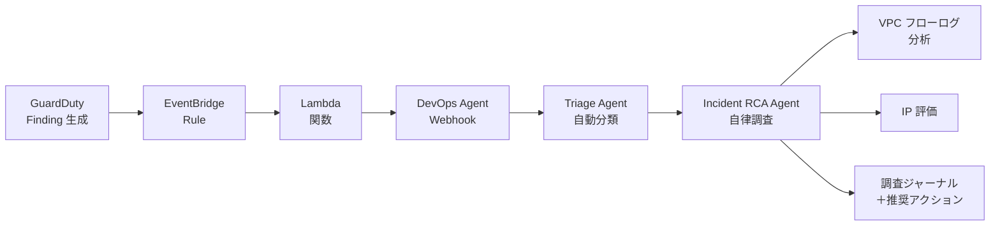
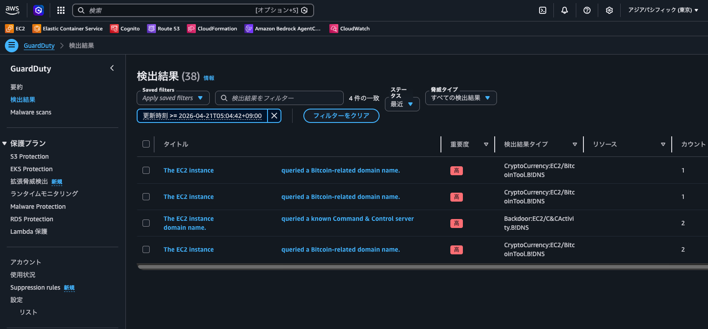
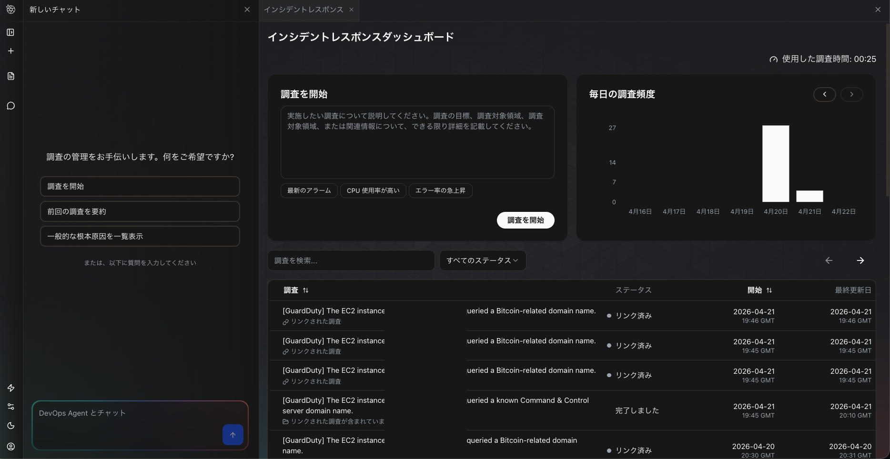
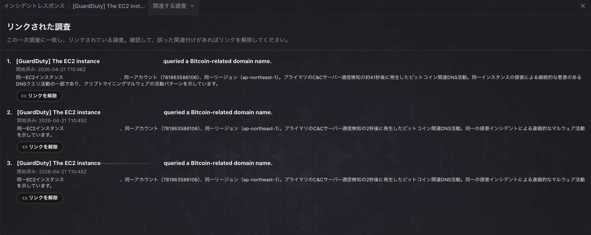
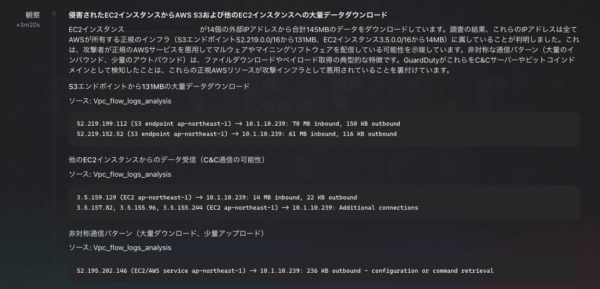
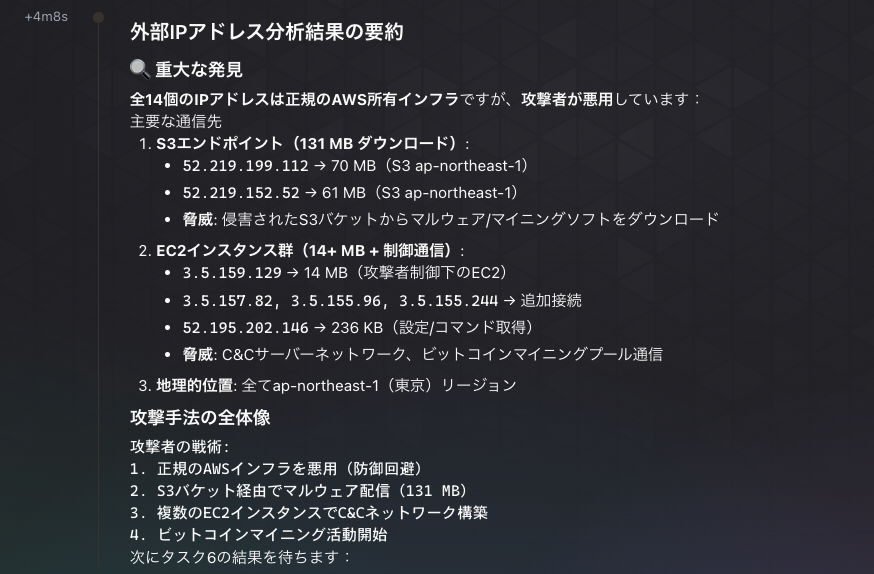
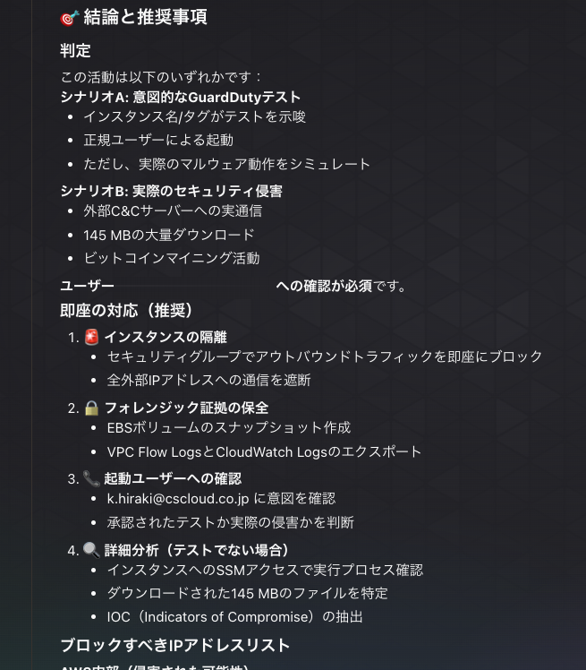

こんにちは、CSC の [CloudFastener](https://cloud-fastener.com/) というプロダクトで TAM のポジションで働いている平木です！

深夜 2 時に GuardDuty のアラートが飛んできたとき、誰が調査しますか？

この問いに対する AWS の答えが、2026 年 3 月 31 日に GA となった **AWS DevOps Agent** です。
AI がアラートを受信した瞬間から自律的に調査を開始し、翌朝には調査ジャーナルと推奨アクションが揃っている、そんな運用を実現してくれるサービスです。

今回は DevOps Agent を GuardDuty と連携し、コインマイニングドメインへの DNS ルックアップや C&C ドメインへの DNS クエリといった実際のセキュリティ検知シナリオで、AI がどのようにインシデントを調査するかを検証しました。

## 3 点まとめ

- DevOps Agent は GuardDuty Findings を **EventBridge → Lambda → Webhook 経由で自動受信**し、即座にインシデント調査を開始する。VPC フローログの分析や IP 評価まで自律的に実施してくれる
- **Triage Agent** が重複 Findings を自動で関連付け（LINKED）してくれるため、同一インシデントに起因する複数アラートのノイズが大幅に削減される
- DevOps Agent の調査結果は**日本語で出力**され、攻撃手法の全体像や推奨アクションまで提示してくれるが、あくまで**読み取り専用**であり自動修復は行わない

## AWS DevOps Agent とは

AWS DevOps Agent は Amazon Bedrock の基盤モデルを活用した AI 運用アシスタントです。インシデントの調査・解決、プロアクティブな障害予防、オンデマンドの SRE タスクを AWS・マルチクラウド・オンプレミス環境にまたがって実行できます。

https://docs.aws.amazon.com/ja_jp/devopsagent/latest/userguide/about-aws-devops-agent.html

| 特徴 | 説明 |
| --- | --- |
| **自律的インシデント対応** | アラート受信と同時に調査を開始。24/7 対応 |
| **プロアクティブな障害予防** | 過去のインシデントパターンを分析し、再発防止策を提示 |
| **オンデマンド SRE タスク** | 自然言語でインフラの状態を問い合わせ、レポートを作成 |
| **クロスアカウント調査** | 複数の AWS アカウントにまたがるリソースを横断調査 |
| **スキル（Skills）** | カスタムの調査手順やドメイン知識をエージェントに追加 |
| **マルチクラウド対応** | AWS、Azureを横断した調査が可能 |

管理単位は **Agent Space** という論理コンテナです。  
Agent Space ごとに AWS アカウント設定・サードパーティツール連携・権限設定を独立管理でき、日常のインシデント調査は **DevOps Agent Web App（Operator Portal）** から行います。

## GuardDuty との連携アーキテクチャ

今回は、GuardDuty で検知したインシデントを調査させたいと思ったため、調査させるまでのロジックを考えてみました。

### Webhook 経由で連携する

DevOps Agent が調査を開始するトリガーは次の 3 つです。

1. **Built-in integrations** — ServiceNow 等のチケットシステムとの組み込み統合による自動トリガー
2. **Webhooks** — 外部システムから HTTP リクエストでイベントを送信（PagerDuty チケット、Grafana アラーム等）
3. **Manually** — Operator Portal 画面から手動で調査を開始

https://docs.aws.amazon.com/ja_jp/devopsagent/latest/userguide/working-with-devops-agent-autonomous-incident-response.html

GuardDuty は組み込み統合の対象外のため、今回は **Webhook 経由**で連携しました。  
EventBridge ルールで GuardDuty Findings をキャッチし、Lambda 関数で DevOps Agent の Generic Webhook URL に送信する構成です。

:::message
DevOps Agent の EventBridge 統合は**DevOps Agent から外部へイベントを送信する方向**（調査完了時の通知等）のみです。EventBridge から直接 DevOps Agent の調査をトリガーすることはできません。
:::

### データフロー



現時点での組み込み統合の対応状況は以下の通りです。

| カテゴリ | 対応サービス |
| --- | --- |
| **AWS オブザーバビリティ** | Amazon CloudWatch（メトリクス、ログ、アラーム、トレース） |
| **AWS イベント** | Amazon EventBridge（DevOps Agent → 外部への通知のみ） |
| **サードパーティ オブザーバビリティ** | Datadog, Dynatrace, New Relic, Splunk, Grafana, Prometheus |
| **CI/CD** | GitHub, GitLab, Azure DevOps |
| **コラボレーション** | Slack, ServiceNow, PagerDuty |
| **クラウドプロバイダー** | AWS（プライマリ）, Azure（セカンダリ） |

## 検証環境

### ネットワーク構成

今回は擬似的にGuardDuty上でインシデントを検知させるために以下のような構成の環境を用意しました。

```
VPC
├── Public Subnet
│   ├── Internet Gateway
│   └── NAT Gateway
├── Private Subnet
│   ├── EC2 ← テスト対象
│   └── VPC Endpoints (SSM, SSM Messages)
└── VPC Flow Logs → CloudWatch Logs
```

### ログ環境

DevOps Agent が調査に活用できるよう、以下のログソースを CloudWatch Logs に送信するように整備しました。

- VPC フローログ
- OS syslog (`/var/log/messages`) 
- 認証ログ (`/var/log/secure`)

## インシデント検知〜調査完了の全流れ

ここからが本題です。Session Manager 経由で EC2 に接続し GuardDuty 検知テストを実施した後、DevOps Agent がどのように自律調査を進めるかをステップごとに追います。

### ステップ 1: GuardDuty Finding を生成する

| テスト | コマンド | 期待される Finding | 結果 |
| --- | --- | --- | --- |
| コインマイニング DNS | `nslookup pool.supportxmr.com` | `CryptoCurrency:EC2/BitcoinTool.B!DNS` | ✅ 検出 |
| 追加マイニング DNS | `nslookup xmr.pool.minergate.com` | `CryptoCurrency:EC2/BitcoinTool.B!DNS` | ✅ 検出 |
| C&C ドメイン | `dig GuardDutyC2ActivityB.com` | `Backdoor:EC2/C&CActivity.B!DNS` | ✅ 検出 |
| EICAR ファイル | `curl -o /tmp/eicar.com https://secure.eicar.org/eicar.com` | `Execution:EC2/MaliciousFile` | ❌ 未検出 |

DNS ルックアップ系のテストはすべて正常に名前解決され、GuardDuty Findings も生成されました。EICAR テストファイルのダウンロードは成功したものの、GuardDuty Malware Protection による Finding は生成されませんでした。EBS スキャンが自動トリガーされる条件を満たさなかった可能性があります。



### ステップ 2: DevOps Agent が自動調査を開始する

Finding 生成から調査完了までの流れは以下の通りです。

| 経過時間 | イベント | 担当 |
| --- | --- | --- |
| T+0 分 | GuardDuty Finding が生成される | AWS GuardDuty |
| T+~1 分 | EventBridge → Lambda → Webhook で通知 | Lambda（自動） |
| T+8 分 | DevOps Agent が調査を自動開始 | DevOps Agent |
| T+数十分 | VPC フローログ分析・IP 評価完了、ジャーナル生成 | DevOps Agent |



### ステップ 3: Triage Agent による自動分類

DevOps Agent の **Triage Agent** が、受信した複数の GuardDuty Findings を自動的に分析・分類しました。

```
受信した Finding 例:
├── [PRIMARY] Backdoor:EC2/C&CActivity.B!DNS (Severity: 8)
│   ├── [LINKED] CryptoCurrency:EC2/BitcoinTool.B!DNS
│   │   └── 理由: "プライマリの C&C サーバー通信検知の 2 秒後に発生した
│   │          ビットコイン関連 DNS 活動。同一の侵害インシデントによる
│   │          連鎖的なマルウェア活動を示しています。"
│   └── [LINKED] CryptoCurrency:EC2/BitcoinTool.B!DNS
│       └── 理由: "同一 EC2 インスタンス、同一アカウント、同一リージョン。"
```



**同一インスタンスに起因する複数の Findings を自動的に LINKED ステータスにまとめてくれる**点が重要です。1 つのインシデントに対して複数のアラートが発生しても、プライマリタスクに集約されることでノイズが大幅に削減されます。LINKED の理由も日本語で明確に記述されており、なぜ関連付けられたのかが一目で分かります。

### ステップ 4: 調査ジャーナルの内容

DevOps Agent は調査の過程を**ジャーナル（Investigation Journal）**として記録します。今回は以下の分析が自律的に行われていました。

#### VPC フローログ分析

| 通信先 | データ量 | 分析結果 |
| --- | --- | --- |
| S3 エンドポイント（52.219.x.x） | 131 MB 受信 | 正規 AWS インフラだが、侵害された S3 バケットからのマルウェア配信の可能性 |
| EC2 インスタンス（3.5.x.x） | 14 MB 受信 | 攻撃者制御下の EC2 による C&C ネットワーク |
| EC2/AWS サービス（52.195.x.x） | 236 KB 送信 | 設定ファイルやコマンド取得の可能性 |



検出された 14 個の外部 IP アドレスに加え、以下の不審な通信パターンも自動検出しました。

- **非対称通信**: 大量インバウンドに対して少量アウトバウンド（ペイロード取得の典型的特徴）
- **起動直後の外部通信**: インスタンス起動後 6 分以内に外部 IP への HTTPS 通信を開始

#### 推定された攻撃シナリオ（攻撃キルチェーン）

| フェーズ | 手法 | DevOps Agent の観測内容 |
| --- | --- | --- |
| 防御回避 | 正規 AWS インフラ（S3）を悪用 | 52.219.x.x から 131 MB 受信 |
| C2 通信確立 | EC2 ベースの C&C ネットワーク構築 | 3.5.x.x から 14 MB 受信 |
| 実行 | マイニングプールへの DNS クエリ | GuardDuty Finding（Severity 8） |
| 収益化 | ビットコインマイニング活動開始 | 複数のマイニングプールへの通信 |



:::message
今回はテスト目的で DNS ルックアップを行っただけですが、DevOps Agent は VPC フローログの通信パターンから「S3 バケット経由のマルウェア配信」や「C&C ネットワーク構築」といった攻撃シナリオまで推定しています。実際の攻撃ではないため過検知ではありますが、**利用可能な情報を最大限活用して調査を行う姿勢**は印象的でした。
:::

#### 推奨アクション

最終的なアクションプランについては3段階に分けて報告されています。

- 🚨 即座に全 14 個の IP アドレスをセキュリティグループでブロック
- 🔒 侵害されたインスタンスを隔離し、フォレンジック分析を実施
- 📋 AWS Abuse Team に攻撃者制御下の EC2 インスタンス IP を報告



ユーザーによる検証ということもバレていそうですね笑

## クロスアカウント調査

DevOps Agent の大きな強みの一つが、**複数の AWS アカウントにまたがるリソースを横断的に調査できる**点です。

Agent Space にはプライマリアカウントに加えて、セカンダリアカウントを追加できます。セカンダリアカウントに IAM ロール（`AIOpsAssistantPolicy` マネージドポリシー + インラインポリシー）を作成し、プライマリアカウントから AssumeRole できるように信頼関係を設定するだけで連携が完了します。

```
Agent Space (プライマリアカウント)
├── セカンダリアカウント A ← AssumeRole
├── セカンダリアカウント B ← AssumeRole
└── ...
```

セキュリティ運用での代表的な活用シーンは以下の通りです。

| 活用シーン | 内容 |
| --- | --- |
| **Organizations 環境での横断調査** | あるアカウントの Finding をトリガーに、関連する他アカウントの VPC フローログ・CloudTrail・CloudWatch メトリクスも含めて調査 |
| **攻撃の横展開の追跡** | 同じ IAM インスタンスプロファイルを使用する他アカウントのインスタンスへの影響確認 |
| **共有サービスアカウントの調査** | ログ集約アカウントやセキュリティアカウントのデータを参照しながら、ワークロードアカウントのリソースを調査 |

## スキル（Skills）機能

DevOps Agent には**スキル**という拡張機能があり、エージェントにカスタムの調査手順やドメイン知識を追加できます。

https://docs.aws.amazon.com/devopsagent/latest/userguide/about-aws-devops-agent-devops-agent-skills.html

| スキル種別 | 誰が作成 | 更新タイミング | GuardDuty 運用での活用例 |
| --- | --- | --- | --- |
| **Agent Space Understanding** | DevOps Agent（自動） | 統合追加・変更時 | VPC/EC2 トポロジーの自動把握 |
| **Tool Use Best Practices** | DevOps Agent（自動） | 30 調査ごと | ログ取得の効率化 |
| **Custom Skills** | ユーザー | 手動 | Finding Type ごとの調査フロー |

今回の検証では、Agent Space 作成後に `Create Agent Space Understanding Skills` というシステムタスクが自動実行され、環境の学習が行われていました。これにより DevOps Agent は調査開始時点で既に環境のトポロジーを把握した状態になります。

### Custom Skills の構成

```
my-skill/
├── SKILL.md              # 必須: メインの調査手順（frontmatter に name と description を記述）
├── references/           # 任意: 参考ドキュメント
└── assets/               # 任意: 画像、図、データファイル
```

特定のエージェントタイプにのみスキルを適用できる**ターゲティング機能**も便利です。例えば、GuardDuty Findings の調査手順を **Incident RCA** にのみターゲティングすれば、根本原因分析時にだけそのスキルが読み込まれます。不要なコンテキスト消費を抑えつつ調査精度を向上させられます。

| エージェントタイプ | 用途 |
| --- | --- |
| **Generic** | すべてのエージェントタイプに適用（デフォルト） |
| **Incident Triage** | インシデントの初期評価 |
| **Incident RCA** | 根本原因分析 |
| **Incident Mitigation** | インシデント緩和 |
| **On-demand** | オンデマンドの会話クエリ |
| **Evaluation** | プロアクティブな推奨事項 |

### チャットからスキルを作成する

Custom Skills は、Operator Portal のチャット（オンデマンド SRE タスク）から会話形式で作成することもできます。「GuardDuty の調査手順をスキルとして作成して」と依頼するだけで、エージェントが適切な `SKILL.md` を生成してくれます。

今回の検証では、チャットを通じて以下の 3 つのカスタムスキルを作成しました。

:::details guardduty-initial-analysis（GuardDuty 検出結果の初期分析）

**説明:** GuardDuty 検出結果を受け取ったときの初期分析ワークフロー。検出タイプの理解、重大度評価、影響範囲の特定、および次のステップの優先順位付けを実施します。

**手順（抜粋）:**

```markdown
# GuardDuty検出結果の初期分析

GuardDuty検出結果を効果的に分析するための標準ワークフローです。検出内容を理解し、重大度を評価し、対応の優先順位を決定します。

## いつ使用するか
- GuardDutyから新しい検出結果を受け取った
- 既存の検出結果を再評価する必要がある
- 複数の検出結果の優先順位付けが必要
- セキュリティインシデントの初期評価を行う

## 分析ステップ

### ステップ1: 検出結果の基本情報を確認
検出結果から以下の情報を抽出：
- **検出タイプ** - CryptoCurrency:EC2/BitcoinTool.B等のカテゴリ
- **検出の説明** - 何が検出されたか
- **重大度** - High/Medium/Low
- **対象リソース** - EC2インスタンス、IAMユーザー等
- **検出日時** - いつ発生したか
- **アカウントID** - どのAWSアカウントか

### ステップ2: 重大度を評価
¥```
HIGH重大度:
  └─ 即座の対応が必要
  └─ 侵害の兆候が強い
  └─ データ流出のリスク
  └─ 横方向移動の可能性

MEDIUM重大度:
  └─ 数時間以内の対応
  └─ 侵害の兆候が中程度
  └─ 追加の調査が必要

LOW重大度:
  └─ 対応の優先度は低い
  └─ 予防的な対応
  └─ 定期的な確認で十分
¥```

### ステップ3: 影響範囲を特定
対象リソースから以下を確認：

**EC2インスタンスの場合:**
- インスタンスID、インスタンスタイプ、起動日時
- VPC/セキュリティグループ設定
- IAMロール、関連するIAMユーザー
- 接続されているストレージ（EBS、NFS等）
- 実行中のアプリケーション/サービス

**IAMユーザーの場合:**
- ユーザーの権限（アタッチ済みポリシー）
- 最近のAPI活動
- 作成されたアクセスキーの数
- MFA設定状況

### ステップ4: 検出タイプ別の初期調査
**各検出タイプで最初に確認すべき項目:**

| 検出タイプ | 重点確認項目 |
|-----------|-----------|
| CryptoCurrency:EC2/BitcoinTool.* | CPU使用率、ネットワークトラフィック、実行中プロセス |
| Trojan:EC2/Phishing* | 開かれているネットワークポート、インバウンドトラフィック源 |
| Backdoor:EC2/SSH* | SSHログイン履歴、セキュリティグループ設定 |
| Unauth:IAMUser/* | ユーザーのAPI呼び出し履歴、権限レベル |
| PenTest:IAMUser/* | API呼び出しパターン、作成されたリソース |

### ステップ5: 対応アクションを決定

**High重大度の場合:**
1. インスタンスをネットワークから隔離（セキュリティグループ修正）
2. インスタンスをシャットダウン（スナップショット作成後）
3. 詳細な取り調査のため調査用インスタンスで分析
4. IAMユーザーの権限を即座に剥奪
5. ネットワークトラフィック分析を開始

**Medium重大度の場合:**
1. リソースの詳細情報を収集
2. 関連するログを分析
3. 過去24時間のAPI活動を確認
4. 必要に応じてネットワーク監視を強化

**Low重大度の場合:**
1. リソースをモニタリング
2. ログを保存して定期的に確認
3. 予防的な設定強化を検討

### ステップ6: 調査の次のステップを決定

調査が必要な場合は、以下の観点から詳細調査を計画：
- **ネットワークトラフィック分析** - 通信先、通信量、通信プロトコル
- **インフラストラクチャ変更追跡** - CloudTrailイベント、セキュリティグループ変更
- **ログ分析** - システムログ、アプリケーションログ
- **マルウェア検出** - プロセス分析、ファイルシステム確認

## 出力フォーマット

分析結果をまとめるフォーマット：

¥```
【GuardDuty検出結果の初期分析】

検出内容:
- 検出タイプ: [タイプ]
- 対象リソース: [リソース]
- 検出日時: [日時]

重大度評価: [High/Medium/Low]

影響範囲:
- [主要な影響]
- [二次的な影響]

推奨アクション:
1. [即座のアクション]
2. [短期的なアクション]
3. [長期的なアクション]

次のステップ:
- [詳細調査の方向性]
¥```

## 注記
- 重大度がHighの場合は、ビジネスチームへの通知を忘れずに
- 対象のEC2インスタンスやIAMユーザーは削除前にバックアップ/スナップショットを作成
- CloudTrailログは後の監査のため保持する
- 詳細な取り調査はセキュアな環境で実施
```

:::

:::details ec2-compromise-investigation（EC2 インスタンス侵害の詳細調査）

**説明:** EC2 インスタンス侵害の詳細な調査ワークフロー。不審なネットワーク通信、マルウェアの兆候、システムの異常を体系的に調査し、根本原因を特定します。

**手順（抜粋）:**

```markdown
# EC2インスタンス侵害の詳細調査

EC2インスタンスが侵害されたと判断された場合、根本原因を特定し、影響範囲を評価するための詳細な調査プロセスです。

## いつ使用するか
- GuardDutyが疑わしいEC2インスタンスを検出した
- CryptoCurrency:EC2/BitcoinTool検出が発生した
- Trojan:EC2/Phishing検出がある
- Backdoor:EC2/SSH検出がある
- インスタンスの不審な動作が報告された

## 調査ステップ

### ステップ1: インスタンスの隔離と保護
**重大度がHighの場合、即座に実施:**

1. **セキュリティグループの修正**
   - インスタンスを新しいセキュリティグループに移動
   - すべてのインバウンドトラフィックを拒否
   - アウトバウンドトラフィックも必要最小限に制限
   
2. **スナップショット/イメージ作成**
   - EBSボリュームのスナップショット作成（取り調査用）
   - AMIイメージ作成（後の分析用）
   
3. **ネットワークインターフェース確認**
   - ENIの詳細情報を記録
   - セカンダリIPアドレスを確認
   - Elastic IPの確認

### ステップ2: タイムラインの構築
検出から現在までの時間経過を把握：

¥```
起動日時 → インスタンス起動時刻
最初の異常 → 最初のアラート/ログエントリ
検出日時 → GuardDuty検出日時
現在 → 調査開始時刻

期間計算:
- 起動から検出まで → 侵害の可能性期間
- 検出から現在まで → 活動継続期間
¥```

### ステップ3: CloudTrailイベントの分析
インスタンスに関連するAPI活動を確認：

**確認すべきイベント:**
- RunInstances: インスタンスの起動
- DescribeInstances: インスタンス情報へのアクセス
- CreateSecurityGroup: セキュリティグループ作成
- ModifyInstanceAttribute: インスタンス属性の変更
- CreateImage: AMI作成
- CreateSnapshot: スナップショット作成
- AuthorizeSecurityGroupIngress: セキュリティグループルール追加
- RevokeSecurityGroupIngress: セキュリティグループルール削除
- DescribeKeyPairs: キーペアへのアクセス

**分析ポイント:**
- 異常な時刻のAPI呼び出し
- 想定外のユーザーからのAPI呼び出し
- インスタンス起動直後の構成変更
- 権限昇格の試み

### ステップ4: ネットワークトラフィック分析
VPC Flow Logsから通信パターンを分析：

**確認すべき項目:**
1. **インバウンドトラフィック**
   - 予期しない送信元IP
   - 通常と異なるポート
   - SSH（22）への直接接続
   - RDP（3389）への直接接続

2. **アウトバウンドトラフィック**
   - 通常と異なる宛先
   - 大量のデータ転送
   - 既知のマイニング/C&Cサーバーへの通信
   - DNS リクエストの異常パターン

3. **通信量の異常**
   - CPU使用率が高いことに対応する通信量
   - 不規則な通信パターン
   - ピーク時間帯の異常

### ステップ5: システムログの分析
CloudWatch Logsやシステムログから兆候を発見：

**Linux環境での確認項目:**
- `auth.log`: ログイン試行、sudo使用
- `syslog`: システムイベント、エラー
- プロセスログ: 不審なプロセス起動
- cron/スケジュール実行: 自動タスク

**確認ポイント:**
- 異常なタイムスタンプのログ
- ルートアクセスの試み
- sudo使用の履歴
- パッケージのインストール履歴
- ネットワーク設定変更

### ステップ6: IAMロール/権限の確認
インスタンスに関連するIAM構成を調査：

1. **アタッチされたIAMロール**
   - ロール名と権限スコープ
   - アタッチ日時と変更履歴

2. **権限の範囲**
   - S3アクセス権限
   - RDSアクセス権限
   - その他のAWS service権限
   - 意図しない権限昇格

3. **認証情報の公開リスク**
   - インスタンスメタデータからの認証情報窃取の可能性
   - セッションの有効期間

### ステップ7: セキュリティグループとネットワーク設定
ネットワークセグメンテーション設定を確認：

1. **セキュリティグループルール**
   - インバウンドルール（許可/拒否）
   - アウトバウンドルール
   - いつ追加/変更されたか

2. **ネットワークACL**
   - VPCレベルのアクセス制御
   - 異常なルール

3. **ルートテーブル**
   - デフォルトゲートウェイ
   - NAT/NAT Gateway経由の通信

### ステップ8: 侵害経路の特定
攻撃の流入経路を推測：

**主な侵害経路:**
1. **SSH/RDP ブルートフォース攻撃**
   - 弱いパスワード
   - デフォルト認証情報
   - 鍵の盗難

2. **セキュリティグループ設定の甘さ**
   - 0.0.0.0/0からのSSHアクセス許可
   - インスタンスメタデータへの直接アクセス

3. **ユーザーデータスクリプト**
   - 起動時に悪意のあるスクリプト実行
   - 外部URLからのダウンロード

4. **AMI/スナップショット経由**
   - 事前に感染したAMIを使用
   - 共有AMIからの感染

5. **既存の脆弱性**
   - アプリケーションのセキュリティ脆弱性
   - OS/ライブラリの未パッチ脆弱性

### ステップ9: マルウェアとツールの特定
実際のマルウェアやツールを特定：

**暗号通貨マイニングの兆候:**
- CPU使用率が常に高い（80%以上）
- 実行中プロセスからマイナーの痕跡
- cron ジョブでマイナースクリプトが定期実行
- ダウンロード履歴にマイナーツール

**バックドアの兆候:**
- 不審なプロセスがバックグラウンドで実行
- 隠しファイルの存在
- 異常なネットワーク接続

**トロイの木馬の兆候:**
- ファイルシステムに改ざんの痕跡
- 不審な実行ファイル
- ライブラリのハイジャック

### ステップ10: 横方向移動の可能性評価
インスタンスから他のリソースへのアクセス可能性を評価：

1. **他のEC2インスタンスへのアクセス**
   - セキュリティグループルールで許可されたポート
   - ネットワークセグメンテーション

2. **データストアへのアクセス**
   - S3バケットのアクセス権限
   - RDSインスタンスへの接続性
   - EFS共有への接続性

3. **同じサブネット内のリソース**
   - スキャン可能なホスト
   - 乗っ取られる可能性のあるサービス

## 出力フォーマット

¥```
【EC2インスタンス侵害調査レポート】

対象インスタンス:
- インスタンスID: [ID]
- インスタンスタイプ: [タイプ]
- 起動日時: [日時]

タイムライン:
- 起動から検出まで: [日数]
- 検出から調査開始まで: [日数]

侵害経路:
- [推定される侵害経路]

検出された異常:
- [異常1]
- [異常2]

横方向移動の可能性:
- [高/中/低] - [理由]

推奨アクション:
1. [即座のアクション]
2. [緊急のアクション]
3. [長期的なアクション]

調査進捗: [実施済みステップ]
¥```

## 注記
- 侵害されたインスタンスは本番環境から速やかに隔離
- 証拠保全のため、削除する前に必ずスナップショット/イメージを作成
- IAMロールの権限を理解した上で、他のリソースへのアクセス可能性を評価
- 法的/コンプライアンス要件がある場合は対応
```
:::

:::details security-incident-response（セキュリティインシデント対応プレイブック）

**説明:** セキュリティインシデント発生時の初動対応プレイブック。検出から対応まで、体系的で実行可能なステップを提供します。意思決定フロー、対応優先度、エスカレーションパスを明確にします。

**手順（抜粋）:**

```markdown
# セキュリティインシデント対応プレイブック

セキュリティインシデント検出時の初動対応フロー、意思決定、エスカレーションを標準化するプレイブックです。

## いつ使用するか
- GuardDutyアラートが到着した
- セキュリティイベント検出時の初動対応が必要
- インシデント対応チーム間での意思統一が必要
- 対応優先度の決定が必要
- エスカレーション判断が必要

## インシデント対応フロー

### フェーズ1: 検出とアラート受信（初期段階）

**実施者:** セキュリティオペレーションセンター (SOC) / 担当エンジニア

**ステップ:**
1. アラート/検出の受信確認
2. 基本情報の記録
   - 検出日時 (UTC)
   - 検出ツール (GuardDuty、CloudTrail等)
   - 対象リソース（EC2ID、IAMユーザー等）
   - 重大度レベル
3. インシデントチケット作成
4. 初期的な影響範囲の把握

**判定基準:**
- **HIGH重大度** → フェーズ2へ即座に進行、エスカレーション
- **MEDIUM重大度** → フェーズ2へ進行、30分以内に分析完了
- **LOW重大度** → フェーズ2スキップ、ログに記録、定期確認

**出力**: インシデントチケット (ID、タイムスタンプ、アラート詳細)

---

### フェーズ2: 初期評価とトリアージ（最初の30分）

**実施者:** セキュリティアナリスト/DevOpsエンジニア

**目的:** インシデントの真実性、重大度、影響範囲を確認

**実施項目:**

#### 2-1. 検出の妥当性を確認
- [ ] アラートが誤検知でないことを確認
- [ ] 対象リソースが実際に存在することを確認
- [ ] 検出タイプが既知のパターンに一致するか確認

#### 2-2. リソース情報を収集
¥```
対象リソース: [EC2ID / IAMUser / その他]
所有チーム: [チーム名]
本番環境?: [Yes/No]
関連するデータ: [データベース、S3等]
依存するサービス: [サービスA、B等]
¥```

#### 2-3. 重大度を再評価
¥```
重大度判定マトリックス:

HIGH:
  └─ 本番環境へのアクセス + データへのアクセス可能性
  └─ 複数のリソースへの影響の可能性
  └─ ネットワーク境界からの外部アクセス

MEDIUM:
  └─ 本番環境へのアクセス (限定的)
  └─ 開発環境での不審な活動
  └─ IAM権限の異常

LOW:
  └─ 開発/テスト環境のみ
  └─ 権限が限定的
  └─ データアクセスの可能性が低い
¥```

#### 2-4. 初期仮説を立案
- 最初に考えられる侵害経路は何か？
- 攻撃者の目的は何か？
- どのデータが危険にさらされている可能性があるか？

**意思決定ポイント:**
¥```
重大度 = HIGH?
  ├─ Yes → フェーズ3へ進行、直ちにエスカレーション
  ├─ No → 重大度 = MEDIUM?
        ├─ Yes → フェーズ3へ進行、30分以内に完了
        └─ No → ログ記録、定期確認 (フェーズ終了)
¥```

**出力**: 初期評価レポート (重大度再確認、初期仮説、次のステップ)

---

### フェーズ3: 詳細分析 (重大度に応じて並行実施)

**実施者:** セキュリティアナリスト + インフラチーム

**HIGH重大度の場合の並行アクション:**

#### 3-A. 対象リソースの隔離 (実行時間: 5-10分)
**実行:** 認定オペレーター

1. **EC2インスタンスの場合:**
   - セキュリティグループをリストリクティブなグループに変更
   - すべてのインバウンドトラフィックを拒否
   - 管理者のみが調査用アクセスを許可

2. **IAMユーザーの場合:**
   - すべてのアクティブなアクセスキーを無効化
   - 認証トークンを削除
   - セッションを終了
   - パスワードをリセット

3. **その他:**
   - 該当するリソースのアクセスを制限

#### 3-B. ビジネスインパクト評価 (並行実施)
**実行:** ビジネスオーナー + セキュリティチーム

1. 対象リソースの依存関係を把握
2. 隔離による影響を評価
3. 継続的なビジネス運用の必要性を判定
4. 復旧優先度を決定

#### 3-C. 詳細ログ分析 (並行実施)
**実行:** セキュリティアナリスト

検出項目:
- [ ] CloudTrail イベントの確認
- [ ] VPC Flow Logs のエクスポート/分析
- [ ] System/Application ログの確認
- [ ] ネットワークトラフィック分析
- [ ] マルウェア検出/IOC確認

**MEDIUM重大度の場合:**
- 隔離は不要 (監視強化のみ)
- 詳細分析は順序立てて実施
- リソースをオンラインに保つ

---

### フェーズ4: インシデント対応 (重大度に応じた実行)

**実施者:** セキュリティチーム + 対象チーム

#### 4-1. 根本原因の特定
前のステップの分析結果から、以下を特定:
- 侵害が発生した正確な日時
- 侵害経路
- 攻撃者が実施したアクション
- 影響を受けたデータ/リソース

#### 4-2. 侵害範囲の確定
1. 他のリソースへの横方向移動の可能性を評価
2. 他の関連するアカウント/ユーザーをチェック
3. 共有リソース（共有AMI、S3等）への影響を確認

#### 4-3. 対応アクション実施
**HIGH重大度の場合:**
1. 隔離されたリソースを確認
2. 関連するログをバックアップ
3. マルウェア駆除またはリソース再構築の判定
4. 対象リソースの復旧手順を計画

**意思決定:**
¥```
侵害の範囲が確定?
  ├─ 単一リソースのみ→ 復旧計画を立案
  └─ 複数リソート複数の影響 → 拡大対応フェーズへ
¥```

#### 4-4. コミュニケーション
- [ ] 経営層への報告
- [ ] 法務/コンプライアンスチームへの通知 (必要に応じて)
- [ ] 顧客への通知準備 (必要に応じて)
- [ ] 外部セキュリティベンダーへの相談 (必要に応じて)

---

### フェーズ5: 復旧と検証

**実施者:** インフラチーム + セキュリティチーム

#### 5-1. リソースの復旧方法を決定
¥```
復旧オプション:

オプション1: 修復 (Low Risk)
  前提条件:
  - 根本原因が明確である
  - 限定的な侵害 (単一リソース)
  - パッチ適用/設定修正で対応可能
  
  実施手順:
  1. 脆弱性/設定を修正
  2. 新しいパスワード/キーを発行
  3. セキュリティグループを適切に設定
  4. リソースをオンラインに戻す
  5. ログに記録

オプション2: 再構築 (Medium Risk)
  前提条件:
  - 根本原因が不明または複数の兆候
  - マルウェア感染の可能性
  
  実施手順:
  1. クリーンなAMIから新しいインスタンスを起動
  2. アプリケーションを再デプロイ
  3. 古いインスタンスを削除
  4. 新しい認証情報を発行
  5. ネットワークアクセスを設定

オプション3: 全体的な再構築 (High Risk)
  前提条件:
  - 複数のリソースが影響を受けた
  - 供給チェーン侵害の可能性
  - コンプライアンス/法的要件
  
  実施手順:
  1. 影響を受けたすべてのリソースを停止
  2. 完全なインフラ監査を実施
  3. クリーンな状態から再構築を計画
  4. 段階的な復旧計画を実行
¥```

#### 5-2. 復旧の実施
- [ ] バックアップから復旧 (必要に応じて)
- [ ] リソースの再構築/再デプロイ
- [ ] セキュリティグループ/ACLの再設定
- [ ] 新しい認証情報の配布
- [ ] ヘルスチェック実施

#### 5-3. 復旧の検証
¥```
検証チェックリスト:
  ├─ リソースが期待通りに動作しているか
  ├─ セキュリティグループルールが正しいか
  ├─ ログが正常に記録されているか
  ├─ 監視アラートが機能しているか
  ├─ 通常のトラフィックが流れているか
  └─ 異常なトラフィック/アクセスがないか
¥```

---

### フェーズ6: 調査完了と予防

**実施者:** セキュリティチーム + 経営層

#### 6-1. インシデント報告書作成
¥```
報告書の構成:
  1. エグゼクティブサマリー
     - 何が発生したか (1-2文)
     - 影響 (定量的)
     - 対応状況
  
  2. インシデントの詳細
     - 検出日時
     - 根本原因
     - 影響範囲
     - 対応アクション
  
  3. タイムライン
     - 日時毎の主要な出来事
  
  4. 予防対策
     - 再発防止の方法
     - 推奨される設定変更
     - 監視ルール の強化
  
  5. レッスンズラーン
     - 改善点
     - 対応フローの見直し
¥```

#### 6-2. 予防対策の実装
- [ ] セキュリティグループルールの強化
- [ ] IAM権限の最小権限化
- [ ] 監視ルールの追加
- [ ] デバイス管理ポリシーの改善
- [ ] アクセス管理の改善
- [ ] 自動化ツールの導入

#### 6-3. チーム間のフィードバック
- セキュリティチーム ← オペレーション
- 開発チーム ← 運用チーム
- 経営層 ← セキュリティチーム

---

## エスカレーション基準

¥```
エスカレーションレベル判定:

Level 1: セキュリティチーム (内部)
  └─ 一般的なセキュリティイベント
  └─ LOW-MEDIUM重大度

Level 2: 経営層 + 法務
  └─ HIGH重大度
  └─ データ流出の可能性
  └─ 規制要件に抵触する可能性

Level 3: 外部ステークホルダー
  └─ 個人情報の流出確認
  └─ コンプライアンス違反
  └─ 外部への通知が必要
¥```

**エスカレーション実行時刻:**
- HIGH重大度: 検出直後 (0-5分以内)
- MEDIUM重大度: 30分以内
- LOW重大度: レポート提出時

---

## 連絡先と役割

**セキュリティチーム:**
- 24/7 オンコール

**インフラチーム:**
- リソース隔離/復旧の実施

**ビジネスオーナー:**
- ビジネスインパクト評価
- 対応優先度の決定

**法務/コンプライアンス:**
- 規制要件の確認
- 外部通知の判定

---

## 注記
- 本プレイブックは「初期対応」に焦点を当てています
- 詳細なフォレンジック分析が必要な場合は、外部セキュリティベンダーに相談
- HIPAA, PCI-DSS等の規制対象環境では、追加のコンプライアンス手順が必要
- 定期的にプレイブックをレビュー・更新 (最低でも年1回)
```

:::

スキルを事前に作成しておくことで、次回以降の GuardDuty Finding 調査時に DevOps Agent が自動的に参照し、より体系的な調査を実施してくれるようになります。

:::message
スキルは [Agent Skills 仕様](https://agentskills.io/) というオープンスタンダードに基づいています。現時点では Markdown、PDF、画像、データファイルのみサポートされており、スクリプトの実行は将来のリリースで対応予定です。
:::

## DevOps Agent で変わること・変わらないこと

### AI と人間の役割分担

DevOps Agent は「**調査と提案**」まで自律実行します。最終判断と「**実行**」は人間が担います。

| アクション | DevOps Agent | 人間（オペレーター） |
| --- | :---: | :---: |
| Finding の受信・分類 | ✅ 自動 | — |
| VPC フローログ分析 | ✅ 自動 | — |
| IP 評価 | ✅ 自動 | — |
| 攻撃シナリオ推定 | ✅ 自動 | — |
| 推奨アクション提示 | ✅ 自動 | — |
| セキュリティグループ変更 | ❌ 不可 | ✅ 要実施 |
| インスタンス隔離 | ❌ 不可 | ✅ 要実施 |
| フォレンジック分析 | ❌ 不可 | ✅ 要実施 |

修復アクションを自動実行しない設計は、セキュリティの観点からは適切です。一方で完全自動化を期待する場合は、推奨アクションを受け取って実行する別の仕組みが必要になります。

### 良かった点

**調査の自律性が高い**

GuardDuty Finding をトリガーに VPC フローログの分析、IP 評価、通信パターンの分析まで、人間が指示しなくても自律的に調査を進めてくれます。深夜にアラートが発生しても、翌朝には調査結果が揃っている状態を作れるのは大きなメリットです。

**Triage Agent によるノイズ削減**

GuardDuty は 1 つのインシデントに対して複数の Findings を生成することがよくあります。Triage Agent が自動的に関連付けてくれるため、オペレーターは本質的なインシデントに集中できます。

**日本語対応**

Agent Space 作成時にロケールを日本語に設定すると、調査結果や Triage 理由がすべて日本語で出力されます。英語のログを読み解く負担が軽減されるのは、日本のチームにとって嬉しいポイントです。

**調査ジャーナルの透明性**

AI が何を考え、どのデータを参照し、どのような結論に至ったかがジャーナルとして記録されます。ブラックボックスではなく、調査プロセスを追跡・検証できる点は信頼性の面で重要です。

**クロスアカウント調査で Organizations 環境に対応**

セカンダリアカウントの追加が容易で、マルチアカウント環境での横断調査が実現できます。GuardDuty のマルチアカウント運用（Organizations 統合）と組み合わせることで、組織全体のセキュリティインシデントを一元的に調査できる可能性があります。

**スキルによるカスタマイズ性**

カスタムスキルで自社固有の調査手順やドメイン知識をエージェントに教え込める点は、汎用 AI アシスタントとの大きな差別化ポイントです。Learned Skills による自動学習と合わせて、使い込むほど調査精度が向上していく設計になっています。

## まとめ

以下は今回のまとめです。

- DevOps Agent は GuardDuty Findings を EventBridge → Lambda → Webhook 経由で受信し、VPC フローログや CloudWatch Logs を活用した**自律的なインシデント調査**を実行する
- Triage Agent による**重複 Findings の自動関連付け**は、GuardDuty 運用における大きなノイズ削減効果がある
- **クロスアカウント調査**により、Organizations 環境での横断的なセキュリティ調査が可能。セカンダリアカウントの追加も容易
- **スキル機能**（Learned Skills + Custom Skills）により、自社固有の調査手順やドメイン知識をエージェントに教え込め、使い込むほど調査精度が向上する
- 調査結果は日本語で出力され、攻撃手法の推定や推奨アクションまで提示してくれるが、**修復アクションの自動実行は行わない**
- GuardDuty とのネイティブ統合がないため、EventBridge ルール + Lambda 経由での Webhook 連携設定が別途必要

Slack との統合などによりさらにセキュリティ担当者のような位置付けで活用する道もありそうなのでさらに検証を進めていきたいと思います。

この記事がどなたかの役に立つと嬉しいです。
