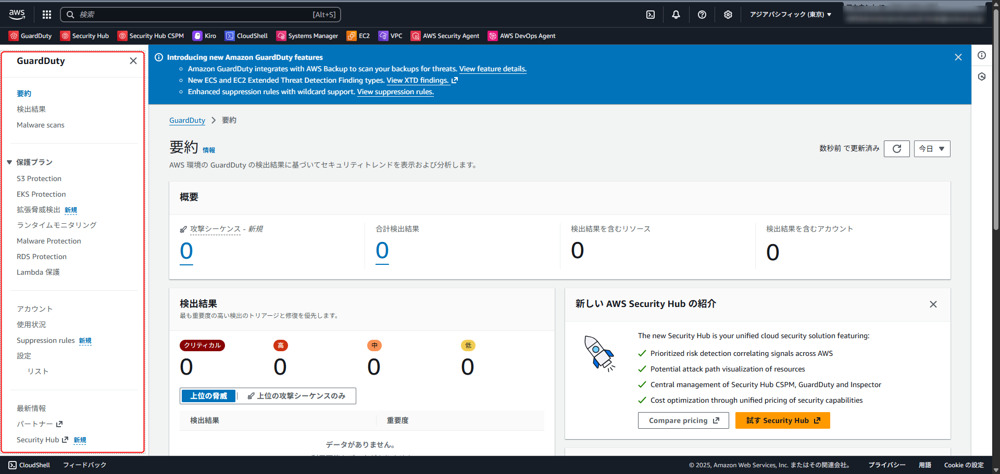
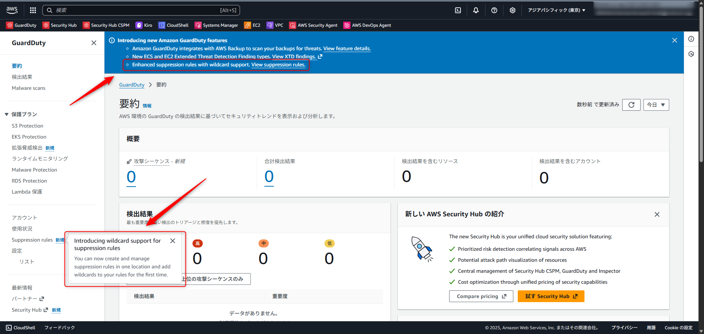

こんにちは、CSC の [CloudFastener](https://cloud-fastener.com/) というプロダクトで TAM のポジションで働いている平木です！

今日も今日とてGuardDutyを眺めていたところふとコンソール画面のナビゲーションペインの項目が変わっていることに気付きました。



re:Invent期間中のためいろいろ変わってもおかしくはないですが、
さらによく見てみるとこのような記載がされていることに気付きます。

> Enhanced suppression rules with wildcard support.
> ワイルドカード対応の強化された抑制ルール。

> Introducing wildcard support for suppression rules
> You can now create and manage suppression rules in one location and add wildcards to your rules for the first time.
> 抑制ルールへのワイルドカードサポートの導入
> 抑制ルールを一箇所で作成・管理できるようになり、初めてルールにワイルドカードを追加できるようになりました。



これは抑制ルールの最高のアップデートだな、と思い今回取り上げます。

## 3点まとめ

- ワイルドカードを抑制ルールに活用することでより柔軟な抑制ルールの適用が可能になる
- ついでに「ランク」という抑制ルール内の優先度付けが可能になりました
- 今まで抑制ルールを使用していたユーザーにはデフォルトでは自動的に抑制ルールのランクが指定されているので必要に応じて修正が必要

## 抑制ルールとは

抑制ルールは、フィルター条件に一致した検知結果については自動的にアーカイブしてくれるルールのことになります。

この機能自体は今までもあり、GuardDutyの運用を適切に行う上では必要な機能です。

ノイズを減らすことができるため、本来注力すべきセキュリティ運用に集中しやすくなる利点があります。

https://docs.aws.amazon.com/guardduty/latest/ug/findings_suppression-rule.html

## 今までの課題

しかし、これまでの抑制ルールはルール一覧が現在のこのあたりでしか見れなかったり、


今回の主題でもあるワイルドカードが使用できなく、柔軟な抑制ルールの運用というのが難しかったのが今まででした。

下記クラメソさんのブログでもワイルドカードが使用できないことで、厳格なフィルター条件の適用を諦めているケースもあったくらいです。

https://dev.classmethod.jp/articles/guardduty-suppress-discovery-iamuser-anomalousbehavior/

## 今回できるようになったこと

### ワイルドカードのサポート

今回のアップデートにより、任意の文字の一致である `*` と1つの文字を一致させる `?` を抑制ルールにおけるフィルター条件として使用できるようになりました。

ListFindingsおよびGetFindingsStatisticsではワイルドカードマッチングは使用できません。ワイルドカードを含む条件は、ListFindingsおよびGetFindingsStatisticsを使用して検証できません。

```shell
aws guardduty create-filter \
--detector-id $(aws guardduty list-detectors --query 'DetectorIds[0]' --output text) \
--name "wildcard-test-rule" \
--region ap-northeast-1 \
--finding-criteria file://criteria.json
```

## まとめ

GuardDutyの抑制ルールにワイルドカードがサポートされたことで、より柔軟な抑制ルールの適用が可能になりました。

また、抑制ルールにランク付けができるようになったことで、複数の抑制ルールが同じ検知結果にマッチした場合の優先度付けも可能になりました。

抑制ルールをすでに使用している場合は、デフォルトでランク1が割り当てられているため、必要に応じてランクの見直しを行うことをお勧めします。

この記事がどなたかの役に立つと嬉しいです。