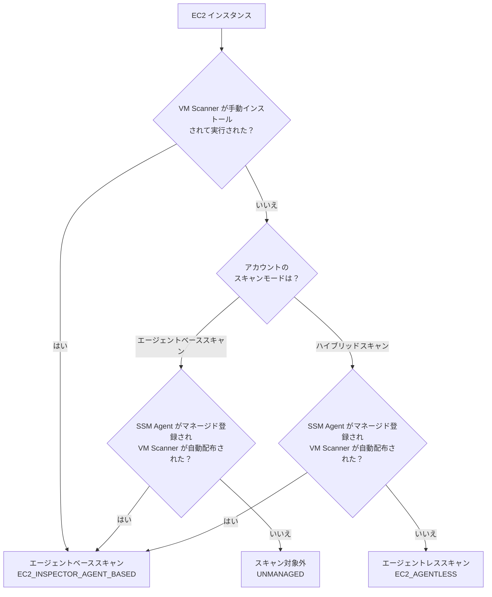

こんにちは、CSC の [CloudFastener](https://cloud-fastener.com/) というプロダクトで TAM のポジションで働いている平木です！

皆さんは Inspector を使用してAWSの脆弱性管理をしていますか？

ふと Amazon Inspector の画面を見たところ以下のような表示が出ている事に気づきました。


なんのアップデートか確認してみたところ、EC2 スキャンに、新しいスキャンエンジン「**Amazon Inspector VM Scanner**」が登場していました。

https://aws.amazon.com/jp/about-aws/whats-new/2026/05/amazon-inspector-ec2-agent-scanning-improvements/

従来のエージェントベーススキャンを支えていた Inspector SSM Plugin を置き換えるアップデートのようです。  
ただ、Inspector の EC2 スキャンにはもともと複数のモードがあり、名前も似ていて混同しやすい部分があります。

このブログでは、VM Scanner の位置づけ、良い点・気を付けたい点を確認してみました。

:::message
**この記事の6行まとめ**

- 従来のエージェントベース EC2 スキャンのエンジンを刷新した新スキャンエンジン「VM Scanner」が登場した（旧 Inspector SSM Plugin を置き換え）
- リソース使用量削減・検出範囲（WordPress / Apache HTTP Server / Python / Ruby gem）が拡大した
- エージェントレスとの検出パリティも実現し、追加費用・追加 IAM ロールも不要
- 自動インストールには SSM マネージドインスタンスであることが必要ですが、手動インストールも可能です
- 一方で CIS スキャンは引き続き Inspector SSM Plugin 管理、Scan Type は `sbom` のみ
- ログパスも SSM Plugin と共通で混在しうる点には注意が必要
:::


まず、EC2 のスキャン方式を全体像として整理します。

| スキャン方式 | 仕組み | SSM Agent | スキャンエンジン | スキャン頻度 | ディープインスペクション |
| --- | --- | --- | --- | --- | --- |
| エージェントベース | SSM Agent 経由でホスト内をスキャン | 必要（※） | VM Scanner（旧 Inspector SSM Plugin） | 従来6時間ごと／VM Scanner 自動導入時はデフォルト3時間ごと | 可能 |
| エージェントレス | EBS スナップショットを使用 | 不要 | エージェントレススキャンエンジン | 24時間ごと | 不可 |

（※）これは Inspector が自動で SSM 経由インストールする場合の前提条件です。後述の検証で確認するように、VM Scanner を手動インストールする場合は SSM Agent が動作していなくてもエージェントベーススキャンとして成立します。

今回刷新されたのは、この表の**エージェントベース側のスキャンエンジン**です。これが VM Scanner にあたります。エージェントベースとエージェントレスをどう使い分けるかは、アカウント全体のスキャン設定である「スキャンモード」で決まります。次章で整理します。

## EC2 スキャンモードの全体像を整理する

Inspector の EC2 スキャンには、ハイブリッドスキャンとエージェントベーススキャンという2つのスキャンモードがあります。

### ハイブリッドスキャン

ハイブリッドモードは、デフォルトで推奨されるスキャンモードです。

このモードを設定すると、Inspector は各 EC2 インスタンスの状態を見て、SSM Agent が利用可能なインスタンスには `エージェントベーススキャン` を割り当てます。

SSM Agent がないインスタンスには `エージェントレススキャン`を自動的に割り当てます。

SSM Agent の導入状況に関わらずカバレッジを確保できるため、多くの環境ではこのハイブリッドモードが推奨されます。

### エージェントベーススキャン

エージェントベーススキャンは、全インスタンスをエージェントベース方式のみでスキャンするモードです。

SSM Agent が導入されていないインスタンスはスキャン対象外になるため、このモードを選ぶ場合は環境内の全インスタンスに SSM Agent が導入されていることが前提になります。エージェントレスへのフォールバックは行われません。

## VM Scanner とは

VM Scanner は、上記の `エージェントベーススキャン` を実行するエンジンそのものを刷新した新機能です。

### 従来の Inspector SSM Plugin を置き換える新スキャンエンジン

従来、エージェントベースのディープインスペクションは Inspector SSM Plugin が担っていました。  
このプラグインは Systems Manager Distributor を通じてインスタンスにデプロイされる仕組みでした。

Inspector コンソールで「Enhanced EC2 Scanning」を有効化すると、この Inspector SSM Plugin が VM Scanner に置き換わります。  
VM Scanner は内部で Amazon Inspector SBOM Generator のインベントリ収集機能を利用します。
これにより SBOM（Software Bill of Materials）を生成し、Inspector Telemetry チャネル経由で評価のために送信します。

この仕組みにより、パッケージのインストール方法に依存しない一貫したスキャン機構が実現されています。

新旧のエンジンを比較すると、次のような違いがあります。

| 項目 | 従来（Inspector SSM Plugin） | VM Scanner |
| --- | --- | --- |
| デプロイ方式 | Systems Manager Distributor | SSM 経由の自動インストール、または手動インストール |
| リソース使用量 | 相対的に高い | 削減（CPU 使用率が低減、特に Windows で改善） |
| 検出範囲 | 従来の範囲 | WordPress / Apache HTTP Server / Python パッケージ / Ruby gem を追加 |
| エージェントレスとの検出パリティ | なし | あり（カバレッジが一致） |
| 所有・保守 | — | Inspector が完全に所有・保守（不具合対応や検出拡張が速い） |
| CIS スキャン | 対応 | 未対応（引き続き Inspector SSM Plugin が担当） |

### VM Scanner のメリット

VM Scanner への刷新によるメリットは次の通りです。

- **リソース使用量の削減**：CPU 使用率が低減され、特に Windows インスタンスで大きなパフォーマンス向上が見られます。本番ワークロードへの影響を最小限に抑えられます
- **パッケージレベルの詳細インベントリ**：より粒度の細かいパッケージ収集により、高忠実度な脆弱性評価が可能です
- **検出範囲の拡大**：WordPress、Apache HTTP Server、Python パッケージ、Ruby gem の脆弱性が新たに検出対象になりました
- **エージェントレスとの検出パリティ**：エージェントベーススキャンの検出範囲がエージェントレススキャンと一致し、どちらの方式でも一貫した検出結果が得られます
- **職務分離**：セキュリティチームはアカウントレベルでスキャンを有効化でき、インスタンス管理者は個々のインスタンスでの手動インストール・設定を制御できます
- **追加費用なし**：既存のエージェントベース EC2 スキャンの料金がそのまま適用されます
- **追加の IAM ロールが不要**：既存の SSM Agent の設定はそのまま変更なく動作します
- Amazon Inspector が利用可能な全 AWS リージョンで利用できます

## 有効化方法

VM Scanner の導入方法には、自動インストールと手動インストールの2つがあります。

### 自動インストール（推奨）

Inspector コンソールから「Account management」→「EC2 scanning」→「Edit」を選択し、「Enhanced EC2 Scanning」を有効化します。  

有効化すると、Inspector が SSM アソシエーションを作成し、対象となる全インスタンスに VM Scanner を自動的にインストールします。  
スキャナはデフォルトで**3時間ごと**に脆弱性評価を実行し、結果を Inspector Telemetry Service に送信します。

自動インストールを利用するには、次の前提条件を満たす必要があります。

- SSM Agent がインスタンス上で稼働していること
- SSM がインスタンスを管理できる IAM インスタンスプロファイルがアタッチされていること
- SSM サービスエンドポイントへのネットワーク接続があること

:::message alert
プライベートサブネットの EC2 インスタンスで Enhanced EC2 Scanning を利用する場合、以下の5つの VPC エンドポイントの作成が必須です。

- `com.amazonaws.{リージョン}.ec2messages`
- `com.amazonaws.{リージョン}.inspector2-telemetry`
- `com.amazonaws.{リージョン}.s3`
- `com.amazonaws.{リージョン}.ssm`
- `com.amazonaws.{リージョン}.ssmmessages`

これらのエンドポイントが不足していると、VM Scanner がテレメトリを送信できず、スキャン結果が反映されません。
:::

### 手動インストール

SSM が利用できない環境や、スキャナを独立して管理したい場合は、標準パッケージマネージャ（RPM、DEB、APK、MSI、PKG）を使って VM Scanner を手動インストールすることもできます。この方式では SSM は不要です。

手動インストールしたバイナリのパスは OS によって異なります。

- Unix 系（macOS 含む）：`/opt/aws/inspector/bin/inspector-vm-scanner`
- Alpine 系（Chainguard 含む）：`/usr/opt/aws/inspector/bin/inspector-vm-scanner`
- Windows：`C:\Program Files\Amazon\Inspector\inspector-vm-scanner.exe`

https://docs.aws.amazon.com/inspector/latest/user/inspector-vm-scanner-using.html

### 実行コマンドと Scan Type

VM Scanner の実行ファイルは、第1引数に Scan Type を指定して実行します。現時点でサポートされる値は `sbom` のみです。

```bash
./inspector-vm-scanner sbom --send-results telemetry
./inspector-vm-scanner sbom --help
```

デフォルトでは SBOM をローカルに保存しませんが、テレメトリ送信に失敗した場合のみ、Unix 系では `/var/lib/amazon/inspector/state/sbom.json`（Windows では `C:\ProgramData\Amazon\Inspector\State\sbom.json`）に書き込まれます。

https://docs.aws.amazon.com/inspector/latest/user/inspector-vm-scanner-using.html#inspector-vm-scanner-running

### 高度な設定（advanced-config）

VM Scanner には、ログ出力・リソース制御・スキャン対象を細かく制御するための多数のオプションが用意されています。

:::details advanced-config の全オプション一覧

| 分類 | オプション | デフォルト値 | 説明 |
| --- | --- | --- | --- |
| 出力／ログ | `--send-results` | `telemetry` | `telemetry` または `disabled` を指定。`disabled` で SBOM を送信せずに続行 |
| 出力／ログ | `--log-dir` | 標準出力 | ログの出力先ディレクトリ |
| 出力／ログ | `--log-level` | `INFO` | ログの出力粒度 |
| 出力／ログ | `--log-retention` | 7日 | 指定日数より古いログを削除 |
| 出力／ログ | `--debug` | — | デバッグレベルのログを有効化し、専用のログファイルを生成 |
| 出力／ログ | `--state-dir` | 未保存 | SBOM の書き込み先ディレクトリ |
| 出力／ログ | `--metric-dir` | 未保存 | メトリクスログの書き込み先ディレクトリ |
| 出力／ログ | `--config-path` | — | TOML 形式の設定ファイルから引数を読み込む。CLI 引数が優先 |
| リソース制御 | `--scan-timeout` | タイムアウトなし | 指定秒数でスキャンをタイムアウト |
| リソース制御 | `--nice-priority` | 3 | Unix 系での `nice` 優先度 |
| リソース制御 | `--cpu-limit` | 65% | Linux（`cgroups` 使用時）における CPU 使用のハードキャップ |
| リソース制御 | `--process-priority` | `BELOW NORMAL` | Windows でのプロセス優先度 |
| スキャン対象 | `--max-scan-depth` | — | スキャンが走査する最大ディレクトリ数 |
| スキャン対象 | `--target-directories` | — | デフォルト以外の追加スキャン対象ディレクトリ |
| スキャン対象 | `--override-scanners` | — | デフォルトを上書きするファイルスキャナの指定 |
| スキャン対象 | `--additional-scanners` | — | デフォルトに追加するファイルスキャナの指定 |
| スキャン対象 | `--list-scanners` | — | 使用可能なスキャナの一覧を表示 |

設定ファイル（TOML）の例：

```toml
log-level = "INFO"
send-results = "telemetry"
log-dir = "log"
state-dir = "state"
debug = false
log-retention = 7
scan-timeout = 300

[sbom]
max-scan-depth = 5
target-directory = ["~"]
```

:::

`--cpu-limit` と `--process-priority` のデフォルト値は、従来の Inspector SSM Plugin と同一の値が採用されています。

https://docs.aws.amazon.com/inspector/latest/user/inspector-vm-scanner-advanced-config.html

### ログの確認方法

VM Scanner が出力するログファイルは `inspector-vm-scanner` で始まり `.log` で終わるファイル名で、次のディレクトリに出力されます。

- Unix：`/var/log/amazon/inspector`
- Windows：`C:\ProgramData\Amazon\Inspector\Logs`

いずれも Inspector SSM Plugin と同一のパスです。CPU・メモリ使用量を追跡するオプションのメトリクスログは、上記ログディレクトリ配下の `metrics`（Windows では `Metrics`）サブディレクトリに出力できます。

Linux（systemd）では、次のコマンドでログを確認できます。

```bash
journalctl -u inspector-vm-scanner -f          # リアルタイム
journalctl -u inspector-vm-scanner --since "1 hour ago"  # 直近1時間
journalctl -u inspector-vm-scanner --since today          # 本日分
systemctl status inspector-vm-scanner                     # サービス状態
```

https://docs.aws.amazon.com/inspector/latest/user/inspector-vm-scanner-viewing-logs.html

### 定期実行の管理

パッケージマネージャで VM Scanner をインストールすると、OS ごとの仕組みでスケジュールタスクが自動作成されます。

- **Linux（systemd）**：`systemctl status inspector-vm-scanner.timer`、`systemctl cat inspector-vm-scanner.timer` でタイマー間隔を確認。`systemctl edit inspector-vm-scanner.timer` で `OnCalendar` を変更（例：`daily`）。`systemctl enable` / `disable` で有効・無効化
- **Windows（Task Scheduler）**：`Get-ScheduledTask -TaskName "Inspector VM Scanner"`、`schtasks /query` で確認。`Set-ScheduledTask` でトリガーを変更。`Enable-ScheduledTask` / `Disable-ScheduledTask` で有効・無効化
- **macOS（launchd）**：`sudo launchctl print system/com.amazon.inspector.vm-scanner` で確認。`sudo launchctl start com.amazon.inspector.vm-scanner` で即時実行

https://docs.aws.amazon.com/inspector/latest/user/inspector-vm-scanner-advanced-config.html#inspector-vm-scanner-periodic-execution

## 実際に動きを確認してみた

:::message
検証時点で EC2 スキャンモードはハイブリッドスキャンとしてすでに有効化されていました。  
そこで、新規に EC2 インスタンスを起動し、VM Scanner が自動的にインストール・実行される様子を確認しました。
:::

### 現在のスキャン設定を CLI で確認する

まず、現在のアカウント設定を CLI で確認します。

```bash
aws inspector2 get-configuration
# → ec2Configuration.scanModeState.scanMode: EC2_HYBRID
# → ec2Configuration.scanModeState.scanModeStatus: SUCCESS

aws inspector2 batch-get-account-status
# → ec2 / ecr / lambda が ENABLED
```

さらに `list-coverage` を確認すると、既存の EC2 インスタンスは `EC2_SSM_AGENT_BASED` と `EC2_AGENTLESS` の両方のモードで混在していました。`EC2_HYBRID` の挙動どおり、SSM Agent の有無に応じてスキャン方式が自動的に振り分けられているようです。

Inspector コンソールの「Account management」から「EC2 scanning」を開いても、同じ設定内容を確認できます。Enhanced EC2 Scanning はすでに有効な状態でした。

### 検証用の EC2 インスタンスを起動する

SSM Agent が動作する Amazon Linux 2023 で新規に EC2 インスタンスを起動しました。  
起動後、`aws ssm describe-instance-information` を実行すると、数分でインスタンスが SSM の管理対象（Online）になっていました。

続けて `list-coverage` で対象インスタンスの状態を追跡すると、起動直後は次のように `INACTIVE` でしたが、数分後には `ACTIVE` に変わりました。

```bash
# 起動直後
# → scanStatus.statusCode: INACTIVE
# → scanStatus.reason: UNMANAGED_EC2_INSTANCE

# 数分後
# → scanStatus.statusCode: ACTIVE
# → scanStatus.reason: SUCCESSFUL
# → scanMode: EC2_INSPECTOR_AGENT_BASED
```

追加のインストール作業は一切していません。それでもインスタンス起動から数分でスキャン対象として認識されました。

### SSM 経由で自動インストールされた VM Scanner の中身を見てみる

続いて対象インスタンス上のファイルを直接確認しました。  
SSM アソシエーション（`InspectorLinuxDistributor-do-not-delete`）によって、VM Scanner が自動的にインストールされています。

```bash
$ ls -la /opt/aws/inspector/bin/
inspector-vm-credentials
inspector-vm-scanner
inspectorssmplugin

$ rpm -qa | grep -i inspector
inspector-vm-scanner-1.0.5-1.x86_64
inspectorssmplugin-1.0.509-1.x86_64

$ systemctl status inspector-vm-scanner.timer
Active: active (waiting)
```

RPM パッケージとして `inspector-vm-scanner` がインストールされ、systemd のタイマーによってスキャンが自動的にスケジュールされる仕組みのようです。従来の Inspector SSM Plugin（`inspectorssmplugin`）も同居していました。

「Amazon Inspector SBOM Generator」（別名 Sbomgen、単体では `inspector-sbomgen` というスタンドアロン CLI として配布されているツール）についても確認しました。  

しかし、独立したバイナリやプロセスとしては見当たりませんでした。  
代わりに、`inspector-vm-scanner` バイナリを `strings` コマンドで調べたところ、`github.com/aws/amazon-inspector-sbom-generator/...` という Go のパッケージパスが複数埋め込まれていました。

```bash
$ strings /opt/aws/inspector/bin/inspector-vm-scanner | grep -i sbom-generator
github.com/aws/amazon-inspector-sbom-generator/pkg/sbomclient
github.com/aws/amazon-inspector-sbom-generator/internal/dirwalk
github.com/aws/amazon-inspector-sbom-generator/internal/analyzers
```

つまり VM Scanner は SBOM Generator を外部プロセスとして呼び出すのではなく、**Go のライブラリとして静的にリンクした形で内包している**ようです。ドキュメントには「VM Scanner は内部で SBOM Generator を利用する」と説明されていますが、おそらくこの静的リンクによる統合を指しています。

### SBOM の生成・送信ログを確認する

VM Scanner のログを確認すると、実際にスキャンが実行され、結果が送信されている様子が見て取れます。

```bash
$ cat /var/log/amazon/inspector/*.log
level=info msg="Successfully initialized sbom scanner"
level=info msg="Starting sbom scan"
level=info msg="encoded 716 components"
level=info msg="Sbom scan complete"
level=info msg="Sending SBOM"
level=info msg="Successfully sent all 1 chunks for SBOM hash ..."
level=info msg="Scan time: 17.943s"
level=info msg="Result count: 716"
```

716個のコンポーネントを収集し、SBOM として Inspector に送信するまでの一連の流れがログに残っていました。

:::message
VM Scanner のデフォルトのスキャン間隔は3時間ごとです。検出結果が Inspector コンソールの Findings に反映されるまで、さらに時間がかかる場合があります。
:::

### SSM マネージドインスタンスにならないパターンを確認する

「手動インストール」の章で触れたとおり、公式ドキュメントには手動インストールは *agent-based scanning* として扱われ、SSM を必要としないと明記されています。これを、SSM マネージドインスタンスにならない複数のパターンで実機検証しました。

**パターン1: SSM Agent 自体を停止する**

起動直後の User Data で SSM Agent を停止・無効化した EC2 インスタンスを用意しました。`aws ssm describe-instance-information` では一時的に情報が残るものの、`LastPingDateTime` は更新されなくなり、SSM Agent は実質的に停止した状態になっています。

この状態で、公式手順に沿って RPM パッケージを手動インストールし、手動実行してみます。

```bash
curl -O https://inspector-vm-scanner.s3.amazonaws.com/latest/RPM-X86_64/inspector-vm-scanner.gpg.pub
curl -O https://inspector-vm-scanner.s3.amazonaws.com/latest/RPM-X86_64/inspector-vm-scanner-latest.x86_64.rpm
rpm --import inspector-vm-scanner.gpg.pub
rpm --checksig inspector-vm-scanner-latest.x86_64.rpm
sudo yum install -y inspector-vm-scanner-latest.x86_64.rpm

$ sudo /opt/aws/inspector/bin/inspector-vm-scanner sbom --send-results telemetry
# → Using IIR (Instance Identity Role) credentials
# → Using dualstack telemetry endpoint: https://inspector2-telemetry.ap-northeast-1.api.aws
# → Successfully sent all 1 chunks
```

SSM を経由しないため、認証は SSM ハイブリッドアクティベーションではなく、EC2 インスタンスプロファイルのロール（IIR）を使って行われています。  
IAM 権限のエラーは発生せず、テレメトリ送信も成功しました。`list-coverage` でも次のように `ACTIVE` / `EC2_INSPECTOR_AGENT_BASED` として認識されており、SSM Agent が完全に停止していても手動インストールはエージェントベーススキャンとして成立するようです。

```bash
# → scanStatus.statusCode: ACTIVE
# → scanStatus.reason: SUCCESSFUL
# → scanMode: EC2_INSPECTOR_AGENT_BASED
```

**パターン2: インスタンスプロファイルに権限を付与しない**

次に、SSM 管理用のインスタンスプロファイルそのものから権限を外した場合を確認しました。`AmazonSSMManagedInstanceCore` ポリシーをアタッチしない状態で、SSM Agent は起動したまま EC2 インスタンスを起動します。

```bash
$ aws iam list-attached-role-policies --role-name <検証用ロール>
{"AttachedPolicies": []}
```

予想では「IAM 権限が無いのでマネージド登録されないはず」でしたが、実際には次のようにマネージド登録されていました。

```bash
$ aws ssm describe-instance-information
# → PingStatus: Online
# → IamRole: service-role/AWSSystemsManagerDefaultEC2InstanceManagementRole
```

`IamRole` の値がインスタンスプロファイルのロールではなく、`AWSSystemsManagerDefaultEC2InstanceManagementRole` になっている点がポイントです。これは、このアカウントで **Default Host Management Configuration（DHMC）** が有効化されていたためでした。

```bash
$ aws ssm get-service-setting --setting-id arn:aws:ssm:ap-northeast-1:<account-id>:servicesetting/ssm/managed-instance/default-ec2-instance-management-role
# → SettingValue: service-role/AWSSystemsManagerDefaultEC2InstanceManagementRole
# → Status: Customized
```

DHMC が有効なアカウントでは、インスタンスプロファイルの IAM 権限が不足していても、SSM Agent は DHMC の管理ロールにフォールバックしてマネージド登録できる仕組みになっています。

https://dev.classmethod.jp/articles/aws-systems-manager-supports-default-host-management-configuration/

**パターン3: DHMC も無効化する**

DHMC が結果に影響していたことが分かったため、DHMC を無効化したうえで同じ検証をやり直しました。

```bash
$ aws ssm get-service-setting --setting-id arn:aws:ssm:ap-northeast-1:<account-id>:servicesetting/ssm/managed-instance/default-ec2-instance-management-role
# → SettingValue: $None
```

この状態で、IAM ポリシーを一切アタッチしていないインスタンスプロファイルを使って EC2 インスタンスを起動すると、今回は想定どおり SSM Agent はマネージド登録に失敗しました。

```bash
$ aws ssm describe-instance-information
# → 該当インスタンスは一覧に表示されない

$ sudo journalctl -u amazon-ssm-agent --no-pager | tail
# → AccessDeniedException: ... is not authorized to perform: ssm:UpdateInstanceInformation
# → AccessDeniedException: Systems Manager's instance management role is not configured for account
```

SSM 未登録のため、SSM Distributor による VM Scanner の自動配布も行われませんでした（`/opt/aws/inspector/bin/` にファイルが存在しない）。ここまでは想定どおりです。

しかし、公式手順で VM Scanner を手動インストールし、手動実行してみました。**IAM インスタンスプロファイルに一切権限が無く、SSM にも未登録の状態にも関わらず、テレメトリ送信は成功しました。**

```bash
$ sudo /opt/aws/inspector/bin/inspector-vm-scanner sbom --send-results telemetry
# → Using IIR (Instance Identity Role) credentials
# → Successfully sent all 1 chunks for SBOM hash ...
# → exit code: 0
```

`list-coverage` を確認しても、`ACTIVE` / `EC2_INSPECTOR_AGENT_BASED` として認識されています。

```bash
# → scanStatus.statusCode: ACTIVE
# → scanStatus.reason: SUCCESSFUL
# → scanMode: EC2_INSPECTOR_AGENT_BASED
```

3つのパターンから分かることがあります。SSM マネージドインスタンスになるかどうかは、VM Scanner が自動配布されるかどうかを左右するだけです。スキャン方式そのものを決めているわけではありません。SSM 未登録であっても VM Scanner を手動インストール・実行できれば、エージェントベーススキャンとして扱われます。

:::message alert
VM Scanner のテレメトリ送信は、SSM のマネージド登録状態やインスタンスプロファイルの IAM 権限に依存していません。ログにある「IIR（Instance Identity Role）」という仕組みが関係していると考えられます。これは IMDS から取得できるインスタンスアイデンティティ情報を使い、Inspector のテレメトリエンドポイントに直接認証する仕組みです。つまり、EC2 インスタンスを起動できる権限があれば、IAM 側で個別の権限を付与しなくても VM Scanner を動かせてしまう、という点は運用上意識しておく必要があります。
:::

## 気を付けたい点

VM Scanner を評価するうえで、気を付けておきたい点を整理します。

:::message alert
**CIS スキャンは VM Scanner の対象外です。** CIS ベンチマークに基づくスキャンは、引き続き Inspector SSM Plugin が管理します。現時点で CIS サポートを VM Scanner に移行する計画はありません。CIS スキャンを利用している環境では、Inspector SSM Plugin も併存し続けることになります。
:::

- **IAM 権限に依存しないテレメトリ送信**：前章で見たとおり、SSM やインスタンスプロファイルの権限が無くても VM Scanner のテレメトリ送信は成功します。権限管理の外側で動き続けるスキャナが存在しうる、という前提で運用を考える必要があります
- **Scan Type は現時点で `sbom` のみ**：VM Scanner が実行できるスキャンタイプは今のところ `sbom` のみです。今後拡張される可能性はありますが、現状はこの1種類に限られます
- **ログパスが Inspector SSM Plugin と共通**：VM Scanner のログ出力先（Unix では `/var/log/amazon/inspector`、Windows では `C:\ProgramData\Amazon\Inspector\Logs`）は従来と同じディレクトリです。移行期には古いプラグインのログと新しいログが混在する可能性があり、解析時は注意が必要です
- **自動インストールには SSM の前提条件が必須**：SSM Agent の稼働、SSM 管理用の IAM インスタンスプロファイル、SSM エンドポイントへのネットワーク接続が必要です。整っていないと自動インストールは失敗します。プライベートサブネットでは、前述の VPC エンドポイントが5種類必要になる点も見落としやすいです
- **オープンソースの3rdパーティコンポーネントを含む**：VM Scanner にはオープンソースライセンスのサードパーティコンポーネントが含まれており、`THIRD-PARTY-LICENSES.txt` が公開されています。ライセンス管理を厳密に行っている組織では確認したほうが良いです

## まとめ

VM Scanner は、Inspector のエージェントベース EC2 スキャンを支える内部エンジンを刷新したアップデートでした。

- **良い点**：リソース使用量・CPU 使用率の削減、検出範囲の拡大（WordPress / Apache HTTP Server / Python / Ruby gem）が実現しました。エージェントレススキャンとの検出パリティも実現し、追加費用も追加の IAM ロールも不要です
- **気を付けたい点**：CIS スキャンは対象外で Inspector SSM Plugin が引き続き必要です。Scan Type は `sbom` のみで、ログパスも旧プラグインと共通で混在しうる点に注意してください

これまでエージェントベーススキャンとエージェントレススキャンが混在する環境においては見えるスコープに違いがあるのが課題でした。
しかし今回のアップデートにより、よりそのギャップが小さくなったような気がします。

最後に、今回の検証結果を踏まえて、EC2 インスタンスがどちらのスキャン方式になるかを判定するフローを整理します。



ポイントは、一番上の分岐（K）です。VM Scanner を手動インストールして実行できれば、SSM のマネージド登録状態やアカウントのスキャンモードに関わらず、その時点でエージェントベーススキャンとして扱われます。これが本記事の検証で見えてきた VM Scanner の特徴です。SSM マネージド登録は、あくまで VM Scanner を自動配布するかどうかを左右するだけで、手動インストールというルートを塞ぐものではありません。

この記事がどなたかの役に立つと嬉しいです。
