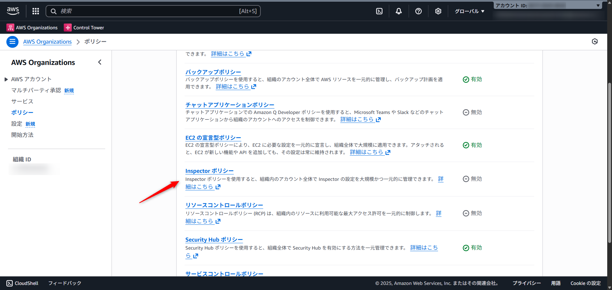
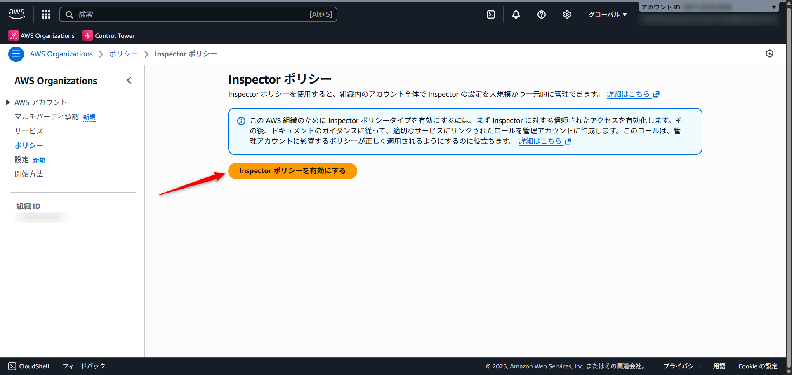
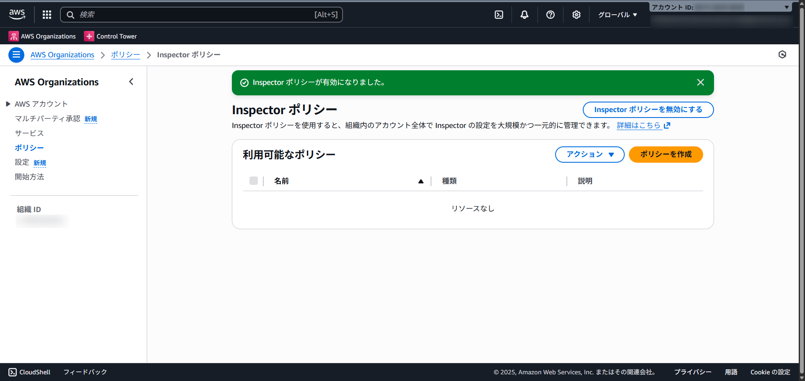
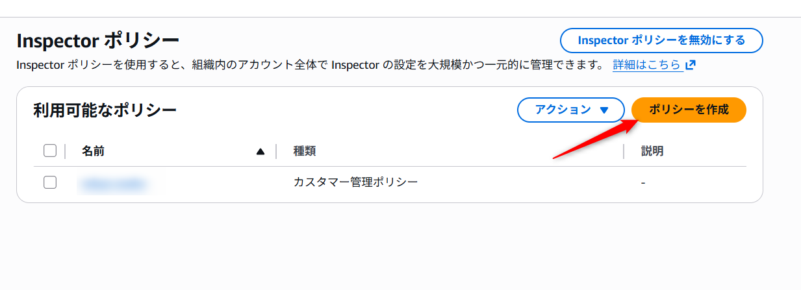
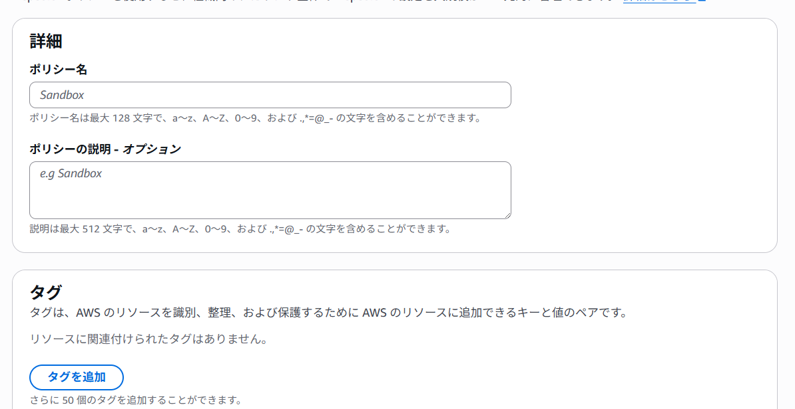
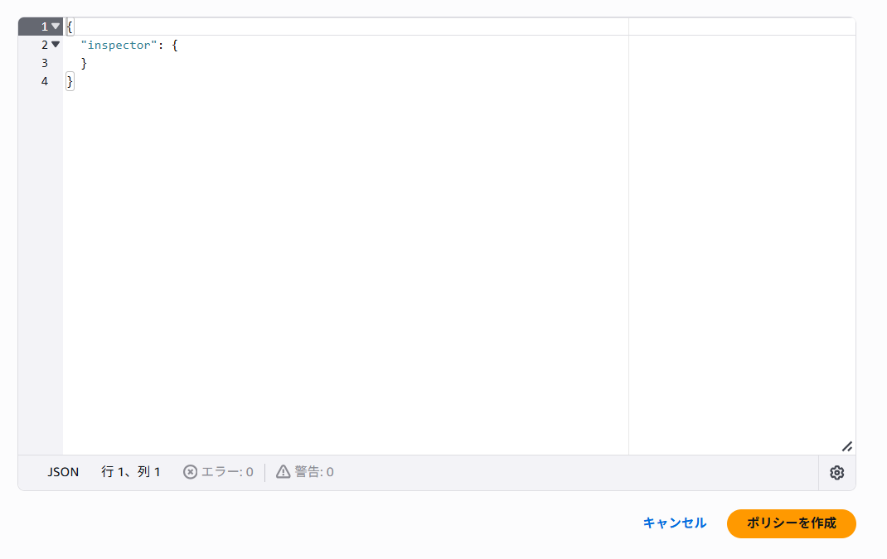
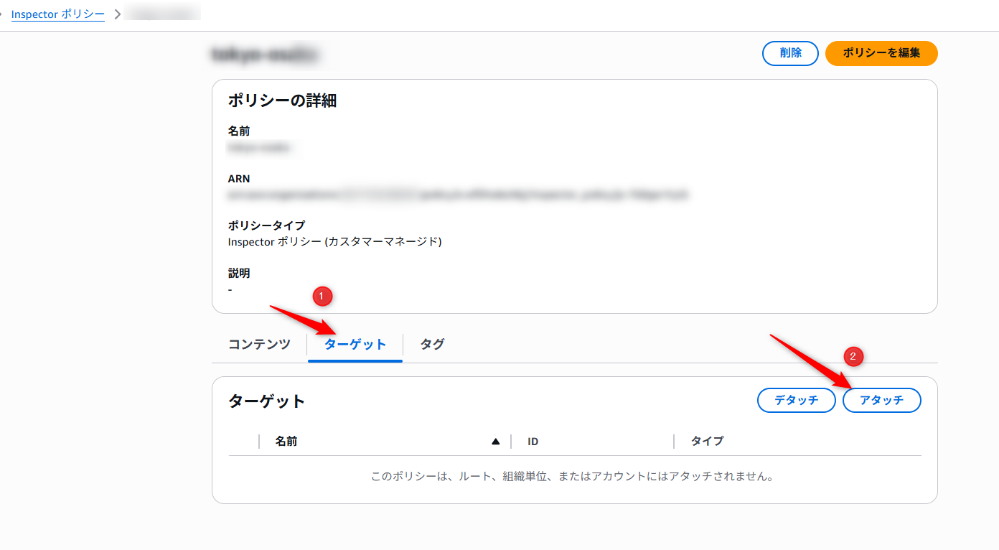
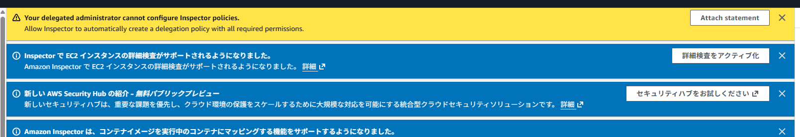
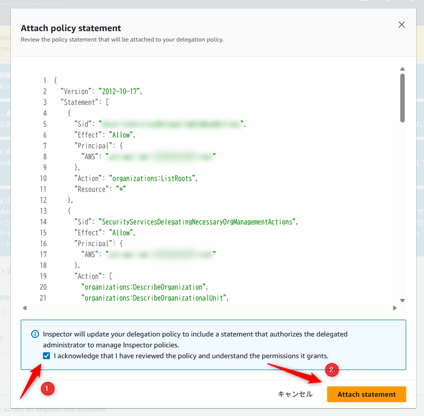

こんにちは、CSC の [CloudFastener](https://cloud-fastener.com/) というプロダクトで TAM のポジションで働いている平木です！

皆さんは Inspector を使って脆弱性管理をしていますか？

マルチアカウントでセキュリティ対策を考える上で、Security Hub CSPM は中央設定を、GuardDuty は Organizations 統合を、Inspector も Organizations 統合を使用してメンバーアカウントの設定管理を行っていることはよくあると思います。

そんな中、今回 Organizations ポリシーとして Inspector の有効化管理が可能な Inspector ポリシーが爆誕したのでご紹介します。

https://aws.amazon.com/jp/about-aws/whats-new/2025/11/amazon-inspector-organization-wide-management-aws-organizations-policies/



## 3 行まとめ

- Inspector のサービスコンソールでの管理と機能的な違いはありませんが、コードとして管理できたり、OU 別にガバナンスの適用方法を変えられたりするメリットがあります
- 記法はほとんど Security Hub ポリシーと同じ
- 現時点ではサービスコンソール側でもポリシー側でも両方でコントロールは可能

## Inspector ポリシーとは

Inspector ポリシーは、AWS Organizations を使用して複数のメンバーアカウントにわたって Amazon Inspector の設定を一元管理できる機能です。

最近だと Security Hub ポリシーというのが記憶に新しいかと思います。
Security Hub ポリシーについては下記ブログをご参照ください。

https://qiita.com/HIRA_dayo/items/94b525883760c4080f96

Inspector ポリシーを活用することで、今まで Inspector のサービスコンソールで管理していた内容をポリシーという形で Organizations 全体で適用できます。

また、Inspector ポリシーは OU 単位で指定可能なため、特定のワークロード OU や環境別の OU ごとに、有効化する Inspector のスキャンタイプを柔軟に指定することも可能です。

## Inspector ポリシーの記法について

Inspector ポリシーの大枠の構造としては以下のようになります。

```json
{
    "inspector": {
        "enablement": {
            "ec2_scanning": {
                "enable_in_regions": {
                    "@@assign": [<有効化したいリージョン>]
                }
            },
            "ecr_scanning": {
                "enable_in_regions": {
                    "@@assign": [<有効化したいリージョン>]
                }
            },
            "code_repository_scanning": {
                "enable_in_regions": {
                    "@@assign": [<有効化したいリージョン>]
                }
            },
            "lambda_standard_scanning": {
                "enable_in_regions": {
                    "@@assign": [<有効化したいリージョン>]
                },
                "lambda_code_scanning": {
                    "enable_in_regions": {
                        "@@assign": [<有効化したいリージョン>]
                    }
                }
            }
        }
    }
}
```

それぞれ上のレイヤーから見ていきます。

- Inspector
  - Inspector ポリシーを扱う上でのドキュメントの最上位キーであり、Inspector ポリシーのドキュメントだという宣言になります
- enablement
  - 組織全体で Amazon Inspector を有効化する方法を定義し、スキャンタイプの設定が含まれています
- 各スキャンタイプ
  - 有効化の指定を行うスキャンタイプを記載します
  - 現時点（2025/11/21）では以下 5 タイプです
    - `ec2_scanning`
    - `ecr_scanning`
    - `code_repository_scanning`
    - `lambda_standard_scanning`
    - `lambda_code_scanning` (`lambda_standard_scanning`階層の中に入れる必要があります)
- enable_in_regions or disable_in_regions
  - 有効または無効にするリージョンをリスト形式で表記できます
- 継承演算子
  - 指定したリージョンについて追加を行うのか削除を行うのか、子 OU に上書きを許可させるのかなどを指定できます
  - [継承演算子 - AWS Organizations](https://docs.aws.amazon.com/ja_jp/organizations/latest/userguide/policy-operators.html)

### Organizations 全体で全てのスキャンモードを有効化したい場合

Organizations 全体で全てのリージョンで全てのスキャンモードを有効化したい場合は以下のようなポリシーを作成し、root OU に割り当てます。

無効化するリージョンがない場合でも項目としては用意しておく必要があります。

```json
{
    "inspector": {
        "enablement": {
            "ec2_scanning": {
                "enable_in_regions": {
                    "@@assign": ["ALL_SUPPORTED"]
                },
                "disable_in_regions": {
                    "@@assign": []
                }
            },
            "ecr_scanning": {
                "enable_in_regions": {
                    "@@assign": ["ALL_SUPPORTED"]
                },
                "disable_in_regions": {
                    "@@assign": []
                }
            },
            "code_repository_scanning": {
                "enable_in_regions": {
                    "@@assign": ["ALL_SUPPORTED"]
                },
                "disable_in_regions": {
                    "@@assign": []
                }
            },
            "lambda_standard_scanning": {
                "enable_in_regions": {
                    "@@assign": ["ALL_SUPPORTED"]
                },
                "disable_in_regions": {
                    "@@assign": []
                },
                "lambda_code_scanning": {
                    "enable_in_regions": {
                        "@@assign": ["ALL_SUPPORTED"]
                    },
                    "disable_in_regions": {
                            "@@assign": []
                    }
                }
            }
        }
    }
}
```

### Organizations 全体で EC2 スキャンと ECR スキャンを東京リージョンと大阪リージョンでのみ有効化したい場合

東京リージョンと大阪リージョンにて EC2 と ECR スキャンのみ有効化したいといった場合には、
以下のようなポリシーを root OU に割り当てることで全てのアカウントで有効化されます。

また継承演算子の `@@operators_allowed_for_child_policies` を活用することで、子 OU での上書きを許可したり禁止したりでき、値が `none` の場合は上書きを禁止にできます。

```json
{
    "inspector": {
        "enablement": {
            "ec2_scanning": {
                "enable_in_regions": {
                    "@@assign": ["ap-northeast-1", "ap-northeast-3"],
                    "@@operators_allowed_for_child_policies": ["@@none"]
                },
                "disable_in_regions": {
                    "@@assign": [],
                    "@@operators_allowed_for_child_policies": ["@@none"]
                }
            },
            "ecr_scanning": {
                "enable_in_regions": {
                    "@@assign": ["ap-northeast-1", "ap-northeast-3"],
                    "@@operators_allowed_for_child_policies": ["@@none"]
                },
                "disable_in_regions": {
                    "@@assign": [],
                    "@@operators_allowed_for_child_policies": ["@@none"]
                }
            }
        }
    }
}
```

## Inspector ポリシーの有効化方法と使い方

Inspector ポリシーの有効化とポリシー作成の手順について記載します。

まず Organizations からポリシーをナビゲーションペインで選択し、「Inspector ポリシー」を押します。


続いて、「Inspector ポリシーを有効にする」を押します。



「有効になりました」と表記されたら完了です。



ポリシーを作成したい場合は、「ポリシーを作成」を押します。



上部では任意のポリシー名、説明、タグを指定します。



下部で任意のポリシードキュメントを反映させ、「ポリシーを作成」を押したら完了です。



作成したポリシーはターゲットのタブから「アタッチ」を押し、任意の OU を選択するとアタッチできます。



## もしうまくいかない場合

もしうまくいかない場合、権限上の問題がある可能性があります。

Inspector のコンソールを見ると黄色いバーが表示されるので「Attach Statement」を押し、



チェックを入れ、「Attach statement」を押し状況が改善するか確認してみてください。



## まとめ

今回は Inspector ポリシーについてご紹介しました。

Inspector ポリシーを活用することでより柔軟かつ確実に Inspector を組織全体で有効化でき、組織の脆弱性管理状況を可視化できます。

この記事がどなたかの役に立つと嬉しいです。