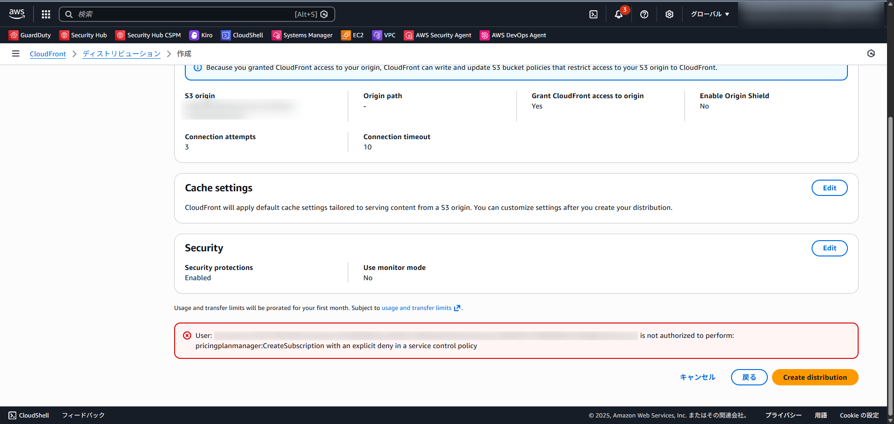
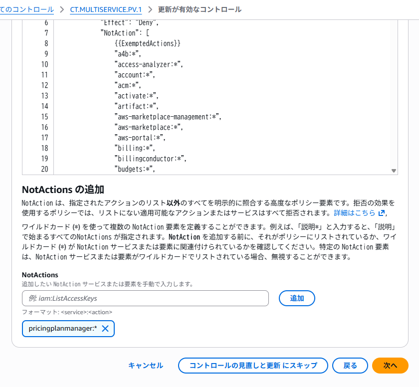

こんにちは、CSC の [CloudFastener](https://cloud-fastener.com/) というプロダクトで TAM のポジションで働いている平木です！

皆さんは SCP を使用してリージョン制限していますか？

リージョン制限を実施することで、セキュリティインシデントの際によく悪用されがちな、普段使用しないリージョンに対してわざわざセキュリティサービスなどを適用する必要がなくなります。
ただ、CloudFront や Route 53 などを許可するためだけにバージニア北部リージョンを解放するのは、管理上の観点から避けたい場合もあります。  
そのため、グローバルサービスに関連する API を SCP の NotAction（除外条件）に含めるのが一般的です。

実際に Control Tower のリージョン制限機能を活用する場合、グローバルサービスのアクションは除外されています。

今回、リージョン制限の適用下で CloudFront のディストリビューションを作成しようとしたところエラーが出たためブログにしました。

## 早速まとめ

同じ事象が出ている方向けに早速結論を述べます。

- CloudFront の従量課金（Pay-as-you-go）以外の料金プランを選択すると発生する
- エラーは出ているがディストリビューションの作成自体は PAYG のプランで出来ている
- NotAction に以下の API を含めることで解決する
  - `pricingplanmanager:AssociateResourcesToSubscription`
  - `pricingplanmanager:CancelSubscription`
  - `pricingplanmanager:CancelSubscriptionChange`
  - `pricingplanmanager:CreateSubscription`
  - `pricingplanmanager:DisassociateResourcesFromSubscription`
  - `pricingplanmanager:UpdateSubscription`
  - `pricingplanmanager:GetSubscription`
  - `pricingplanmanager:ListSubscriptions`
  - または、 `pricingplanmanager:*`

## 起きたこと

今回この事象に気づいたのは、Control Tower 配下の AWS アカウントで、SCP が意図通りに適用されているかを確認していた時でした。

今回、Control Tower にはコントロールの機能の 「CT.MULTISERVICE.PV.1」を使用して、
東京・大阪リージョンに限定してリージョン制限を行っています。

詳しくは下記ブログをご参照ください。

https://dev.classmethod.jp/articles/202506-enabling-ct-multiservice-pv1/

Control Tower のリージョン制限を使用すると明示的に指定しなくても、グローバルサービスが作成できるように以下のように SCP があたるように設計されています。

```
{
  "Version": "2012-10-17",
  "Statement": [
    {
      "Condition": {
        "StringNotEquals": {
          "aws:RequestedRegion": [
            "ap-northeast-1",
            "ap-northeast-3"
          ]
        },
        "ArnNotLike": {
          "aws:PrincipalARN": [
            "arn:*:iam::*:role/AWSControlTowerExecution",
            "arn:*:iam::*:role/aws-controltower-ConfigRecorderRole",
            "arn:*:iam::*:role/aws-controltower-ForwardSnsNotificationRole",
            "arn:*:iam::*:role/AWSControlTower_VPCFlowLogsRole"
          ]
        }
      },
      "Resource": "*",
      "Effect": "Deny",
      "NotAction": [
        "a4b:*",
        "access-analyzer:*",
        "account:*",
        "acm:*",
        "activate:*",
        "artifact:*",
        "aws-marketplace-management:*",
        "aws-marketplace:*",
        "aws-portal:*",
        "billing:*",
        "billingconductor:*",
        "budgets:*",
        "ce:*",
        "chatbot:*",
        "chime:*",
        "cloudfront:*",
        "cloudtrail:LookupEvents",
        "compute-optimizer:*",
        "config:*",
        "consoleapp:*",
        "consolidatedbilling:*",
        "cur:*",
        "datapipeline:GetAccountLimits",
        "devicefarm:*",
        "directconnect:*",
        "ec2:DescribeRegions",
        "ec2:DescribeTransitGateways",
        "ec2:DescribeVpnGateways",
        "ecr-public:*",
        "fms:*",
        "freetier:*",
        "globalaccelerator:*",
        "health:*",
        "iam:*",
        "importexport:*",
        "invoicing:*",
        "iq:*",
        "kms:*",
        "license-manager:ListReceivedLicenses",
        "lightsail:Get*",
        "mobileanalytics:*",
        "networkmanager:*",
        "notifications-contacts:*",
        "notifications:*",
        "organizations:*",
        "payments:*",
        "pricing:*",
        "quicksight:DescribeAccountSubscription",
        "resource-explorer-2:*",
        "route53-recovery-cluster:*",
        "route53-recovery-control-config:*",
        "route53-recovery-readiness:*",
        "route53:*",
        "route53domains:*",
        "s3:CreateMultiRegionAccessPoint",
        "s3:DeleteMultiRegionAccessPoint",
        "s3:DescribeMultiRegionAccessPointOperation",
        "s3:GetAccountPublicAccessBlock",
        "s3:GetBucketLocation",
        "s3:GetBucketPolicyStatus",
        "s3:GetBucketPublicAccessBlock",
        "s3:GetMultiRegionAccessPoint",
        "s3:GetMultiRegionAccessPointPolicy",
        "s3:GetMultiRegionAccessPointPolicyStatus",
        "s3:GetStorageLensConfiguration",
        "s3:GetStorageLensDashboard",
        "s3:ListAllMyBuckets",
        "s3:ListMultiRegionAccessPoints",
        "s3:ListStorageLensConfigurations",
        "s3:PutAccountPublicAccessBlock",
        "s3:PutMultiRegionAccessPointPolicy",
        "savingsplans:*",
        "shield:*",
        "sso:*",
        "sts:*",
        "support:*",
        "supportapp:*",
        "supportplans:*",
        "sustainability:*",
        "tag:GetResources",
        "tax:*",
        "trustedadvisor:*",
        "vendor-insights:ListEntitledSecurityProfiles",
        "waf-regional:*",
        "waf:*",
        "wafv2:*"
      ],
      "Sid": "CTMULTISERVICEPV1"
    }
  ]
}
```

今回は SCP の適用確認の中でグローバルサービスが適切に作成できるかの確認を実施しました。

そこで CloudFront のディストリビューションを free プランで作成しようとしたところ、以下のエラーが発生しました。

> User: XXXXX is not authorized to perform: pricingplanmanager:CreateSubscription with an explicit deny in a service control policy



ただよく見てみるとディストリビューション自体は作成できていたので、謎が深まりました。

## 原因と解決法

理由が分からなかったためよくエラーを読んでみるとどうやら `pricingplanmanager:CreateSubscription` という API が拒絶されているように見えます。

ここで最近、CloudFront に定額プランが追加されたことを思い出しました。

詳細は以下ブログが分かりやすいです。

https://dev.classmethod.jp/articles/aws-flat-rate-pricing-plans/

そこで、「CloudFront のディストリビューションを作成する際に、従量課金（Pay-as-you-go）以外の料金プランを選択すると `pricingplanmanager:CreateSubscription` API が呼ばれるのではないか」と仮説を立てました。  
調査したところ、AWS の公式ドキュメントの権限一覧に、pricingplanmanager 系の API が必要なことが記載されていることが分かりました。

https://docs.aws.amazon.com/AmazonCloudFront/latest/DeveloperGuide/security-iam-awsmanpol.html#security-iam-awsmanpol-cloudfront-full-access

具体的には以下です。

- `pricingplanmanager:AssociateResourcesToSubscription`
- `pricingplanmanager:CancelSubscription`
- `pricingplanmanager:CancelSubscriptionChange`
- `pricingplanmanager:CreateSubscription`
- `pricingplanmanager:DisassociateResourcesFromSubscription`
- `pricingplanmanager:UpdateSubscription`
- `pricingplanmanager:GetSubscription`
- `pricingplanmanager:ListSubscriptions`

そのため以下のように変更しました。

変更方法としては、
Control Tower の場合は、コントロールの更新時の NotActions の追加という項目に、当該 API 全てか、`pricingplanmanager:*` を追加します。



自前で SCP を立てている場合は、NotAction のセクションに当該 API 全てか、`pricingplanmanager:*` を追加してください。

これで無事、作成が完了できます。

## まとめ

今回は検証中に起きたちょっとした細かい AWS の仕様の穴について見ていきました。

このように、CloudFront の全機能をリージョン制限下で利用するには、デフォルトの SCP 設定に追加の権限を許可する必要があります。  
実際に運用する際には、利用したい機能に応じて必要な権限を精査し、SCP を更新していくプロセスが求められるようです。

この記事がどなたかの役に立つと嬉しいです。