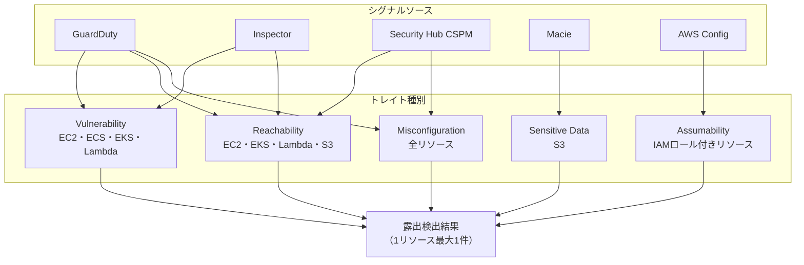
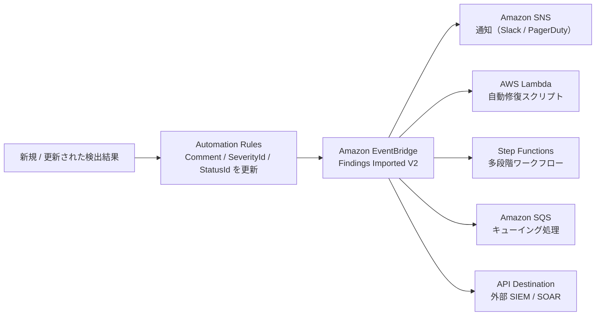

こんにちは、CSC の [CloudFastener](https://cloud-fastener.com/) というプロダクトで TAM のポジションで働いている平木です！

これまでAWSのセキュリティサービスの検出結果の集約やCSPMの機能として **AWS Security Hub CSPM** を活用してクラウドセキュリティ運用を行ってきましたが、2025年12月に新しく **AWS Security Hub**（プレビュー時はSecurity Hub Advancedとコンソールに記載されていた） が GA（一般提供）されました。

https://aws.amazon.com/jp/about-aws/whats-new/2025/12/security-hub-near-real-time-risk-analytics/

GA してから半年ほど経過しましたが、現在時点でどんな機能が提供されているのかをまとめてみました。

:::message
**この記事の3行まとめ**
- Security Hub は CSPM（コンプライアンスチェック）から、脅威・脆弱性・露出・体制管理を統合する運用プラットフォームへと進化した
- 新機能「露出（Exposure）」が複数のセキュリティシグナルを相関分析し、対応すべきリスクを自動で優先順位付けする
- 検出結果フォーマットが ASFF から OCSF へ移行し、料金もリソースベース課金へ刷新された
:::

| 比較軸 | Security Hub CSPM | Security Hub |
|---|---|---|
| **スコープ** | コンプライアンス・体制管理中心 | 脅威・脆弱性・露出・体制を統合管理 |
| **ダッシュボード** | セキュリティスコア中心 | 脅威・露出・脆弱性・体制を1画面で把握 |
| **検出結果管理** | 全サービスの検出結果を混在表示 | 脅威 / 露出 / 脆弱性 / 体制管理 に分類 |
| **リソースビュー** | 限定的 | リソース単位で横断的に確認可能 |
| **パートナー統合** | サードパーティとの手動連携 | Extended Plan でワンクリック統合（21 パートナー） |
| **設定管理** | リージョン・アカウント個別 | 設定カタログ（Configuration catalog）で組織全体を管理 |
| **料金モデル** | チェック数 + 検出結果数課金 | リソースユニットベース課金（シンプル化） |
| **自動化** | EventBridge 中心 | 自動化ルール + EventBridge の 2 段階 |
| **データ標準化** | ASFF | OCSF |

## Security Hub の位置づけ

### AWS セキュリティサービス全体における立ち位置

AWS のセキュリティサービスは大きく以下の役割で分類できます。

- **Amazon GuardDuty** — 脅威検出（異常な振る舞い・マルウェア・攻撃シーケンス）
- **Amazon Inspector** — 脆弱性管理（EC2・ECR・Lambda の CVE スキャン）
- **Amazon Macie** — 機密データ保護（S3 の個人情報・クレジットカード情報検出）
- **AWS Config** — リソース設定変更の記録・コンプライアンス評価
- **AWS Security Hub CSPM** — クラウドセキュリティ体制管理（コンプライアンス・ベストプラクティス準拠チェック）
- **AWS Security Hub** — 上記すべてを統合する**セキュリティ運用プラットフォーム**

旧来の Security Hub は GuardDuty・Inspector・Macie などの検出結果を集めて一覧する「**集約ハブ**」兼 CSPM として機能していました。

新しい Security Hub は、それを大きく超えて、**脅威・脆弱性・露出・体制管理を1つのコンソールで完結させる統合セキュリティ運用プラットフォーム**へと進化しています。


## Security Hub の各機能

Security Hub の左ナビゲーションペインは以下の構成になっています。


### ダッシュボード

セキュリティ状況を可視化するカスタマイズ可能なウィジェット型ダッシュボードです。ウィジェットの追加・削除・並び替えが可能で、フィルターセットの保存や Organizational Units 単位での絞り込みにも対応しています。

ダッシュボードには **エグゼクティブ** と **トリアージ** の2つのタブがあり、用途に応じて使い分けます。

| タブ | 想定ユーザー | 表示データの特徴 |
|---|---|---|
| **エグゼクティブ** | 経営層・マネージャー | 時系列トレンドグラフ中心。過去の変化を俯瞰する |
| **トリアージ** | セキュリティ運用チーム | 現時点のサマリーリスト中心。今すぐ対応すべき項目を確認する |

**エグゼクティブタブ**

露出・脅威・リソースのトレンドデータを時系列グラフで表示します。加えて、各セキュリティサービスのアカウントカバレッジを確認できる **Security Coverage** ウィジェットが含まれます。


*エグゼクティブタブ。傾向の概要カードと時系列グラフで環境全体の変化を把握できる*

**トリアージタブ**

露出・脅威・リソースのサマリーを重大度順のリスト形式で表示します。各カテゴリ最大8件（重大度が高い順）が表示され、クリックで該当ダッシュボードへ遷移します。


*トリアージタブ。今すぐ対応が必要な項目が重大度順に並ぶ。「View all」で各ダッシュボードへ移動できる*

:::message
ダッシュボードのカスタマイズ（フィルターセット・ウィジェットレイアウト）は**自動保存**されます。クロスリージョン集約を設定している場合、ダッシュボードにはリンクされた全リージョンのデータが集約表示されます。委任管理者アカウントのカスタマイズはメンバーアカウントとは独立して保存されます。
:::

#### 概要

環境全体の傾向をひと目で把握できるサマリー画面です。前日比・前週比・前月比でのトレンド変化が確認できます。

画面上部の **「Choose Organizations Units」** ボタンから OU（組織単位）またはアカウントを選択することで、表示データのスコープを絞り込むことができます。特定の事業部や環境（本番 / 開発）に絞ったセキュリティ状況の確認が可能です。この OU スコープの切り替えはダッシュボードの概要に限らず、**脅威・露出・脆弱性・体制管理など各セクションでも共通して使用可能**です。


**傾向の概要**

脅威・露出・リソース・すべての検出結果の件数と前期比をカード形式で表示します。


*傾向の概要ウィジェット。前月比で脅威が +32% など、変化の方向と割合が一目でわかる*

**脅威検出結果の傾向**

重大度（Critical / High / Medium / Low）別の件数を時系列グラフで表示します。5日・30日・90日・6か月・1年の期間を切り替えて確認できます。


*脅威検出結果の傾向グラフ（例：90日表示）。重大度ごとにスタックされ、スパイクしている日付にカーソルを当てると内訳が確認できる*

**リソースの傾向**

環境内のリソース数を時系列グラフで表示します。5日・30日・90日・6か月・1年の期間を切り替えて確認でき、グラフにカーソルを当てると特定時点のリソース平均数が確認できます。「View current resources」からリソースダッシュボードへ遷移できます。


*リソース数の推移グラフ。期間切り替えで増減トレンドを把握できる*

**セキュリティカバレッジ**

以下の 4 つのセキュリティ機能それぞれについて、アカウントカバレッジ（有効化されているアカウント・リージョンの割合）を表示します。

| セキュリティ機能 | 担当サービス |
|---|---|
| 脆弱性管理（Vulnerability management） | Amazon Inspector |
| 脅威検出（Threat detection） | Amazon GuardDuty |
| 機密データ検出（Sensitive data discovery） | Amazon Macie |
| 体制管理（Posture management） | AWS Security Hub CSPM |

**Account coverage** 列のパーセンテージは、Security Hub が有効なアカウント・リージョン全体でのカバレッジチェックの合否割合を示します。パーセンテージをクリックすると、チェックが合格（Covered）・不合格（Not covered）の詳細を確認できます。


*各セキュリティ機能のアカウントカバレッジが一覧表示される。未有効化のサービスは Not covered として表示される*

#### 脅威

GuardDuty が検出した脅威情報に特化したビューです。

GuardDuty を有効化していると、以下の情報が集約されます：
- 重大度別の脅威件数
- 最多の脅威タイプ Top10
- アタックシーケンス（攻撃の一連の流れ）


**アタックシーケンス**（24時間ウィンドウで複数イベントを相関分析した攻撃チェーン）も確認できます。


#### 露出

Security Hub の中でも特に核心となる機能です。  
**複数のセキュリティシグナルを相関分析し、AWS 環境内の潜在的なリスクを自動で特定・優先順位付け**します。  
単一の検出結果では判断しにくい「組み合わせによるリスク」を可視化できる点が最大の特徴です。

GuardDuty・Inspector・Security Hub CSPM・Macie などの各サービスからのシグナルが、対象リソースに対して一定の**トレイト（traits）**として付加され、Security Hub がそれを相関分析することで露出検出結果を生成します。

:::message
**1 リソース = 最大 1 つの露出検出結果**というルールがあります。露出トレイトが不十分なリソースには露出検出結果は生成されません。
:::

**サポートされるリソース**

露出検出結果の生成対象となるリソースは以下の 8 種類です：

- `AWS::EC2::Instance`
- `AWS::Lambda::Function`
- `AWS::ECS::Service`
- `AWS::EKS::Cluster`
- `AWS::S3::Bucket`
- `AWS::RDS::DBInstance`
- `AWS::DynamoDB::Table`
- `AWS::IAM::User`

[Security Hub での露出の検出結果でサポートされているリソースタイプ - AWS Security Hub](https://docs.aws.amazon.com/ja_jp/securityhub/latest/userguide/exposure-findings-supported-resources.html)

**トレイトの種類**

露出検出結果は以下の 5 種類のトレイトを組み合わせて評価されます：

| トレイト | 内容 | データソース | 適用リソース |
|---|---|---|---|
| **Misconfiguration** | リソースの設定ミスを示す | Security Hub CSPM・GuardDuty・AWS Config | 全リソース |
| **Reachability** | リソースへのオープンなネットワークパスを示す | Security Hub CSPM・GuardDuty・Inspector ネットワーク到達可能性 | EC2・EKS・Lambda・S3 |
| **Vulnerability** | 悪用可能な脆弱性が存在することを示す | Inspector パッケージ脆弱性・GuardDuty EC2 マルウェア検出 | EC2・ECS・EKS・Lambda |
| **Sensitive Data** | リソースに機密データが含まれることを示す | Macie 機密データ検出 | S3 |
| **Assumability** | IAM 権限が付与されたリソースを示す（ブラストラジウス把握に利用） | AWS Config のリソース設定 | IAM ロールが関連付けられた全リソース |

Assumability トレイトは **IAM Access Analyzer の未使用アクセス情報**をコンテキストとして付加し、リソースが侵害された場合の「ブラストラジウス（影響爆発半径）」の把握に使われます。たとえば EC2 インスタンスに脆弱性があり、アタッチされた IAM ロールに 5 サービスにまたがる 47 の未使用権限がある場合、その権限情報が露出検出結果のコンテキストトレイトとして表示されます。

各シグナルソースからトレイトを経て露出検出結果が生成される流れは以下の通りです：



**露出検出結果の構成要素**

各露出検出結果には以下の情報が含まれます：

- **タイトルと説明** — リスクの性質・影響リソース・露出の背景を説明
- **深刻度** — Critical / High / Medium / Low
- **寄与トレイト** — 露出検出結果の原因となった主要因（上記トレイト種別）
- **アタックパス可視化** — 攻撃者が露出をどう悪用できるかを示すインタラクティブな図
- **修復ガイダンス** — 具体的・実行可能な修復手順とベストプラクティス
- **コンテキストトレイト** — 露出検出結果の生成には使われなかったが参考になる追加情報（Assumability など）

**深刻度の決定要素**

深刻度は以下の 5 つの要素を総合して自動判定されます：

- **Awareness（認知度）** — 公開されたエクスプロイトや自動エクスプロイトが存在するか（EC2・Lambda に適用）
- **Ease of discovery（発見容易性）** — ポートスキャンなどの自動ツールでリソースを発見できるか
- **Ease of exploit（悪用容易性）** — オープンなネットワークパスや誤設定されたメタデータがあるか
- **Likelihood of exploit（悪用可能性）** — EPSS に基づく今後 30 日以内の悪用確率
- **Impact（影響度）** — 侵害された場合の被害範囲（可用性・機密性・完全性の喪失など）

:::message
露出検出結果の修復ガイダンスには、具体的な手順と参考リンクが含まれます。ただし他の AWS リソースの追加確認が必要な場合もあるため、修復前に詳細を確認してください。
:::

[Security Hub でサポートされている特性タイプ - AWS Security Hub](https://docs.aws.amazon.com/ja_jp/securityhub/latest/userguide/exposure-findings-supported-traits.html)

**具体例：EC2 インスタンスの露出検出結果**

以下は実際のコンソールで生成された露出検出結果の例です。


*露出ダッシュボード。一覧と右パネルに選択した検出結果の概要が表示される*

この例では **「Potential Resource Hijacking: EC2 instance with administrative access has software vulnerabilities」** という検出結果が生成されています。

| 項目 | 値 |
|---|---|
| **深刻度** | Low |
| **タイプ** | Exposure / Potential Impact / Resource Hijacking |
| **主なリソース** | AWS::EC2::Instance（プライマリ） |
| **関連リソース** | AWS::IAM::Role（関連する IAM ロール） |
| **ステータス** | New |

深刻度が **Low** なのは、Inspector が検出した CVE の EPSS スコアが低く（30 日以内の悪用確率が低い）、既知の公開エクスプロイトが存在しないためです。ただし `AdministratorAccess` が付与された IAM ロールとソフトウェア脆弱性の組み合わせは、リソースハイジャックの潜在的リスクとして記録されます。

**原因となる特性（Contributing Traits）と コンテキスト特性（Contextual Traits）**


*特性タブ。露出検出結果の原因となった Contributing Trait と、参考情報の Contextual Trait に分類される*

この検出結果は 2 種類の Contributing Trait の組み合わせで生成されています：

- **Misconfiguration** — EC2 インスタンスにアタッチされた IAM ロールに `AdministratorAccess` ポリシーが付与されている
- **Vulnerability** — Amazon Inspector が複数の CVE（kernel・openssl 等の脆弱性）を検出している

脆弱性を悪用してインスタンスに侵入した攻撃者が、IAM ロールを介して AWS リソースを広範に操作できる状態であることが、この 2 トレイトの組み合わせから導き出されています。

コンテキスト特性（Contextual Traits）としては以下が付加されており、ブラストラジウスの把握に役立てられます：

- **Misconfiguration** — IAM ロールにサービス管理者ポリシー（`AmazonS3FullAccess` 等）が付与されている
- **Misconfiguration** — IAM ロールに未使用の権限がある（IAM Access Analyzer の情報）
- **Assumability** — EC2 インスタンスにインスタンスプロファイルが関連付けられている

**潜在的な攻撃パス**


*攻撃パスの可視化。EC2 インスタンスからインスタンスプロファイル → IAM ロール → 各ポリシー（AdministratorAccess 等）への権限の連鎖が図示される*

VPC・サブネット・セキュリティグループ・ネットワークインターフェースなどのネットワーク構成と、インスタンスプロファイル → IAM ロール → ポリシーという権限の連鎖がグラフで可視化されます。どのリソースが「橋渡し」になっているかが一目でわかります。

**リソース詳細**


*リソースタブ。プライマリリソース（EC2 インスタンス）と関連リソース（IAM ロール）の詳細が表示される*

**是正の優先順位**

修復ガイダンスには以下の順序で対応することが推奨されています：

1. **Low Priority Vulnerability** — CVE の修正（OS・パッケージのアップデート）
2. **Administrative Access Policy** — IAM ロールへの過剰な権限の削除（`AdministratorAccess` を最小権限ポリシーへ変更）

#### 脆弱性

Inspector が検出した CVE（共通脆弱性識別子）情報に特化したビューです。**既知のエクスプロイトが存在する脆弱性**が優先的にハイライトされます。

主な表示情報：
- エクスプロイト可能な脆弱性の件数と重大度
- 影響を受けるリソース（EC2・ECR・Lambda）
- CVE の CVSS スコア

:::message
脆弱性ビューは **Amazon Inspector が有効な場合のみ**データが表示されます。Inspector を有効化していない場合、このビューは空になります。
:::


#### 体制管理

AWS Config・Security Hub CSPM のセキュリティ標準評価結果をベースに、クラウド設定のセキュリティ体制を管理します。

主な機能：
- セキュリティ標準（FSBP・CIS・PCI DSS など）の準拠率スコア
- コントロール単位での PASS/FAIL 状態
- 未有効化のセキュリティサービス（Macie など）のカバレッジ確認

サポートされるセキュリティ標準：

- **AWS Foundational Security Best Practices (FSBP)** — AWS 推奨のベストプラクティス（デフォルト有効化推奨）
- **CIS AWS Foundations Benchmark** — Center for Internet Security による設定ガイドライン
- **PCI DSS** — クレジットカード情報保護の国際標準
- **NIST SP 800-53 Rev.5** — 米連邦政府向け情報システム保護要件
- **NIST SP 800-171 Rev.2** — 非政府組織向け CUI 保護要件
- **AWS Resource Tagging** — リソースタグ付け準拠チェック

:::message
**コントロール統合検出結果（Consolidated control findings）**を有効化すると、複数のセキュリティ標準で重複するコントロールの検出結果が1件に集約されます。デフォルトでは標準ごとに個別の検出結果が生成されるため、重複カウントに注意が必要です。
:::

体制管理のページは **Dashboard** と **Findings** の 2 つのタブで構成されています。

**Dashboard タブ**


*体制管理 Dashboard タブ（上部）。CSPM スコアと Security standards・Top failed CSPM findings ウィジェットが表示される*

画面上部の **Posture management overview** には、現在の CSPM スコア（有効なコントロールのうち PASS した割合）とコントロールの内訳がバーグラフで表示されます。

| 項目 | 説明 |
|---|---|
| **CSPM score** | 有効なコントロールの Pass 率（例：60% = 389 件中 233 件合格） |
| **Passed** | チェックに合格したコントロール数 |
| **Failed** | チェックに不合格のコントロール数 |
| **No data** | データが取得できていないコントロール数 |
| **Disabled** | 無効化されているコントロール数 |

ダッシュボードには複数のウィジェットが配置されており、以下の情報をすばやく把握できます：

- **Security standards** — 有効化している各標準の Passed・Failed 件数とスコア（%）を一覧表示。未有効化の標準には「Enable」リンクが表示される
- **Top failed CSPM findings** — 重大度・件数が多い順に CSPM の FAIL 検出結果タイトルをランキング表示。Critical 件数が多い項目から順に並ぶ


*体制管理 Dashboard タブ（下部）。4 つの追加ウィジェットでトレンドと IAM リスクを把握できる*

続いて以下のウィジェットが表示されます：

- **Posture management finding trends** — 重大度別の CSPM 検出結果数を時系列グラフで表示（5日・30日・90日・6か月・1年）
- **Compliance status trends** — PASS / FAIL 件数の推移を時系列で表示
- **IAM principals with most posture management findings** — 未使用アクセス（Unused passwords・Unused access keys・Roles with unused permissions など）の検出結果が多い IAM ユーザー・ロールを最大 20 件ランキング表示
- **Top accounts with unused access findings** — 未使用アクセス検出結果が多い AWS アカウントを上位表示

**Findings タブ**

CSPM の検出結果（コントロールの FAIL 一覧）をフィルタリングして確認できるビューです。重大度・コントロール ID・標準名・リソースタイプなどの条件でフィルタリングでき、対応が必要なコントロールを絞り込んで確認できます。

#### 機密データ

Amazon Macie が S3 バケットで検出した機密データ（個人情報・クレジットカード情報・認証情報など）に特化したビューです。

主な表示情報：
- 機密データが検出されたバケット一覧
- 検出されたデータタイプ（PII・資格情報・財務情報など）
- バケットのアクセス許可状態


### インベントリ

Security Hub に集約された検出結果とリソースを横断的に検索・確認できるセクションです。

#### すべての検出結果

Security Hub に集約されたすべての検出結果（GuardDuty・Inspector・Macie・Config・Firewall Manager 等）を一覧・検索できます。

検出結果は **OCSF（Open Cybersecurity Schema Framework）** で標準化されており、以下の軸でフィルタリング可能です：

- 製品名（`metadata.product.name`）・アカウント ID（`cloud.account.uid`）
- 重大度（`severity` / `severity_id`）・ステータス（`status` / `status_id`）
- リソースタイプ（`resources.type`）・リソース ID（`resources.uid`）
- コンプライアンス状態（`compliance.status`）・コントロール ID（`compliance.control`）

フィルター条件を組み合わせた **フィルターセット** として保存でき、次回以降すぐに呼び出せます。

:::message
フィルターセットやウィジェットのカスタマイズには機密情報・個人情報（PII）を含めないよう注意してください。保存済みフィルターセットの内容は他のユーザーから参照できる場合があります。
:::

#### リソース

AWS リソース単位で、そのリソースに関連する検出結果を横断確認できるビューです。

たとえば特定の EC2 インスタンスを選択すると、以下がまとめて確認できます：
- GuardDuty の脅威検出
- Inspector の CVE 脆弱性
- Config の設定コンプライアンス状態


### 管理

AWS Organizations 全体のセキュリティ設定・パートナー統合・自動化ルールを一元管理するセクションです。

#### 設定

AWS Organizations 全体のセキュリティ機能を一元的に設定・管理する画面です。

  
*設定カタログ タブ。4 つの設定項目がカード形式で表示される。Security Hub（必須機能とその他の機能）が推奨として表示される*

カタログから設定したい項目を選択し、対象アカウント・OU・リージョンを指定して設定を適用します。設定フロー（選択 → 設定 → 管理とレビュー）の説明がページ上部に表示されます。

カタログには以下の 4 項目があります：

| 設定項目 | タイプ | 内容 |
|---|---|---|
| **Security Hub（必須機能とその他の機能）** | ポリシーとデプロイ | セキュリティ管理・体制管理・脅威分析・脆弱性管理の必須機能を有効化。追加機能もオプションで選択可能。|
| **GuardDuty による脅威分析** | デプロイ | GuardDuty を有効化し、AWS データソース・ログを継続的にモニタリング・分析 |
| **Security Hub CSPM による体制管理** | デプロイ | Security Hub CSPM の標準とコントロールを有効化し、セキュリティベストプラクティスからの逸脱を検出 |
| **Inspector による脆弱性管理** | ポリシー | Inspector を有効化し、ワークロード・インスタンス・コンテナイメージの脆弱性をスキャン |

:::message
**ポリシー** と **デプロイ** では動作が異なります。

- **ポリシー**（Security Hub・Inspector）: AWS Organizations ポリシーとして管理され、編集・削除が可能。新規追加アカウントにも自動適用されます。
- **デプロイ**（GuardDuty・Security Hub CSPM）: 一回限りのアクションです。実行後に編集・確認はできません。新規追加アカウントには自動適用されないため、GuardDuty や Security Hub CSPM の自動有効化設定を別途行う必要があります。
:::

#### Extended Plan

CrowdStrike・Okta・Splunk などのサードパーティセキュリティソリューションを Security Hub に統合できる拡張プランです。

現在対応している 9 カテゴリ 21 パートナーの一覧は下記料金プランの中に記載されています。
https://aws.amazon.com/security-hub/pricing/#pricing_details

パートナーの検出結果も **OCSF（Open Cybersecurity Schema Framework）** で標準化されるため、AWS ネイティブの検出結果と同一のビューで確認・分析できます。

:::message alert
Extended Plan は各パートナーとの別途契約が必要です。AWS Marketplace 経由で購入できます。
:::


#### オートメーション

検出結果への自動対応を設定する画面です。Security Hub では **OCSF（Open Cybersecurity Schema Framework）** の属性を条件として使用する Automation Rules が中心となっています。

**Automation Rules（自動化ルール）**：

- **実行タイミング** — 新規・更新された検出結果に対してリアルタイムで適用
- **適用リージョン** — ホームリージョンで作成したルールは、リンクされた全リージョンに適用
- **遡及適用** — なし（ルール作成後に生成された検出結果のみ対象）

条件（Criteria）として使用できる主な OCSF フィールド：

- `cloud.account.uid`（アカウント ID）・`cloud.region`（リージョン）
- `severity`（重大度）・`status`（ステータス）
- `resources.type`（リソースタイプ）・`resources.uid`（リソース ID）・`resources.tags`（タグ）
- `metadata.product.name`（製品名）・`compliance.status`（コンプライアンス状態）
- `vulnerabilities.is_exploit_available`（既知エクスプロイトの有無）など 40 以上

自動更新できるフィールドは以下の **3 つ**に限定されています：

- `Comment` — 検出結果へのメモ追記
- `SeverityId` — 重大度の変更（CRITICAL / HIGH / MEDIUM / LOW / INFORMATIONAL）
- `StatusId` — ステータスの変更（New / In Progress / Suppressed / Resolved など）

**ルール順序（Rule Order）**：同一の検出結果に複数ルールが適用される場合、**数値が大きいルールが最後に適用され最終的な値になります**。

設定例：
- 開発環境タグのリソースの LOW 検出結果を自動 Suppressed
- 特定アカウントの全検出結果の重大度を INFORMATIONAL に引き下げ

**サードパーティチケット作成**：Automation Rules から Jira Cloud や ServiceNow ITSM へのチケット自動作成も可能です（統合の設定が前提）。

:::message alert
Automation Rules は **`BatchUpdateFindingsV2` による手動更新ではトリガーされません**。あくまで検出結果プロバイダー（GuardDuty・Inspector 等）が生成・更新した検出結果のみが対象です。また、ルール作成前に既存していた検出結果には遡及適用されません。

ただし、`BatchUpdateFindingsV2` で手動更新したフィールドと同じフィールドを、**その後プロバイダーが更新した場合は Automation Rules が再トリガーされ、手動更新の内容が上書きされる**可能性があります。たとえば `BatchUpdateFindingsV2` で Status を `In Progress` に変更した後、GuardDuty が同じ検出結果を更新すると、Automation Rules が適用されて Status が別の値に戻ることがあります。
:::

**Amazon EventBridge との連携**

Automation Rules は Security Hub 内部のフィールド更新に特化しており、**外部への通知・修復アクションには EventBridge** を組み合わせます。実行順序は「Automation Rules → EventBridge」の順です。



Security Hub の EventBridge イベントの `detail-type` は **`"Findings Imported V2"`** です（旧 Security Hub CSPM の `"Security Hub Findings - Imported"` とは異なります）。

イベントパターンの例：

```json
{
  "source": ["aws.securityhub"],
  "detail-type": ["Findings Imported V2"],
  "detail": {
    "findings": {
      "severity": ["Critical", "High"],
      "status": ["New"],
      "metadata": {
        "product": {
          "name": ["GuardDuty"]
        }
      }
    }
  }
}
```

:::message
Security Hub CSPM と Security Hub を**同時に有効にしている場合**、同じ検出結果がそれぞれ異なる `detail-type` で EventBridge に2回届く可能性があります。既存の EventBridge ルールが CSPM の `detail-type` を指定している場合、v2 のイベントは拾われないため注意が必要です。
:::


#### 統合

Security Hub の「統合」画面では、外部チケットシステムとの連携を管理します。現在（2026/05/25）サポートされているのは **Jira Cloud** と **ServiceNow ITSM** を始めとした 20 製品です。

:::message alert
Jira Cloud 統合は API レートリミットの影響を受けます。大量の検出結果が発生する環境ではチケット作成が遅延・欠落する可能性があります。Automation Rules でフィルタリングして重要な検出結果のみをチケット化することを推奨します。
:::

**Jira Cloud 統合**：

Security Hub の検出結果を手動または Automation Rules で自動的に Jira Cloud へ送信し、Issue としてチケット管理できます。

設定前の前提条件：
1. Atlassian Marketplace から「**AWS Security Hub for Jira Cloud**」アプリをインストール
2. 連携するプロジェクトをアプリに関連付け（**会社管理**プロジェクトのみ対応）
3. 専用システムアカウントの使用を推奨（OAuth 接続はユーザーアカウントに紐付くため）

暗号化オプション：AWS マネージドキー（デフォルト）またはカスタマー管理の KMS キー（設定後変更不可）

**ServiceNow ITSM 統合**：

Security Hub の検出結果から ServiceNow にインシデントまたは問題（Problem）を自動作成できます。

設定前の前提条件：
1. ServiceNow Store から「**Security Hub findings integration for IT Service Management**」アプリをインストール
2. インバウンド OAuth の Client Credentials グラントタイプを設定
3. ServiceNow の OAuth 認証情報を **AWS Secrets Manager** に保存（カスタマー管理の KMS キーが必須）

**統合のテスト**：

コンソールの「**Create test ticket**」から接続テストが可能です。`TESTING Test CreateTicketV2 Finding` というタイトルのテストチケットが Jira / ServiceNow に実際に作成されます（確認後は削除してください）。


### 設定

Security Hub 自体のリージョン設定・アカウントカバレッジ・利用状況を管理するセクションです。

#### 一般

リージョン設定・集約リージョン（Aggregation Region）の設定を行います。集約リージョンを設定すると、全リージョンの検出結果を1か所で確認できます。

#### アカウントのカバレッジ

AWS Organizations 配下のアカウントに対する Security Hub の有効化状況と、設定ポリシーの適用状況を確認・管理します。

- 未有効化アカウントへの自動有効化設定
- OU（組織単位）単位でのポリシー適用
- メンバーアカウントの設定委任


#### Usage

Security Hub の利用状況を確認できます。

- 処理済みセキュリティチェック数
- 処理済み検出結果数
- 無料トライアル残日数
- アカウント・リージョン別の内訳


`Cost optimization strategies` を押すことで、Security Hub の利用コストを削減するための推奨事項を確認できます。
コスト最適化の際にここで利用量を確認しながら設定を調整します。


## 料金体系

[統合クラウドセキュリティソリューション – AWS Security Hub の料金 – Amazon Web Services](https://aws.amazon.com/jp/security-hub/pricing/)

### 30 日間の無料トライアル

Security Hub は **全アカウント・全リージョンで 30 日間無料**でお試しいただけます。Usage 画面でトライアル残日数を確認できます。

:::message
Config・GuardDuty・Inspector などの統合サービスの利用費用は別途発生します。
:::

### Essentials Plan（基本プラン）

**$3.75 / リソースユニット / 月**

リソースユニットの換算：

| リソースタイプ | 換算 |
|---|---|
| EC2 インスタンス | 1 インスタンス = 1 ユニット |
| Lambda 関数 | 12 関数 = 1 ユニット |
| ECR コンテナイメージ | 18 イメージ = 1 ユニット |
| IAM ユーザー / ロール | 125 リソース = 1 ユニット |

含まれる機能：リスク分析・脆弱性管理・CSPM・セキュリティ体制管理・自動化ルール・オートメーション

### Threat Analytics アドオン（脅威分析）

GuardDuty 相当の脅威分析機能を利用する場合に追加される料金：

| 対象 | 料金 |
|---|---|
| CloudTrail イベント | $4.00 / 100万イベント |
| VPC / DNS ログ（最初の 1,000 GB） | $0.55 / GB |
| VPC / DNS ログ（〜10,000 GB） | $0.25 / GB |
| VPC / DNS ログ（10,000 GB 超） | $0.10 / GB |

### Extended Plan（拡張プラン）

パートナーソリューションを Security Hub に統合する場合の料金。パートナーごとに異なります（AWS Marketplace 経由で課金）。

| パートナー | 料金例 |
|---|---|
| CrowdStrike Falcon | $4.20〜$49.65 / エンドポイント / 月 |
| Okta | $20 / ユーザー / 月（最低 10 ユーザー） |
| Proofpoint | $5.00 / ユーザー / 月（最低 750 ユーザー） |
| Splunk | $77〜$193 / GB / 日 |

### コスト試算例

| 規模 | 構成例 | 月額試算 |
|---|---|---|
| 小規模 | EC2 100台 + Essentials のみ | 約 $375 |
| 中規模 | EC2 500台 + Threat Analytics | 約 $2,300〜 |
| 大規模 | EC2 1,200台 + Threat Analytics + Extended | 要個別見積もり |

:::message alert
旧 Security Hub の料金体系（セキュリティチェック数 + 検出結果数）から**リソースベース課金**に変わっています。移行前にコスト比較をおすすめします。
:::

## 検出結果のフォーマット（OCSF）

Security Hub では検出結果を **OCSF（Open Cybersecurity Schema Framework）スキーマ v1.6** で標準化しています。OCSF は AWS と業界パートナーが共同開発したオープンスタンダードで、異なるセキュリティツールの検出結果を統一的に扱えるようにします。

:::message
[公式ドキュメント](https://docs.aws.amazon.com/ja_jp/securityhub/latest/userguide/securityhub-ocsf.html)では「OCSF スキーマ v1.6 をサポートしている」と記載されていますが、実際に `GetFindingsV2` API で取得した検出結果の `metadata.version` フィールドは `"1.8.0"` となっていました。ドキュメントが更新されていない可能性があるため、実環境での利用時は実際の検出結果のバージョンを確認することをおすすめします。
:::

### OCSF の基本構造

OCSF は以下の階層で分類されます：

```
カテゴリ（Category）
  └─ クラス（Class）
       └─ イベント（Event）
            └─ 属性（Attribute）
```

[Security Hub と Open Cybersecurity Findings 形式 (OCSF) - AWS Security Hub](https://docs.aws.amazon.com/ja_jp/securityhub/latest/userguide/securityhub-ocsf.html)

Security Hub の検出結果は主に **カテゴリ 2（Findings）** に属し、以下のクラスを使用します：

- **Compliance Finding（class_uid: 2003）** — 体制管理・コンプライアンス検出結果（CSPM）
- **Detection Finding（class_uid: 2004）** — 脅威検出（GuardDuty）・露出検出結果
- **Vulnerability Finding（class_uid: 2002）** — 脆弱性検出（Inspector）
- **Data Security Finding（class_uid: 2006）** — 機密データ検出（Macie）

### 主要フィールド

検出結果のクラスによってフィールド構成が異なります。

:::details Compliance Finding（class_uid: 2003）— 体制管理・CSPM

```json
{
  "activity_id": 2,
  "activity_name": "Update",
  "category_name": "Findings",
  "category_uid": 2,
  "class_name": "Compliance Finding",
  "class_uid": 2003,
  "type_name": "Compliance Finding: Update",
  "type_uid": 200302,      // class_uid * 100 + activity_id
  "severity_id": 4,        // 1=Info, 2=Low, 3=Medium, 4=High, 5=Critical, 6=Fatal
  "severity": "High",
  "status_id": 1,          // 1=New, 2=In Progress, 3=Suppressed, 4=Resolved
  "status": "New",
  "time_dt": "2025-05-25T10:00:00Z",

  "metadata": {
    "product": {
      "name": "Security Hub",
      "vendor_name": "AWS",
      "uid": "arn:aws:securityhub:ap-northeast-1::productv2/aws/securityhub"
    },
    "profiles": ["cloud", "datetime", "aws/cloud_resources"],
    "extensions": [{ "name": "aws", "uid": "998", "version": "1.0.0" }],
    "uid": "xxxxxxxxxxxxxxxxxxxxxxxxxxxxxxxxxxxxxxxxxxxxxxxxxxxxxxxxxxxxxxxx",
    "version": "1.8.0"
  },

  "cloud": {
    "account": { "name": "my-account", "uid": "111122223333" },
    "provider": "AWS",
    "region": "ap-northeast-1"
  },

  "finding_info": {
    "analytic": {
      "category": "AWS::Config::ConfigRule",
      "name": "securityhub-s3-bucket-public-read-prohibited-xxxxxxxx",
      "type": "Rule",
      "type_id": 1
    },
    "title": "S3 general purpose buckets should block public read access",
    "desc": "This control checks whether an Amazon S3 general purpose bucket permits public read access.",
    "types": ["Effects/Data Exposure", "Posture Management"],
    "created_time_dt": "2025-04-14T07:58:04.710Z",
    "first_seen_time_dt": "2025-05-01T00:00:00Z",
    "last_seen_time_dt": "2025-05-25T10:00:00Z",
    "modified_time_dt": "2025-05-25T10:00:00Z",
    "uid": "arn:aws:securityhub:ap-northeast-1:111122223333:security-control/S3.1/finding/xxxxxxxx"
  },

  "resources": [
    {
      "type": "AWS::S3::Bucket",
      "uid": "my-public-bucket",
      "uid_alt": "arn:aws:s3:::my-public-bucket",
      "cloud_partition": "aws",
      "provider": "AWS",
      "region": "ap-northeast-1",
      "owner": { "account": { "uid": "111122223333" } }
    }
  ],

  "compliance": {          // コンプライアンス情報（Compliance Finding 固有）
    "control": "S3.1",
    "standards": ["standards/aws-foundational-security-best-practices/v/1.0.0"],
    "status": "Fail",
    "status_id": 3         // 1=Pass, 3=Fail
  },

  "remediation": {
    "desc": "For information on how to correct this issue, consult the AWS Security Hub controls documentation.",
    "references": ["https://docs.aws.amazon.com/console/securityhub/S3.1/remediation"]
  },

  "vendor_attributes": { "severity": "High", "severity_id": 4 }
}
```

:::

:::details Detection Finding（class_uid: 2004）— 脅威検出（GuardDuty）・露出検出

```json
{
  "activity_id": 2,
  "activity_name": "Update",
  "category_name": "Findings",
  "category_uid": 2,
  "class_name": "Detection Finding",
  "class_uid": 2004,
  "type_name": "Detection Finding: Update",
  "type_uid": 200402,
  "severity_id": 5,
  "severity": "Critical",
  "status_id": 1,
  "status": "New",
  "time_dt": "2025-05-25T10:00:00Z",
  "count": 3,              // シグナル数（アタックシーケンス）

  "metadata": {
    "product": {
      "name": "GuardDuty",          // 露出検出の場合は "Security Hub Exposure Detection"
      "vendor_name": "AWS",
      "uid": "arn:aws:securityhub:ap-northeast-1::productv2/aws/guardduty",
      "feature": { "name": "Correlation" }
    },
    "profiles": ["cloud", "datetime", "aws/cloud_resources"],
    "extensions": [{ "name": "aws", "uid": "998", "version": "1.0.0" }],
    "uid": "xxxxxxxxxxxxxxxxxxxxxxxxxxxxxxxxxxxxxxxxxxxxxxxxxxxxxxxxxxxxxxxx",
    "version": "1.8.0"
  },

  "cloud": {
    "account": { "name": "my-account", "uid": "111122223333" },
    "provider": "AWS",
    "region": "ap-northeast-1"
  },

  "evidences": [           // 脅威の証拠（GuardDuty 固有。露出検出には含まれない）
    { "src_endpoint": { "uid": "malicious-domain.example.com" } }
  ],

  "finding_info": {
    "analytic": {
      "type": "Learning (ML/DL)",   // ルールベースの場合は "Rule"
      "type_id": 4,
      "uid": "detector-id-xxxxxxxxxxxxxxxxxxxxxxxxxxxxxxxx"
    },
    "title": "Potential EC2 instance group compromise indicated by a sequence of actions.",
    "desc": "A sequence of actions involving multiple signals indicating a potential compromise.",
    "types": ["Threats", "AttackSequence:EC2/CompromisedInstanceGroup"],
    "attacks": [
      { "tactic": { "name": "Command and Control" } },
      { "technique": { "name": "T1071.004 - Application Layer Protocol: DNS" } }
    ],
    "traits": [            // 脅威シグナルのトレイト（GuardDuty 固有）
      { "name": "MALICIOUS_DOMAIN", "values": ["malicious-domain.example.com"] }
    ],
    "related_events": [    // 個々のシグナル（構成するGuardDuty検出結果）
      {
        "title": "Backdoor:EC2/C&CActivity.B!DNS",
        "type": "FINDING",
        "uid": "arn:aws:guardduty:ap-northeast-1:111122223333:detector/xxxxxxxx/finding/xxxxxxxx"
      }
    ],
    "created_time_dt": "2025-05-25T10:00:00Z",
    "first_seen_time_dt": "2025-05-25T09:00:00Z",
    "last_seen_time_dt": "2025-05-25T10:00:00Z",
    "modified_time_dt": "2025-05-25T10:00:00Z",
    "uid": "arn:aws:guardduty:ap-northeast-1:111122223333:detector/xxxxxxxx/finding/xxxxxxxx"
  },

  "resources": [
    {
      "type": "AWS::EC2::Instance",
      "uid": "i-xxxxxxxxxxxxxxxxx",
      "cloud_partition": "aws",
      "provider": "AWS",
      "region": "ap-northeast-1",
      "owner": { "account": { "uid": "111122223333" } }
    }
  ],

  "vendor_attributes": { "severity": "Critical", "severity_id": 5 }
}
```

:::

:::details Vulnerability Finding（class_uid: 2002）— 脆弱性検出（Inspector）

```json
{
  "activity_id": 2,
  "activity_name": "Update",
  "category_name": "Findings",
  "category_uid": 2,
  "class_name": "Vulnerability Finding",
  "class_uid": 2002,
  "type_name": "Vulnerability Finding: Update",
  "type_uid": 200202,
  "severity_id": 5,
  "severity": "Critical",
  "status_id": 1,
  "status": "New",
  "time_dt": "2025-05-25T10:00:00Z",

  "metadata": {
    "product": {
      "name": "Inspector",
      "vendor_name": "AWS",
      "uid": "arn:aws:securityhub:ap-northeast-1::productv2/aws/inspector"
    },
    "profiles": ["cloud", "datetime", "aws/cloud_resources"],
    "extensions": [{ "name": "aws", "uid": "998", "version": "1.0.0" }],
    "uid": "xxxxxxxxxxxxxxxxxxxxxxxxxxxxxxxxxxxxxxxxxxxxxxxxxxxxxxxxxxxxxxxx",
    "version": "1.8.0"
  },

  "cloud": {
    "account": { "name": "my-account", "uid": "111122223333" },
    "provider": "AWS",
    "region": "ap-northeast-1"
  },

  "finding_info": {
    "title": "CVE-XXXX-XXXXX - affected-package",
    "desc": "...(CVE description)...",
    "types": ["Software and Configuration Checks/Vulnerabilities/CVE", "Vulnerabilities"],
    "created_time_dt": "2025-05-24T00:45:31.042Z",
    "first_seen_time_dt": "2025-05-24T00:45:31.042Z",
    "last_seen_time_dt": "2025-05-24T08:03:59.403Z",
    "modified_time_dt": "2025-05-24T08:03:59.403Z",
    "uid": "arn:aws:inspector2:ap-northeast-1:111122223333:finding/xxxxxxxxxxxxxxxxxxxxxxxxxxxxxxxx"
  },

  "resources": [
    {
      "type": "AWS::EC2::Instance",
      "uid": "i-xxxxxxxxxxxxxxxxx",
      "cloud_partition": "aws",
      "provider": "AWS",
      "region": "ap-northeast-1",
      "owner": { "account": { "uid": "111122223333" } }
    }
  ],

  "vulnerabilities": [     // CVE 詳細（Vulnerability Finding 固有）
    {
      "cve": {
        "uid": "CVE-XXXX-XXXXX",
        "desc": "...",
        "cvss": [
          {
            "base_score": 10,
            "severity": "CRITICAL",
            "vector_string": "CVSS:3.1/AV:N/AC:L/PR:N/UI:N/S:C/C:H/I:H/A:H",
            "vendor_name": "NVD",
            "version": "3.1"
          }
        ],
        "epss": { "score": "0.00018" }
      },
      "affected_packages": [
        {
          "name": "affected-package",
          "version": "x.y.z",
          "fixed_in_version": "x.y.z+1",
          "package_manager": "GENERIC"
        }
      ],
      "is_exploit_available": true,
      "is_fix_available": true
    }
  ],

  "vendor_attributes": { "severity": "Critical", "severity_id": 5 }
}
```

:::

:::details Data Security Finding（class_uid: 2006）— 機密データ検出（Macie）

```json
{
  "activity_id": 1,
  "activity_name": "Create",
  "category_name": "Findings",
  "category_uid": 2,
  "class_name": "Data Security Finding",
  "class_uid": 2006,
  "type_name": "Data Security Finding: Create",
  "type_uid": 200601,
  "severity_id": 3,
  "severity": "Medium",
  "status_id": 1,
  "status": "New",
  "time_dt": "2025-05-25T10:00:00Z",

  "metadata": {
    "product": {
      "name": "Macie",
      "vendor_name": "AWS",
      "uid": "arn:aws:securityhub:ap-northeast-1::productv2/aws/macie"
    },
    "profiles": ["cloud", "data_classification", "datetime", "aws/cloud_resources"],
    "extensions": [{ "name": "aws", "uid": "998", "version": "1.0.0" }],
    "uid": "xxxxxxxxxxxxxxxxxxxxxxxxxxxxxxxxxxxxxxxxxxxxxxxxxxxxxxxxxxxxxxxx",
    "version": "1.8.0"
  },

  "cloud": {
    "account": { "name": "my-account", "uid": "111122223333" },
    "provider": "AWS",
    "region": "ap-northeast-1"
  },

  "databucket": {          // S3 バケット・オブジェクト情報（Data Security Finding 固有）
    "name": "my-bucket",
    "uid": "arn:aws:s3:::my-bucket",
    "type": "S3",
    "type_id": 1,
    "is_public": false,
    "is_encrypted": true,
    "region": "ap-northeast-1",
    "file": {
      "data_classifications": [
        {
          "category": "Personal",
          "category_id": 1,
          "discovery_details": [{ "count": 3, "type": "NAME" }],
          "status": "Partial",
          "status_id": 2
        }
      ]
    }
  },

  "finding_info": {
    "title": "The S3 object contains multiple categories of sensitive data",
    "desc": "The S3 object contains more than one category of sensitive data.",
    "types": ["SensitiveData:S3Object/Multiple", "Sensitive Data"],
    "created_time_dt": "2025-05-25T10:00:00Z",
    "last_seen_time_dt": "2025-05-25T10:00:00Z",
    "modified_time_dt": "2025-05-25T10:00:00Z",
    "uid": "xxxxxxxxxxxxxxxxxxxxxxxxxxxxxxxx"
  },

  "resources": [
    {
      "type": "AWS::S3::Object",
      "uid": "path/to/object.gz",
      "cloud_partition": "aws",
      "provider": "AWS",
      "region": "ap-northeast-1",
      "owner": { "account": { "uid": "111122223333" } }
    }
  ],

  "vendor_attributes": { "severity": "Medium", "severity_id": 3 }
}
```

:::


### OCSF と ASFF の対応関係

Security Hub CSPM では ASFF（AWS Security Finding Format）を使用していましたが、Security Hub では OCSF に移行しています。

| 概念 | OCSF（Security Hub） | ASFF（Security Hub CSPM） |
|---|---|---|
| 検出結果 ID | `metadata.uid` / `finding_info.uid` | `Id` |
| タイトル | `finding_info.title` | `Title` |
| 説明 | `finding_info.desc` | `Description` |
| 重大度 | `severity` / `severity_id`（数値） | `Severity.Label`（文字列） |
| ステータス | `status` / `status_id` | `Workflow.Status` |
| リソース情報 | `resources[].type`, `resources[].uid` | `Resources[].Type`, `Resources[].Id` |
| 製品名 | `metadata.product.name` | `ProductName` |
| コントロール ID | `compliance.control` | `Compliance.SecurityControlId` |
| EventBridge detail-type | `"Findings Imported V2"` | `"Security Hub Findings - Imported"` |

:::message
`GetFindingsV2` API や Automation Rules の条件フィールドは OCSF フィールド名を使用します。旧 CSPM の `GetFindings` API（ASFF）とはフィールド名が異なるため、既存のスクリプト・クエリを移行する際は注意が必要です。
:::

### AWS サービス間の OCSF 活用の違い

AWS では Security Hub だけでなく、**Amazon Security Lake** では OCSF を活用し、最近 **Amazon CloudWatch Logs** も OCSF に対応しました。  
ただし、用途・スキーマバージョン・扱うデータの種類が異なります。

| 比較軸 | Security Hub | Amazon Security Lake | Amazon CloudWatch Logs |
|---|---|---|---|
| **OCSF バージョン** | 1.6 | 1.0.0-rc.2 または 1.1.0 | サービス依存（変換時） |
| **主な用途** | セキュリティ検出結果（findings）の標準化 | AWS ログ・サードパーティログの一元保管 | 運用ログの OCSF 変換・分析 |
| **データ種別** | 脅威検出・脆弱性・体制管理の findings | CloudTrail・VPC Flow・DNS・WAF 等のログ | CloudWatch に取り込まれた任意のログ |
| **保存形式** | イベント形式（API / EventBridge） | S3 上の Apache Parquet 形式 | CloudWatch Logs（ストリーム） |
| **主な OCSF クラス** | Compliance Finding (2003), Detection Finding (2004), Vulnerability Finding (2002), Data Security Finding (2006) | API Activity, Network Activity, DNS Activity, Authentication, Security Finding | 変換元ログ種別に依存 |

**Amazon Security Lake**

Security Lake は CloudTrail・VPC Flow Logs・Route 53・WAFv2 などの AWS ネイティブログを、自動的に OCSF 形式（Parquet）に変換して S3 に集約します。Security Hub CSPM の検出結果も Security Lake に取り込まれ、OCSF の Security Finding クラス（class_uid: 2001）にマッピングされます。

Security Hub CSPM → Security Lake の変換では、元の ASFF フィールドが OCSF にマッピングされます。マッピングされなかった ASFF 独自フィールドは OCSF の `unmapped` 属性に保持されるため、データの欠落はありません。

:::message alert
Security Hub v2 は OCSF **1.6** を出力しますが、Security Lake がサポートする OCSF は **1.1.0** までです。Security Hub v2 の検出結果を Security Lake に取り込む際、OCSF 1.2〜1.6 で追加されたフィールドが Security Lake 側で認識されない可能性があります。AWS 公式ドキュメントではこのバージョン差について現時点で明記されていないため、移行前に実際のデータを確認することを推奨します。
:::

**Amazon CloudWatch Logs（`parseToOCSF` プロセッサ）**

CloudWatch Logs の **Log Transformations** 機能に含まれる `parseToOCSF` プロセッサを使うと、CloudWatch に収集したログ（CloudTrail・VPC Flow・Route 53・EKS Audit・WAF）を OCSF 形式に変換してから下流に転送できます。ETL パイプラインなしに OCSF 正規化を実現できる点が特徴です。

Security Lake との違いは「誰が OCSF 変換を担うか」です。Security Lake はサービス側で自動変換しますが、CloudWatch の `parseToOCSF` はユーザーが明示的にプロセッサを設定することで変換します。複数 AWS アカウントの CloudWatch ログを統合ダッシュボードで分析する場合や、Security Lake 外でのカスタム OCSF 分析に利用できます。

```
利用シーン別の選択基準:
  S3 への長期保管・SIEM 連携         → Security Lake（Parquet + OCSF 1.1.0）
  Security Hub 検出結果のリアルタイム通知 → EventBridge（OCSF 1.6）
  既存 CloudWatch ログの OCSF 正規化  → CloudWatch parseToOCSF プロセッサ
```

## まとめ

Security Hub を実際に触ってみた感想をお伝えします。

最も印象的だったのは、**「検出結果の羅列」から「セキュリティ状況の把握」へ**というコンセプトの転換です。旧 Security Hub では数万件の検出結果が並ぶ画面から優先度を判断するのが難しく、実際には GuardDuty・Inspector・Macie それぞれのコンソールを行き来していました。

Security Hub では「脅威 19 件（前月比 +32%）」「露出 17 件」といったシグナルがひと目でわかり、**どこから手をつけるべきか**が格段に分かりやすくなっています。

一方で、料金体系がリソースベースに変わったことで、**リソース数が多い環境ではコストが増加する可能性**があります。移行前に Usage 画面で試算してから判断することをおすすめします。

この記事がどなたかの役に立つと嬉しいです。
